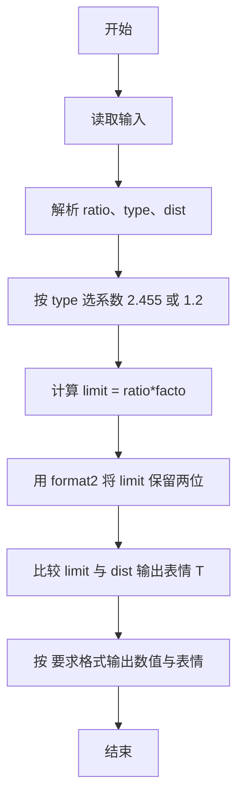
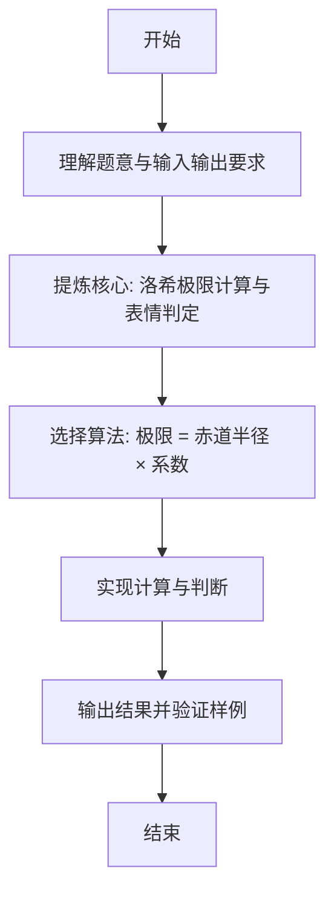

# L1-067 -  洛希极限（10 分）

- **时间限制**: 400 ms
- **内存限制**: 65536 KB
- **代码长度限制**: 16 KB

---

## 题目描述


科幻电影《流浪地球》中一个重要的情节是地球距离木星太近时，大气开始被木星吸走，而随着不断接近地木“刚体洛希极限”，地球面临被彻底撕碎的危险。但实际上，这个计算是错误的。


洛希极限（Roche limit）是一个天体自身的引力与第二个天体造成的潮汐力相等时的距离。当两个天体的距离少于洛希极限，天体就会倾向碎散，继而成为第二个天体的环。它以首位计算这个极限的人爱德华·洛希命名。（摘自百度百科）

大天体密度与小天体的密度的比值开 3 次方后，再乘以大天体的半径以及一个倍数（流体对应的倍数是 2.455，刚体对应的倍数是 1.26），就是洛希极限的值。例如木星与地球的密度比值开 3 次方是 0.622，如果假设地球是流体，那么洛希极限就是 $$0.622\times 2.455=1.52701$$ 倍木星半径；但地球是刚体，对应的洛希极限是 $$0.622\times 1.26=0.78372$$ 倍木星半径，这个距离比木星半径小，即只有当地球位于木星内部的时候才会被撕碎，换言之，就是地球不可能被撕碎。

本题就请你判断一个小天体会不会被一个大天体撕碎。

### 输入格式:

输入在一行中给出 3 个数字，依次为：大天体密度与小天体的密度的比值开 3 次方后计算出的值（$$\le 1$$）、小天体的属性（0 表示流体、1 表示刚体）、两个天体的距离与大天体半径的比值（$$>1$$ 但不超过 10）。

### 输出格式:

在一行中首先输出小天体的洛希极限与大天体半径的比值（输出小数点后2位）；随后空一格；最后输出 `^_^` 如果小天体不会被撕碎，否则输出 `T_T`。

### 输入样例 1：
```in
0.622 0 1.4
```

### 输出样例 1：
```out
1.53 T_T
```

### 输入样例 2：
```in
0.622 1 1.4
```

### 输出样例 2：
```out
0.78 ^_^
```

## 示例

### 示例 1

**输入:**
```
0.622 0 1.4
```

**输出:**
```
1.53 T_T
```

### 示例 2

**输入:**
```
0.622 1 1.4
```

**输出:**
```
0.78 ^_^
```

---

### 解题思路

#### 题目分析
本题为“洛希极限”（洛希极限计算与表情判定）。题面要求根据给定输入按规则计算并输出结果，输入规模小但需注意格式与边界。洛希极限计算与表情判定的判定涉及多分支或字符串处理，需将输入准确分词后逐项处理。仓颉实现中通过 `readToEnd`/`readln` 读取并以空白或行分割，兼顾有无换行与多空格的情况。

#### 核心算法
极限 = 赤道半径 × 系数（固态 2.455/流体 1.26），保留两位小数，比较实际距离输出 T_T 或 ^_^。实现上直接模拟题意：先将原始输入规范化为 Token 或行数组，再按规则遍历计算。例如 解析 ratio、type、dist，随后 按 type 选系数 2.455 或 1.26，最后按条件分支输出。算法保持线性遍历，无需复杂数据结构，仅需若干计数器与集合即可完成。

#### 复杂度分析
- **时间复杂度**：O(1)。
- **空间复杂度**：O(1)，仅需常量或线性辅助数组存储输入分词结果。

### 代码流程说明

1. 解析 ratio、type、dist。
2. 按 type 选系数 2.455 或 1.26。
3. 计算 limit = ratio*factor。
4. 用 format2 将 limit 保留两位小数。
5. 比较 limit 与 dist 输出表情 T_T 或 ^_^。
6. 按 要求格式输出数值与表情。

### 代码实现

完整仓颉源码如下（与 `.cj` 文件一致）：

```cangjie
// L1-067 洛希极限 - 固定2位
import std.env.*
import std.collection.*
import std.convert.*
import std.math.*

func format2(x: Float64): String {
    let scaled = Int64(round(x * 100.0))
    let neg = scaled < 0
    let a: Int64 = if (neg) { -scaled } else { scaled }
    let intPart = a / 100
    let frac = a % 100
    let sign = if (neg) { "-" } else { "" }
    let fracStr = if (frac < 10) { "0${frac}" } else { "${frac}" }
    return "${sign}${intPart}.${fracStr}"
}

main() {
    let all = (getStdIn().readToEnd() ?? "")
    var tokens = ArrayList<String>()
    var cur = StringBuilder()
    let ra = all.toRuneArray()
    for (i in 0..Int64(ra.size)) {
        let c = ra[i]
        if (c != r' ' && c != r'\n' && c != r'\r' && c != r'\t') {
            cur.append("${c}")
        } else {
            if (cur.size > 0) { tokens.add(cur.toString()); cur = StringBuilder() }
        }
    }
    if (cur.size > 0) { tokens.add(cur.toString()) }
    if (tokens.size < 3) { return }
    let ratio = Float64.parse(tokens[0])
    let typ = Int64.parse(tokens[1])
    let dist = Float64.parse(tokens[2])
    let factor: Float64 = if (typ == 0) { 2.455 } else { 1.26 }
    let limit = ratio * factor
    let s = format2(limit)
    let mark = if (limit > dist) { "T_T" } else { "^_^" }
    println("${s} ${mark}")
}
```

### 代码流程图



### 解题流程图


