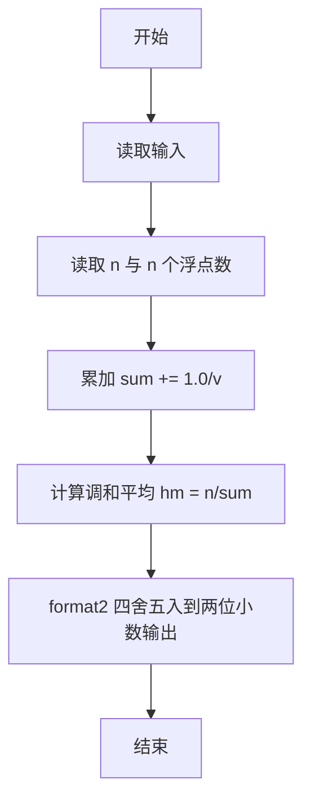

# L1-068 - 调和平均（10 分）

- **时间限制**: 400 ms
- **内存限制**: 65536 KB
- **代码长度限制**: 16 KB

---

## 题目描述


$$N$$ 个正数的**算数平均**是这些数的和除以 $$N$$，它们的**调和平均**是它们倒数的算数平均的倒数。本题就请你计算给定的一系列正数的调和平均值。

### 输入格式:

每个输入包含 1 个测试用例。每个测试用例第 1 行给出正整数 $$N$$ ($$\le 1000$$)；第 2 行给出 $$N$$ 个正数，都在区间 $$[0.1, 100]$$ 内。

### 输出格式:

在一行中输出给定数列的调和平均值，输出小数点后2位。

### 输入样例:
```in
8
10 15 12.7 0.3 4 13 1 15.6
```

### 输出样例:
```out
1.61
```

## 示例

### 示例 1

**输入:**
```
8
10 15 12.7 0.3 4 13 1 15.6
```

**输出:**
```
1.61
```

---

### 解题思路

#### 题目分析
本题为“调和平均”（调和平均数）。题面要求根据给定输入按规则计算并输出结果，输入规模小但需注意格式与边界。调和平均数的判定涉及多分支或字符串处理，需将输入准确分词后逐项处理。仓颉实现中通过 `readToEnd`/`readln` 读取并以空白或行分割，兼顾有无换行与多空格的情况。

#### 核心算法
H = n / Σ(1/x_i)，累加倒数后求倒，保留两位小数。实现上直接模拟题意：先将原始输入规范化为 Token 或行数组，再按规则遍历计算。例如 读取 n 与 n 个浮点数，随后 累加 sum += 1.0/v，最后按条件分支输出。算法保持线性遍历，无需复杂数据结构，仅需若干计数器与集合即可完成。

#### 复杂度分析
- **时间复杂度**：O(n)。
- **空间复杂度**：O(n)，仅需常量或线性辅助数组存储输入分词结果。

### 代码流程说明

1. 读取 n 与 n 个浮点数。
2. 累加 sum += 1.0/v。
3. 计算调和平均 hm = n/sum。
4. format2 四舍五入到两位小数输出。
5. 输出换行并结束程序。

### 代码实现

完整仓颉源码如下（与 `.cj` 文件一致）：

```cangjie
// L1-068 调和平均 - 保留2位
import std.env.*
import std.collection.*
import std.convert.*
import std.math.*

func format2(x: Float64): String {
    let scaled = Int64(round(x * 100.0))
    let neg = scaled < 0
    let a: Int64 = if (neg) { -scaled } else { scaled }
    let intPart = a / 100
    let frac = a % 100
    let sign = if (neg) { "-" } else { "" }
    let fracStr = if (frac < 10) { "0${frac}" } else { "${frac}" }
    return "${sign}${intPart}.${fracStr}"
}

main() {
    let all = (getStdIn().readToEnd() ?? "")
    var tokens = ArrayList<String>()
    var cur = StringBuilder()
    let ra = all.toRuneArray()
    for (i in 0..Int64(ra.size)) {
        let c = ra[i]
        if (c != r' ' && c != r'\n' && c != r'\r' && c != r'\t') {
            cur.append("${c}")
        } else {
            if (cur.size > 0) { tokens.add(cur.toString()); cur = StringBuilder() }
        }
    }
    if (cur.size > 0) { tokens.add(cur.toString()) }
    if (tokens.size == 0) { return }
    let n = Int64.parse(tokens[0])
    var sum: Float64 = 0.0
    for (i in 1..n+1) {
        if (i >= Int64(tokens.size)) { break }
        let v = Float64.parse(tokens[i])
        sum += 1.0 / v
    }
    let hm = Float64(n) / sum
    println(format2(hm))
}
```

### 代码流程图



### 解题流程图

```mermaid
flowchart TD
    A[开始] --> B[理解题意与输入输出要求]
    B --> C[提炼核心: 调和平均数]
    C --> D[选择算法: H = n / Σ(1/x_]
    D --> E[实现计算与判断]
    E --> F[输出结果并验证样例]
    F --> G[结束]
```
