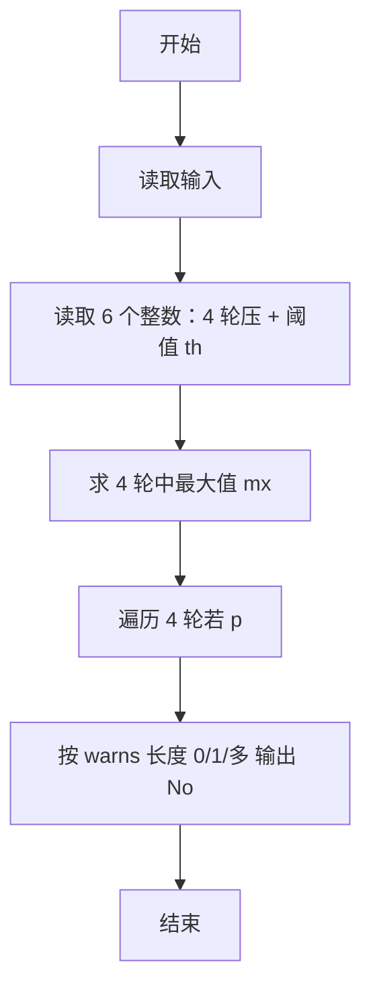
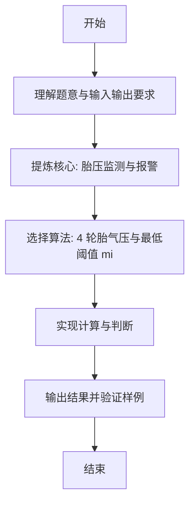

# L1-069 - 胎压监测（15 分）

- **时间限制**: 400 ms
- **内存限制**: 65536 KB
- **代码长度限制**: 16 KB

---

## 题目描述


小轿车中有一个系统随时监测四个车轮的胎压，如果四轮胎压不是很平衡，则可能对行车造成严重的影响。


让我们把四个车轮 —— 左前轮、右前轮、右后轮、左后轮 —— 顺次编号为 1、2、3、4。本题就请你编写一个监测程序，随时监测四轮的胎压，并给出正确的报警信息。报警规则如下：

- 如果所有轮胎的压力值与它们中的最大值误差在一个给定阈值内，并且都不低于系统设定的最低报警胎压，则说明情况正常，不报警；
- 如果存在一个轮胎的压力值与它们中的最大值误差超过了阈值，或者低于系统设定的最低报警胎压，则不仅要报警，而且要给出可能漏气的轮胎的准确位置；
- 如果存在两个或两个以上轮胎的压力值与它们中的最大值误差超过了阈值，或者低于系统设定的最低报警胎压，则报警要求检查所有轮胎。

### 输入格式:

输入在一行中给出 6 个 [0, 400] 范围内的整数，依次为 1~4 号轮胎的胎压、最低报警胎压、以及胎压差的阈值。

### 输出格式:

根据输入的胎压值给出对应信息：

- 如果不用报警，输出 `Normal`；
- 如果有一个轮胎需要报警，输出 `Warning: please check #X!`，其中 `X` 是出问题的轮胎的编号；
- 如果需要检查所有轮胎，输出 `Warning: please check all the tires!`。

### 输入样例 1：
```in
242 251 231 248 230 20
```

### 输出样例 1：
```out
Normal
```

### 输入样例 2：
```in
242 251 232 248 230 10
```

### 输出样例 2：
```out
Warning: please check #3!
```

### 输入样例 3：
```in
240 251 232 248 240 10
```

### 输出样例 3：
```out
Warning: please check all the tires!
```

## 示例

### 示例 1

**输入:**
```
242 251 231 248 230 20
```

**输出:**
```
Normal
```

### 示例 2

**输入:**
```
242 251 232 248 230 10
```

**输出:**
```
Warning: please check #3!
```

### 示例 3

**输入:**
```
240 251 232 248 240 10
```

**输出:**
```
Warning: please check all the tires!
```

---

### 解题思路

#### 题目分析
本题为“胎压监测”（胎压监测与报警）。题面要求根据给定输入按规则计算并输出结果，输入规模小但需注意格式与边界。胎压监测与报警的判定涉及多分支或字符串处理，需将输入准确分词后逐项处理。仓颉实现中通过 `readToEnd`/`readln` 读取并以空白或行分割，兼顾有无换行与多空格的情况。

#### 核心算法
4 轮胎气压与最低阈值 minP 比较，结合最大胎压差阈值 th，统计异常轮胎数分级报警。实现上直接模拟题意：先将原始输入规范化为 Token 或行数组，再按规则遍历计算。例如 读取 6 个整数：4 轮压 + 阈值 t，随后 求 4 轮中最大值 mx，最后按条件分支输出。算法保持线性遍历，无需复杂数据结构，仅需若干计数器与集合即可完成。

#### 复杂度分析
- **时间复杂度**：O(1) 固定 4 轮。
- **空间复杂度**：O(1)，仅需常量或线性辅助数组存储输入分词结果。

### 代码流程说明

1. 读取 6 个整数：4 轮压 + 阈值 th + 最低压 minP。
2. 求 4 轮中最大值 mx。
3. 遍历 4 轮若 p<minP 或 mx-p>th 加入 warns。
4. 按 warns 长度 0/1/多 输出 Normal 或单轮/全部报警。
5. 输出换行并结束程序。

### 代码实现

完整仓颉源码如下（与 `.cj` 文件一致）：

```cangjie
// L1-069 胎压监测
import std.env.*
import std.collection.*
import std.convert.*

main() {
    let all = (getStdIn().readToEnd() ?? "")
    var vals = ArrayList<Int64>()
    var cur = StringBuilder()
    var has = false
    var neg = false
    let ra = all.toRuneArray()
    for (i in 0..Int64(ra.size)) {
        let c = ra[i]
        if (c == r'-') { neg = true }
        else if (c >= r'0' && c <= r'9') { cur.append("${c}"); has = true }
        else {
            if (has) {
                var v = Int64.parse(cur.toString())
                if (neg) { v = -v }
                vals.add(v)
                cur = StringBuilder(); has = false; neg = false
            } else { neg = false }
        }
    }
    if (has) {
        var v = Int64.parse(cur.toString())
        if (neg) { v = -v }
        vals.add(v)
    }
    if (vals.size < 6) { return }
    let minP = vals[4]
    let th = vals[5]
    var mx: Int64 = vals[0]
    for (i in 1..4) { if (vals[i] > mx) { mx = vals[i] } }
    var warns = ArrayList<Int64>()
    for (i in 0..4) {
        let p = vals[i]
        if (p < minP || mx - p > th) { warns.add(i+1) }
    }
    if (warns.size == 0) {
        println("Normal")
    } else if (warns.size == 1) {
        println("Warning: please check #${warns[0]}!")
    } else {
        println("Warning: please check all the tires!")
    }
}
```

### 代码流程图



### 解题流程图


