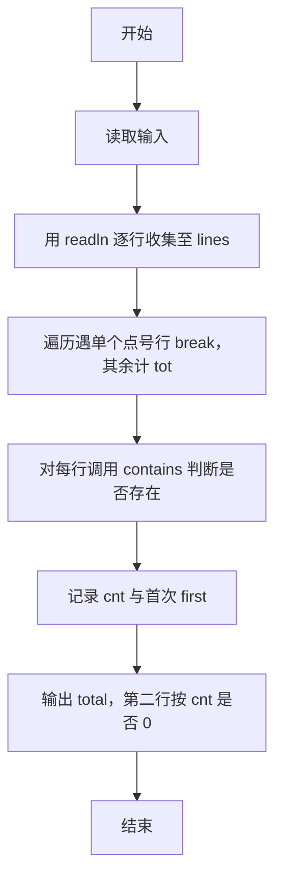
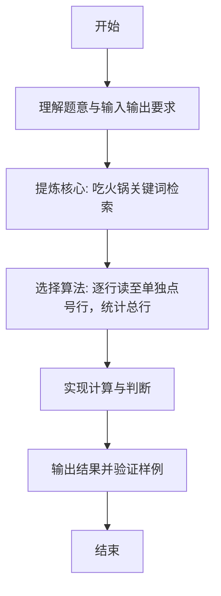

# L1-070 - 吃火锅（15 分）

- **时间限制**: 400 ms
- **内存限制**: 65536 KB
- **代码长度限制**: 16 KB

---

## 题目描述


以上图片来自微信朋友圈：这种天气你有什么破事打电话给我基本没用。但是如果你说“吃火锅”，那就厉害了，我们的故事就开始了。

本题要求你实现一个程序，自动检查你朋友给你发来的信息里有没有 `chi1 huo3 guo1`。

### 输入格式:

输入每行给出一句不超过 80 个字符的、以回车结尾的朋友信息，信息为非空字符串，仅包括字母、数字、空格、可见的半角标点符号。当读到某一行只有一个英文句点 `.` 时，输入结束，此行不算在朋友信息里。

### 输出格式:

首先在一行中输出朋友信息的总条数。然后对朋友的每一行信息，检查其中是否包含 `chi1 huo3 guo1`，并且统计这样厉害的信息有多少条。在第二行中首先输出第一次出现 `chi1 huo3 guo1` 的信息是第几条（从 1 开始计数），然后输出这类信息的总条数，其间以一个空格分隔。题目保证输出的所有数字不超过 100。

如果朋友从头到尾都没提 `chi1 huo3 guo1` 这个关键词，则在第二行输出一个表情 `-_-#`。

### 输入样例 1：
```in
Hello!
are you there?
wantta chi1 huo3 guo1?
that's so li hai le
our story begins from chi1 huo3 guo1 le
.
```

### 输出样例 1：
```out
5
3 2
```

### 输入样例 2：
```in
Hello!
are you there?
wantta qi huo3 guo1 chi1huo3guo1?
that's so li hai le
our story begins from ci1 huo4 guo2 le
.
```

### 输出样例 2：
```out
5
-_-#
```

## 示例

### 示例 1

**输入:**
```
Hello!
are you there?
wantta chi1 huo3 guo1?
that's so li hai le
our story begins from chi1 huo3 guo1 le
.
```

**输出:**
```
5
3 2
```

### 示例 2

**输入:**
```
Hello!
are you there?
wantta qi huo3 guo1 chi1huo3guo1?
that's so li hai le
our story begins from ci1 huo4 guo2 le
.
```

**输出:**
```
5
-_-#
```

---

### 解题思路

#### 题目分析
本题为“吃火锅”（吃火锅关键词检索）。题面要求根据给定输入按规则计算并输出结果，输入规模小但需注意格式与边界。吃火锅关键词检索的判定涉及多分支或字符串处理，需将输入准确分词后逐项处理。仓颉实现中通过 `readToEnd`/`readln` 读取并以空白或行分割，兼顾有无换行与多空格的情况。

#### 核心算法
逐行读至单独点号行，统计总行数与包含子串 chi1 huo3 guo1 的行数及首次出现行号。实现上直接模拟题意：先将原始输入规范化为 Token 或行数组，再按规则遍历计算。例如 用 readln 逐行收集至 lines，随后 遍历遇单个点号行 break，其余计 total，最后按条件分支输出。算法保持线性遍历，无需复杂数据结构，仅需若干计数器与集合即可完成。

#### 复杂度分析
- **时间复杂度**：O(T·L) T 行 L 平均长度。
- **空间复杂度**：O(1)，仅需常量或线性辅助数组存储输入分词结果。

### 代码流程说明

1. 用 readln 逐行收集至 lines。
2. 遍历遇单个点号行 break，其余计 total。
3. 对每行调用 contains 判断是否存在 chi1 huo3 guo1。
4. 记录 cnt 与首次 first。
5. 输出 total，第二行按 cnt 是否 0 输出 -_-# 或 first cnt。

### 代码实现

完整仓颉源码如下（与 `.cj` 文件一致）：

```cangjie
// L1-070 吃火锅
import std.env.*
import std.collection.*
import std.convert.*

func contains(hay: String, needle: String): Bool {
    if (needle.size == 0) { return true }
    if (hay.size < needle.size) { return false }
    let ha = hay.toRuneArray()
    let na = needle.toRuneArray()
    let h = Int64(ha.size)
    let n = Int64(na.size)
    for (i in 0..h - n + 1) {
        var ok = true
        for (j in 0..n) {
            if (ha[i + j] != na[j]) { ok = false; break }
        }
        if (ok) { return true }
    }
    return false
}

main() {
    let cin = getStdIn()
    var lines = ArrayList<String>()
    while (let Some(line) <- cin.readln()) {
        lines.add(line)
    }
    var total: Int64 = 0
    var cnt: Int64 = 0
    var first: Int64 = 0
    let kw = "chi1 huo3 guo1"
    for (i in 0..Int64(lines.size)) {
        let s = lines[i]
        if (s == ".") { break }
        total += 1
        if (contains(s, kw)) {
            cnt += 1
            if (first == 0) { first = total }
        }
    }
    println(total)
    if (cnt == 0) {
        println("-_-#")
    } else {
        println("${first} ${cnt}")
    }
}
```

### 代码流程图



### 解题流程图


