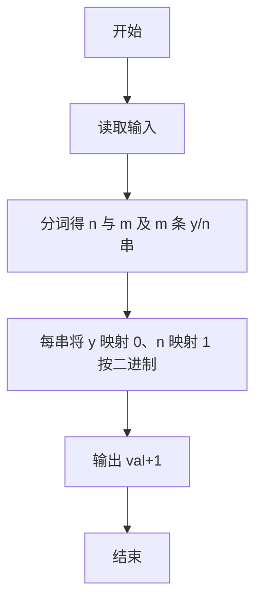
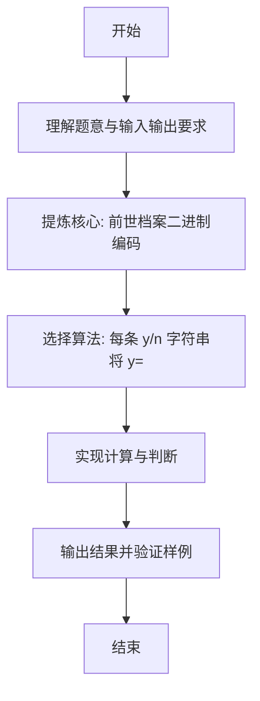

# L1-071 - 前世档案（20 分）

- **时间限制**: 400 ms
- **内存限制**: 65536 KB
- **代码长度限制**: 16 KB

---

## 题目描述


网络世界中时常会遇到这类滑稽的算命小程序，实现原理很简单，随便设计几个问题，根据玩家对每个问题的回答选择一条判断树中的路径（如下图所示），结论就是路径终点对应的那个结点。


现在我们把结论从左到右顺序编号，编号从 1 开始。这里假设回答都是简单的“是”或“否”，又假设回答“是”对应向左的路径，回答“否”对应向右的路径。给定玩家的一系列回答，请你返回其得到的结论的编号。

### 输入格式:

输入第一行给出两个正整数：$$N$$（$$\le 30$$）为玩家做一次测试要回答的问题数量；$$M$$（$$\le 100$$）为玩家人数。

随后 $$M$$ 行，每行顺次给出玩家的 $$N$$ 个回答。这里用 `y` 代表“是”，用 `n` 代表“否”。

### 输出格式:

对每个玩家，在一行中输出其对应的结论的编号。

### 输入样例:
```in
3 4
yny
nyy
nyn
yyn
```

### 输出样例:
```out
3
5
6
2
```

## 示例

### 示例 1

**输入:**
```
3 4
yny
nyy
nyn
yyn
```

**输出:**
```
3
5
6
2
```

---

### 解题思路

#### 题目分析
本题为“前世档案”（前世档案二进制编码）。题面要求根据给定输入按规则计算并输出结果，输入规模小但需注意格式与边界。前世档案二进制编码的判定涉及多分支或字符串处理，需将输入准确分词后逐项处理。仓颉实现中通过 `readToEnd`/`readln` 读取并以空白或行分割，兼顾有无换行与多空格的情况。

#### 核心算法
每条 y/n 字符串将 y=0 n=1 视为二进制数，转十进制后 +1 即档案编号。实现上直接模拟题意：先将原始输入规范化为 Token 或行数组，再按规则遍历计算。例如 分词得 n 与 m 及 m 条 y/n ，随后 每串将 y 映射 0、n 映射 1 按二进制累加 val=val*2+bit，最后按条件分支输出。算法保持线性遍历，无需复杂数据结构，仅需若干计数器与集合即可完成。

#### 复杂度分析
- **时间复杂度**：O(m·n)。
- **空间复杂度**：O(1)，仅需常量或线性辅助数组存储输入分词结果。

### 代码流程说明

1. 分词得 n 与 m 及 m 条 y/n 串。
2. 每串将 y 映射 0、n 映射 1 按二进制累加 val=val*2+bit。
3. 输出 val+1。
4. 输出换行并结束程序。

### 代码实现

完整仓颉源码如下（与 `.cj` 文件一致）：

```cangjie
// L1-071 前世档案 - y=0 n=1 二进制+1
import std.env.*
import std.collection.*
import std.convert.*

main() {
    let all = (getStdIn().readToEnd() ?? "")
    var tokens = ArrayList<String>()
    var cur = StringBuilder()
    let ra = all.toRuneArray()
    for (i in 0..Int64(ra.size)) {
        let c = ra[i]
        if (c != r' ' && c != r'\n' && c != r'\r' && c != r'\t') {
            cur.append("${c}")
        } else {
            if (cur.size > 0) { tokens.add(cur.toString()); cur = StringBuilder() }
        }
    }
    if (cur.size > 0) { tokens.add(cur.toString()) }
    if (tokens.size < 2) { return }
    let n = Int64.parse(tokens[0])
    let m = Int64.parse(tokens[1])
    for (i in 0..m) {
        let idx = 2 + i
        if (idx >= Int64(tokens.size)) { break }
        let s = tokens[idx]
        var val: Int64 = 0
        let sa = s.toRuneArray()
        for (j in 0..n) {
            if (j >= Int64(sa.size)) { break }
            let c = sa[j]
            let bit: Int64 = if (c == r'n') { 1 } else { 0 }
            val = val * 2 + bit
        }
        println(val + 1)
    }
}
```

### 代码流程图



### 解题流程图


