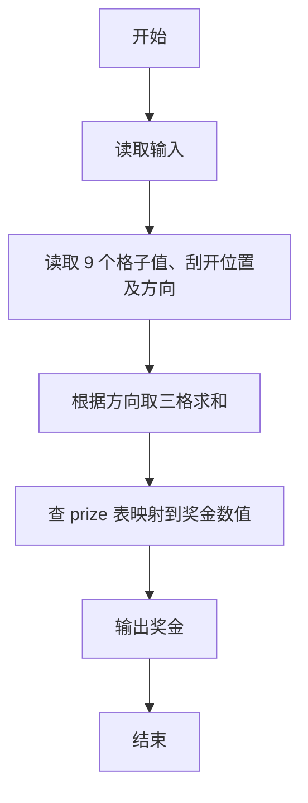
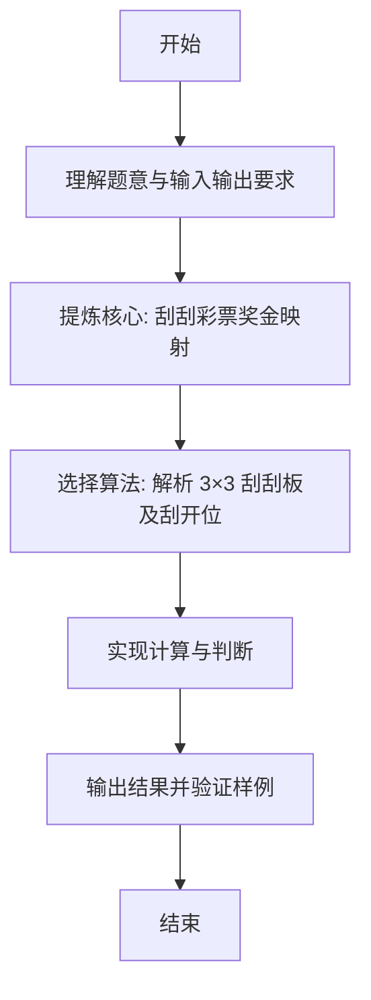

# L1-072 - 刮刮彩票（20 分）

- **时间限制**: 400 ms
- **内存限制**: 65536 KB
- **代码长度限制**: 16 KB

---

## 题目描述


“刮刮彩票”是一款网络游戏里面的一个小游戏。如图所示：


每次游戏玩家会拿到一张彩票，上面会有 9 个数字，分别为数字 1 到数字 9，数字各不重复，并以 $$3\times3$$ 的“九宫格”形式排布在彩票上。

在游戏开始时能看见一个位置上的数字，其他位置上的数字均不可见。你可以选择三个位置的数字刮开，这样玩家就能看见四个位置上的数字了。最后玩家再从 3 横、3 竖、2 斜共 8 个方向中挑选一个方向，方向上三个数字的和可根据下列表格进行兑奖，获得对应数额的金币。


| 数字合计 | 获得金币 | 数字合计 | 获得金币 |
| -------- | -------- | -------- | -------- |
| 6     | 10,000     | 16     | 72     |
| 7     | 36     | 17     | 180     |
| 8     | 720     | 18     | 119     |
| 9     | 360     | 19     | 36     |
| 10     | 80     | 20     | 306     |
| 11    | 252     | 21     | 1,080     |
| 12    | 108     | 22    | 144     |
| 13    | 72     | 23    | 1,800     |
| 14    | 54     | 24    | 3,600     |
| 15    | 180     |      ||      |


现在请你写出一个模拟程序，模拟玩家的游戏过程。

### 输入格式:

输入第一部分给出一张合法的彩票，即用 3 行 3 列给出 0 至 9 的数字。**0 表示的是这个位置上的数字初始时就能看见了**，而不是彩票上的数字为 0。

第二部给出玩家刮开的三个位置，分为三行，每行按格式 `x y` 给出玩家刮开的位置的行号和列号（题目中定义左上角的位置为第 1 行、第 1 列。）。数据保证玩家不会重复刮开已刮开的数字。

最后一部分给出玩家选择的方向，即一个整数： 1 至 3 表示选择横向的第一行、第二行、第三行，4 至 6 表示纵向的第一列、第二列、第三列，7、8分别表示左上到右下的主对角线和右上到左下的副对角线。

### 输出格式:

对于每一个刮开的操作，在一行中输出玩家能看到的数字。最后对于选择的方向，在一行中输出玩家获得的金币数量。

### 输入样例:
```in
1 2 3
4 5 6
7 8 0
1 1
2 2
2 3
7
```

### 输出样例:
```out
1
5
6
180
```

## 示例

### 示例 1

**输入:**
```
1 2 3
4 5 6
7 8 0
1 1
2 2
2 3
7
```

**输出:**
```
1
5
6
180
```

---

### 解题思路

#### 题目分析
本题为“刮刮彩票”（刮刮彩票奖金映射）。题面要求根据给定输入按规则计算并输出结果，输入规模小但需注意格式与边界。刮刮彩票奖金映射的判定涉及多分支或字符串处理，需将输入准确分词后逐项处理。仓颉实现中通过 `readToEnd`/`readln` 读取并以空白或行分割，兼顾有无换行与多空格的情况。

#### 核心算法
解析 3×3 刮刮板及刮开位置，按方向求三数和查表映射奖金。实现上直接模拟题意：先将原始输入规范化为 Token 或行数组，再按规则遍历计算。例如 读取 9 个格子值、刮开位置及方向，随后 根据方向取三格求和，最后按条件分支输出。算法保持线性遍历，无需复杂数据结构，仅需若干计数器与集合即可完成。

#### 复杂度分析
- **时间复杂度**：O(1) 常量表查询。
- **空间复杂度**：O(1)，仅需常量或线性辅助数组存储输入分词结果。

### 代码流程说明

1. 读取 9 个格子值、刮开位置及方向。
2. 根据方向取三格求和。
3. 查 prize 表映射到奖金数值。
4. 输出奖金。
5. 输出换行并结束程序。

### 代码实现

完整仓颉源码如下（与 `.cj` 文件一致）：

```cangjie
// L1-072 刮刮彩票
import std.env.*
import std.collection.*
import std.convert.*

func prize(sum: Int64): Int64 {
    if (sum == 6) { return 10000 }
    if (sum == 7) { return 36 }
    if (sum == 8) { return 720 }
    if (sum == 9) { return 360 }
    if (sum == 10) { return 80 }
    if (sum == 11) { return 252 }
    if (sum == 12) { return 108 }
    if (sum == 13) { return 72 }
    if (sum == 14) { return 54 }
    if (sum == 15) { return 180 }
    if (sum == 16) { return 72 }
    if (sum == 17) { return 180 }
    if (sum == 18) { return 119 }
    if (sum == 19) { return 36 }
    if (sum == 20) { return 306 }
    if (sum == 21) { return 1080 }
    if (sum == 22) { return 144 }
    if (sum == 23) { return 1800 }
    if (sum == 24) { return 3600 }
    return 0
}

main() {
    let all = (getStdIn().readToEnd() ?? "")
    var vals = ArrayList<Int64>()
    var cur = StringBuilder()
    var has = false
    var neg = false
    let ra = all.toRuneArray()
    for (i in 0..Int64(ra.size)) {
        let c = ra[i]
        if (c == r'-') { neg = true }
        else if (c >= r'0' && c <= r'9') { cur.append("${c}"); has = true }
        else {
            if (has) {
                var v = Int64.parse(cur.toString())
                if (neg) { v = -v }
                vals.add(v)
                cur = StringBuilder(); has = false; neg = false
            } else { neg = false }
        }
    }
    if (has) {
        var v = Int64.parse(cur.toString())
        if (neg) { v = -v }
        vals.add(v)
    }
    if (vals.size < 16) { return }
    var grid = Array<Array<Int64>>(3, {i => Array<Int64>(3, repeat: 0)})
    var sumKnown: Int64 = 0
    var zx: Int64 = 0
    var zy: Int64 = 0
    for (i in 0..3) {
        for (j in 0..3) {
            let v = vals[(i*3+j)]
            grid[i][j] = v
            if (v == 0) { zx = i; zy = j } else { sumKnown += v }
        }
    }
    let zeroVal = 45 - sumKnown
    grid[zx][zy] = zeroVal
    var outIdx: Int64 = 9
    for (_ in 0..3) {
        let x = vals[outIdx] - 1
        let y = vals[outIdx+1] - 1
        outIdx += 2
        println(grid[x][y])
    }
    let dir = vals[vals.size - 1]
    var s: Int64 = 0
    if (dir == 1) { s = grid[0][0]+grid[0][1]+grid[0][2] }
    else if (dir == 2) { s = grid[1][0]+grid[1][1]+grid[1][2] }
    else if (dir == 3) { s = grid[2][0]+grid[2][1]+grid[2][2] }
    else if (dir == 4) { s = grid[0][0]+grid[1][0]+grid[2][0] }
    else if (dir == 5) { s = grid[0][1]+grid[1][1]+grid[2][1] }
    else if (dir == 6) { s = grid[0][2]+grid[1][2]+grid[2][2] }
    else if (dir == 7) { s = grid[0][0]+grid[1][1]+grid[2][2] }
    else if (dir == 8) { s = grid[0][2]+grid[1][1]+grid[2][0] }
    println(prize(s))
}
```

### 代码流程图



### 解题流程图


