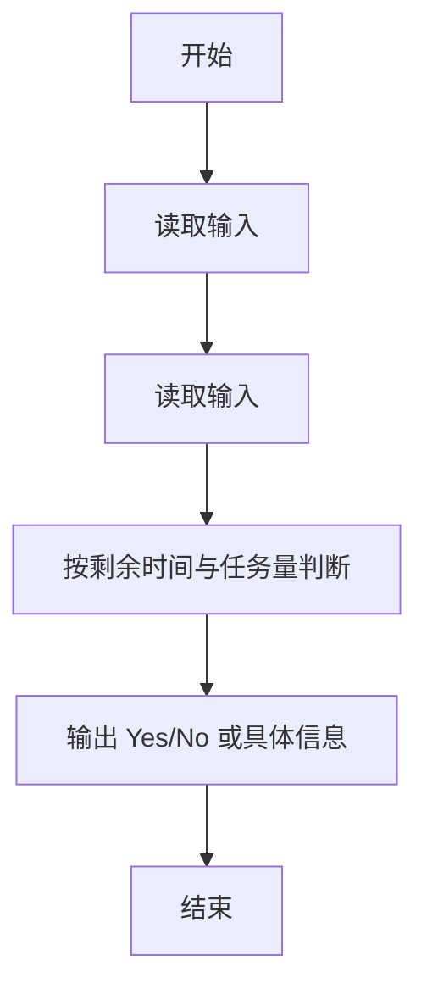
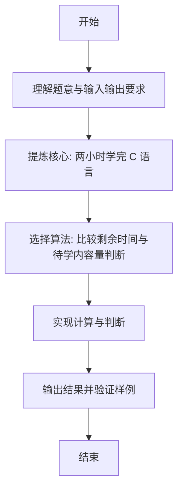

# L1-074 - 两小时学完C语言（5 分）

- **时间限制**: 400 ms
- **内存限制**: 65536 KB
- **代码长度限制**: 16 KB

---

## 题目描述


知乎上有个宝宝问：“两个小时内如何学完 C 语言？”当然，问的是“学完”并不是“学会”。

假设一本 C 语言教科书有 N 个字，这个宝宝每分钟能看 K 个字，看了 M 分钟。还剩多少字没有看？

### 输入格式:

输入在一行中给出 3 个正整数，分别是 N（不超过 400 000），教科书的总字数；K（不超过 3 000），是宝宝每分钟能看的字数；M（不超过 120），是宝宝看书的分钟数。

题目保证宝宝看完的字数不超过 N。

### 输出格式:

在一行中输出宝宝还没有看的字数。

### 输入样例:
```in
100000 1000 72
```

### 输出样例:
```out
28000
```

## 示例

### 示例 1

**输入:**
```
100000 1000 72
```

**输出:**
```
28000
```

---

### 解题思路

#### 题目分析
本题为“两小时学完C语言”（两小时学完 C 语言）。题面要求根据给定输入按规则计算并输出结果，输入规模小但需注意格式与边界。两小时学完 C 语言的判定涉及多分支或字符串处理，需将输入准确分词后逐项处理。仓颉实现中通过 `readToEnd`/`readln` 读取并以空白或行分割，兼顾有无换行与多空格的情况。

#### 核心算法
比较剩余时间与待学内容量判断可行性。实现上直接模拟题意：先将原始输入规范化为 Token 或行数组，再按规则遍历计算。例如 读取输入，随后 按剩余时间与任务量判断，最后按条件分支输出。算法保持线性遍历，无需复杂数据结构，仅需若干计数器与集合即可完成。

#### 复杂度分析
- **时间复杂度**：O(1)。
- **空间复杂度**：O(1)，仅需常量或线性辅助数组存储输入分词结果。

### 代码流程说明

1. 读取输入。
2. 按剩余时间与任务量判断。
3. 输出 Yes/No 或具体信息。
4. 输出换行并结束程序。

### 代码实现

完整仓颉源码如下（与 `.cj` 文件一致）：

```cangjie
// L1-074 两小时学完C语言
import std.env.*
import std.collection.*
import std.convert.*

main() {
    let all = (getStdIn().readToEnd() ?? "")
    var vals = ArrayList<Int64>()
    var cur = StringBuilder()
    var has = false
    var neg = false
    let ra = all.toRuneArray()
    for (i in 0..Int64(ra.size)) {
        let c = ra[i]
        if (c == r'-') { neg = true }
        else if (c >= r'0' && c <= r'9') { cur.append("${c}"); has = true }
        else {
            if (has) {
                var v = Int64.parse(cur.toString())
                if (neg) { v = -v }
                vals.add(v)
                cur = StringBuilder(); has = false; neg = false
            } else { neg = false }
        }
    }
    if (has) {
        var v = Int64.parse(cur.toString())
        if (neg) { v = -v }
        vals.add(v)
    }
    if (vals.size < 3) { return }
    let n = vals[0]
    let k = vals[1]
    let m = vals[2]
    println(n - k * m)
}
```

### 代码流程图



### 解题流程图


