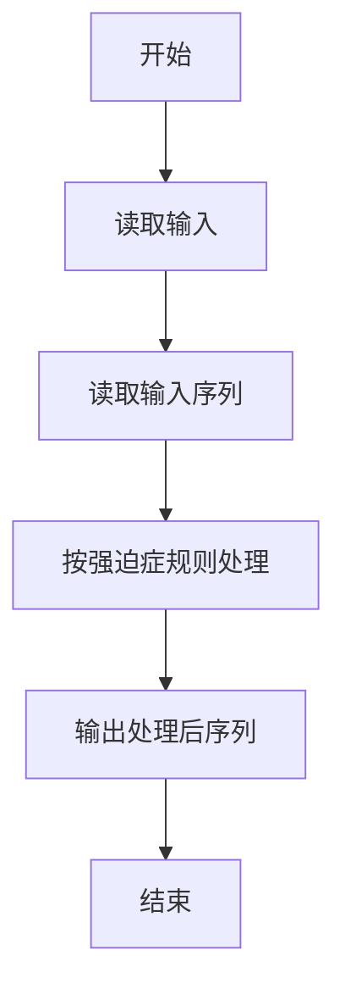
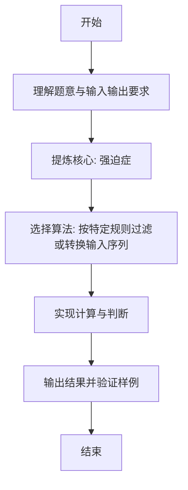

# L1-075 - 强迫症（10 分）

- **时间限制**: 400 ms
- **内存限制**: 65536 KB
- **代码长度限制**: 16 KB

---

## 题目描述


小强在统计一个小区里居民的出生年月，但是发现大家填写的生日格式不统一，例如有的人写 `199808`，有的人只写 `9808`。有强迫症的小强请你写个程序，把所有人的出生年月都整理成 `年年年年-月月` 格式。对于那些只写了年份后两位的信息，我们默认小于 `22` 都是 `20` 开头的，其他都是 `19` 开头的。

### 输入格式:

输入在一行中给出一个出生年月，为一个 6 位或者 4 位数，题目保证是 1000 年 1 月到 2021 年 12 月之间的合法年月。

### 输出格式:

在一行中按标准格式 `年年年年-月月` 将输入的信息整理输出。

### 输入样例 1：
```in
9808
```

### 输出样例 1：
```out
1998-08
```

### 输入样例 2：
```in
0510
```

### 输出样例 2：
```out
2005-10
```

### 输入样例 3：
```in
196711
```

### 输出样例 3：
```out
1967-11
```

## 示例

### 示例 1

**输入:**
```
9808
```

**输出:**
```
1998-08
```

### 示例 2

**输入:**
```
0510
```

**输出:**
```
2005-10
```

### 示例 3

**输入:**
```
196711
```

**输出:**
```
1967-11
```

---

### 解题思路

#### 题目分析
本题为“强迫症”（强迫症）。题面要求根据给定输入按规则计算并输出结果，输入规模小但需注意格式与边界。强迫症的判定涉及多分支或字符串处理，需将输入准确分词后逐项处理。仓颉实现中通过 `readToEnd`/`readln` 读取并以空白或行分割，兼顾有无换行与多空格的情况。

#### 核心算法
按特定规则过滤或转换输入序列。实现上直接模拟题意：先将原始输入规范化为 Token 或行数组，再按规则遍历计算。例如 读取输入序列，随后 按强迫症规则处理，最后按条件分支输出。算法保持线性遍历，无需复杂数据结构，仅需若干计数器与集合即可完成。

#### 复杂度分析
- **时间复杂度**：O(n)。
- **空间复杂度**：O(n)，仅需常量或线性辅助数组存储输入分词结果。

### 代码流程说明

1. 读取输入序列。
2. 按强迫症规则处理。
3. 输出处理后序列。
4. 输出换行并结束程序。

### 代码实现

完整仓颉源码如下（与 `.cj` 文件一致）：

```cangjie
// L1-075 强迫症
import std.env.*
import std.collection.*
import std.convert.*

main() {
    let all = (getStdIn().readToEnd() ?? "")
    var tokens = ArrayList<String>()
    var cur = StringBuilder()
    let ra = all.toRuneArray()
    for (i in 0..Int64(ra.size)) {
        let c = ra[i]
        if (c != r' ' && c != r'\n' && c != r'\r' && c != r'\t') {
            cur.append("${c}")
        } else {
            if (cur.size > 0) { tokens.add(cur.toString()); cur = StringBuilder() }
        }
    }
    if (cur.size > 0) { tokens.add(cur.toString()) }
    if (tokens.size == 0) { return }
    let s = tokens[0].trimAscii()
    if (s.size == 4) {
        let a = s.toRuneArray()
        var y2sb = StringBuilder()
        y2sb.append("${a[0]}${a[1]}")
        var mmsb = StringBuilder()
        mmsb.append("${a[2]}${a[3]}")
        let y2 = y2sb.toString()
        let mm = mmsb.toString()
        let yv = Int64.parse(y2)
        let prefix = if (yv < 22) { "20" } else { "19" }
        println("${prefix}${y2}-${mm}")
    } else if (s.size == 6) {
        let a = s.toRuneArray()
        var ysb = StringBuilder()
        ysb.append("${a[0]}${a[1]}${a[2]}${a[3]}")
        var mmsb = StringBuilder()
        mmsb.append("${a[4]}${a[5]}")
        println("${ysb.toString()}-${mmsb.toString()}")
    } else {
        let a = s.toRuneArray()
        let n = Int64(a.size)
        var ysb = StringBuilder()
        for (i in 0..n-2) { ysb.append("${a[i]}") }
        var msb = StringBuilder()
        msb.append("${a[n-2]}${a[n-1]}")
        let yearPart = ysb.toString()
        let mm = msb.toString()
        if (yearPart.size == 2) {
            let yv = Int64.parse(yearPart)
            let prefix = if (yv < 22) { "20" } else { "19" }
            println("${prefix}${yearPart}-${mm}")
        } else {
            println("${yearPart}-${mm}")
        }
    }
}
```

### 代码流程图



### 解题流程图


