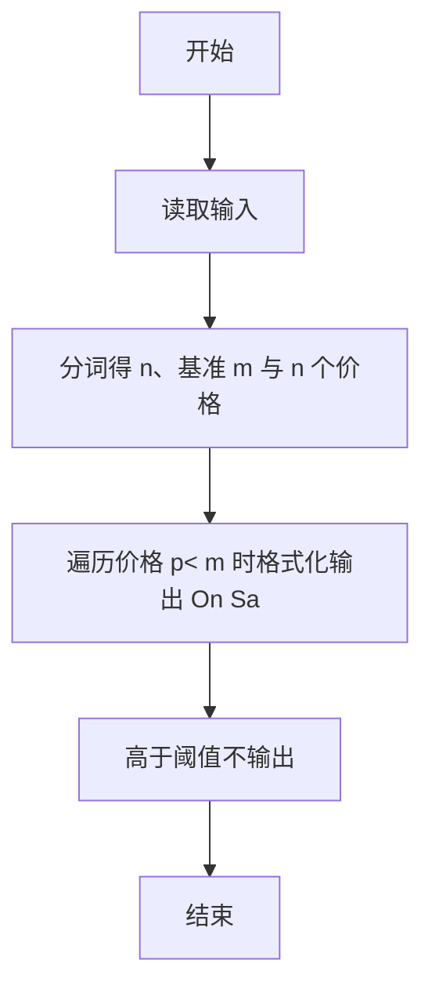
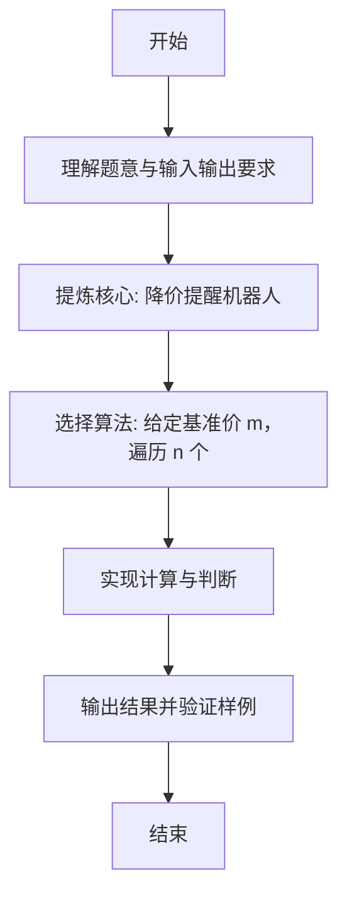

# L1-076 - 降价提醒机器人（10 分）

- **时间限制**: 400 ms
- **内存限制**: 65536 KB
- **代码长度限制**: 16 KB

---

## 题目描述


小 T 想买一个玩具很久了，但价格有些高，他打算等便宜些再买。但天天盯着购物网站很麻烦，请你帮小 T 写一个降价提醒机器人，当玩具的当前价格比他设定的价格便宜时发出提醒。

### 输入格式:

输入第一行是两个正整数 $$N$$ 和 $$M$$ ($$1 \le N \le 100, 0 \le M \le 1000$$)，表示有 $$N$$ 条价格记录，小 T 设置的价格为 $$M$$。

接下来 $$N$$ 行，每行有一个实数 $$P_i$$（$$-1000.0 < P_i < 1000.0$$），表示一条价格记录。

### 输出格式:

对每一条比设定价格 $$M$$ 便宜的价格记录 `P`，在一行中输出 `On Sale! P`，其中 `P` 输出到小数点后 1 位。

### 输入样例:
```in
4 99
98.0
97.0
100.2
98.9
```

### 输出样例:
```out
On Sale! 98.0
On Sale! 97.0
On Sale! 98.9
```

## 示例

### 示例 1

**输入:**
```
4 99
98.0
97.0
100.2
98.9
```

**输出:**
```
On Sale! 98.0
On Sale! 97.0
On Sale! 98.9
```

---

### 解题思路

#### 题目分析
本题为“降价提醒机器人”（降价提醒机器人）。题面要求根据给定输入按规则计算并输出结果，输入规模小但需注意格式与边界。降价提醒机器人的判定涉及多分支或字符串处理，需将输入准确分词后逐项处理。仓颉实现中通过 `readToEnd`/`readln` 读取并以空白或行分割，兼顾有无换行与多空格的情况。

#### 核心算法
给定基准价 m，遍历 n 个价格，低于 m 的按 On Sale! 格式输出。实现上直接模拟题意：先将原始输入规范化为 Token 或行数组，再按规则遍历计算。例如 分词得 n、基准 m 与 n 个价格，随后 遍历价格 p< m 时格式化输出 On Sale! + format1(p)，最后按条件分支输出。算法保持线性遍历，无需复杂数据结构，仅需若干计数器与集合即可完成。

#### 复杂度分析
- **时间复杂度**：O(n)。
- **空间复杂度**：O(n)，仅需常量或线性辅助数组存储输入分词结果。

### 代码流程说明

1. 分词得 n、基准 m 与 n 个价格。
2. 遍历价格 p< m 时格式化输出 On Sale! + format1(p)。
3. 高于阈值不输出。
4. 输出换行并结束程序。

### 代码实现

完整仓颉源码如下（与 `.cj` 文件一致）：

```cangjie
// L1-076 降价提醒机器人
import std.env.*
import std.collection.*
import std.convert.*
import std.math.*

func format1(x: Float64): String {
    let scaled = Int64(round(x * 10.0))
    let neg = scaled < 0
    let a: Int64 = if (neg) { -scaled } else { scaled }
    let intPart = a / 10
    let frac = a % 10
    let sign = if (neg) { "-" } else { "" }
    return "${sign}${intPart}.${frac}"
}

main() {
    let all = (getStdIn().readToEnd() ?? "")
    var tokens = ArrayList<String>()
    var cur = StringBuilder()
    let ra = all.toRuneArray()
    for (i in 0..Int64(ra.size)) {
        let c = ra[i]
        if (c != r' ' && c != r'\n' && c != r'\r' && c != r'\t') {
            cur.append("${c}")
        } else {
            if (cur.size > 0) { tokens.add(cur.toString()); cur = StringBuilder() }
        }
    }
    if (cur.size > 0) { tokens.add(cur.toString()) }
    if (tokens.size < 2) { return }
    let n = Int64.parse(tokens[0])
    let m = Float64.parse(tokens[1])
    for (i in 0..n) {
        let idx = 2 + i
        if (idx >= Int64(tokens.size)) { break }
        let p = Float64.parse(tokens[idx])
        if (p < m) {
            println("On Sale! ${format1(p)}")
        }
    }
}
```

### 代码流程图



### 解题流程图


