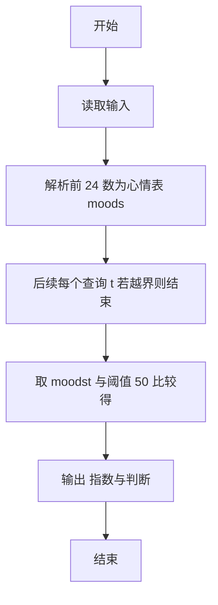
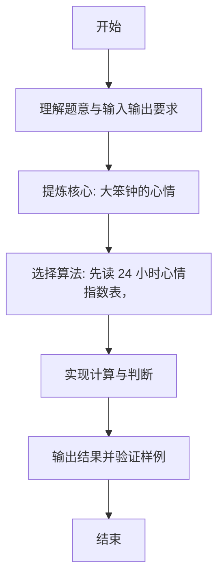

# L1-077 - 大笨钟的心情（15 分）

- **时间限制**: 400 ms
- **内存限制**: 65536 KB
- **代码长度限制**: 16 KB

---

## 题目描述


有网友问：未来还会有更多大笨钟题吗？笨钟回复说：看心情……

本题就请你替大笨钟写一个程序，根据心情自动输出回答。

### 输入格式:

输入在一行中给出 24 个 [0, 100] 区间内的整数，依次代表大笨钟在一天 24 小时中，每个小时的心情指数。

随后若干行，每行给出一个 [0, 23] 之间的整数，代表网友询问笨钟这个问题的时间点。当出现非法的时间点时，表示输入结束，这个非法输入不要处理。题目保证至少有 1 次询问。

### 输出格式:

对每一次提问，如果当时笨钟的心情指数大于 50，就在一行中输出 `心情指数 Yes`，否则输出 `心情指数 No`。

### 输入样例:
```in
80 75 60 50 20 20 20 20 55 62 66 51 42 33 47 58 67 52 41 20 35 49 50 63
17
7
3
15
-1
```

### 输出样例:
```out
52 Yes
20 No
50 No
58 Yes
```

## 示例

### 示例 1

**输入:**
```
80 75 60 50 20 20 20 20 55 62 66 51 42 33 47 58 67 52 41 20 35 49 50 63
17
7
3
15
-1
```

**输出:**
```
52 Yes
20 No
50 No
58 Yes
```

---

### 解题思路

#### 题目分析
本题为“大笨钟的心情”（大笨钟的心情）。题面要求根据给定输入按规则计算并输出结果，输入规模小但需注意格式与边界。大笨钟的心情的判定涉及多分支或字符串处理，需将输入准确分词后逐项处理。仓颉实现中通过 `readToEnd`/`readln` 读取并以空白或行分割，兼顾有无换行与多空格的情况。

#### 核心算法
先读 24 小时心情指数表，再按查询时间点输出指数与 Yes/No。实现上直接模拟题意：先将原始输入规范化为 Token 或行数组，再按规则遍历计算。例如 解析前 24 数为心情表 moods，随后 后续每个查询 t 若越界则结束，最后按条件分支输出。算法保持线性遍历，无需复杂数据结构，仅需若干计数器与集合即可完成。

#### 复杂度分析
- **时间复杂度**：O(1) 建表 O(q) 查询。
- **空间复杂度**：O(1)，仅需常量或线性辅助数组存储输入分词结果。

### 代码流程说明

1. 解析前 24 数为心情表 moods。
2. 后续每个查询 t 若越界则结束。
3. 取 moods[t] 与阈值 50 比较得 Yes/No。
4. 输出 指数与判断。
5. 输出换行并结束程序。

### 代码实现

完整仓颉源码如下（与 `.cj` 文件一致）：

```cangjie
// L1-077 大笨钟的心情
import std.env.*
import std.collection.*
import std.convert.*

main() {
    let all = (getStdIn().readToEnd() ?? "")
    var vals = ArrayList<Int64>()
    var cur = StringBuilder()
    var has = false
    var neg = false
    let ra = all.toRuneArray()
    for (i in 0..Int64(ra.size)) {
        let c = ra[i]
        if (c == r'-') { neg = true }
        else if (c >= r'0' && c <= r'9') { cur.append("${c}"); has = true }
        else {
            if (has) {
                var v = Int64.parse(cur.toString())
                if (neg) { v = -v }
                vals.add(v)
                cur = StringBuilder(); has = false; neg = false
            } else { neg = false }
        }
    }
    if (has) {
        var v = Int64.parse(cur.toString())
        if (neg) { v = -v }
        vals.add(v)
    }
    if (vals.size < 24) { return }
    var moods = Array<Int64>(24, repeat: 0)
    for (i in 0..24) { moods[i] = vals[i] }
    for (i in 24..Int64(vals.size)) {
        let t = vals[i]
        if (t < 0 || t >= 24) { break }
        let mv = moods[t]
        let ans = if (mv > 50) { "Yes" } else { "No" }
        println("${mv} ${ans}")
    }
}
```

### 代码流程图



### 解题流程图


