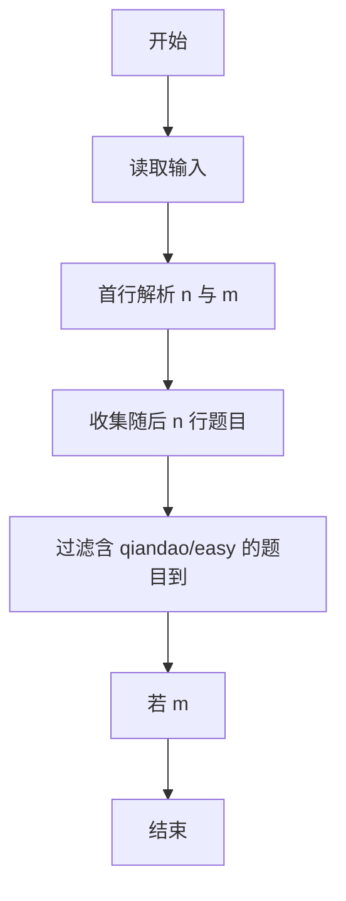
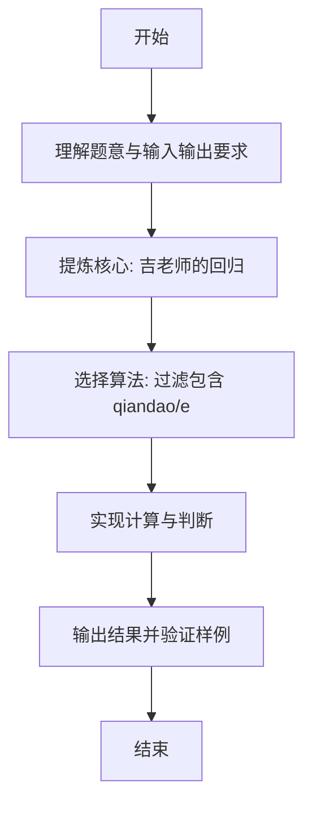

# L1-078 - 吉老师的回归（15 分）

- **时间限制**: 400 ms
- **内存限制**: 65536 KB
- **代码长度限制**: 16 KB

---

## 题目描述


曾经在天梯赛大杀四方的吉老师决定回归天梯赛赛场啦！

为了简化题目，我们不妨假设天梯赛的每道题目可以用一个不超过 500 的、只包括可打印符号的字符串描述出来，如：`Problem A: Print "Hello world!"`。

众所周知，吉老师的竞赛水平非常高超，你可以认为他每道题目都会做（事实上也是……）。因此，吉老师会按照顺序看题并做题。但吉老师水平太高了，所以签到题他就懒得做了（浪费时间），具体来说，假如题目的字符串里有 `qiandao` 或者 `easy`（区分大小写）的话，吉老师看完题目就会跳过这道题目不做。

现在给定这次天梯赛总共有几道题目以及吉老师已经做完了几道题目，请你告诉大家吉老师现在正在做哪个题，或者吉老师已经把所有他打算做的题目做完了。

*提醒：天梯赛有分数升级的规则，如果不做签到题可能导致团队总分不足以升级，一般的选手请千万不要学习吉老师的酷炫行为！*

### 输入格式:

输入第一行是两个正整数 $$N, M$$ ($$1 \le M\le N \le 30$$)，表示本次天梯赛有 $$N$$ 道题目，吉老师现在做完了 $$M$$ 道。

接下来 $$N$$ 行，每行是一个符合题目描述的字符串，表示天梯赛的题目内容。吉老师会按照给出的顺序看题——第一行就是吉老师看的第一道题，第二行就是第二道，以此类推。

### 输出格式:

在一行中输出吉老师当前正在做的题目对应的题面（即做完了 $$M$$ 道题目后，吉老师正在做哪个题）。如果吉老师已经把所有他打算做的题目做完了，输出一行 `Wo AK le`。

### 输入样例 1：
```in
5 1
L1-1 is a qiandao problem.
L1-2 is so...easy.
L1-3 is Easy.
L1-4 is qianDao.
Wow, such L1-5, so easy.
```

### 输出样例 1：
```out
L1-4 is qianDao.
```

### 输入样例 2：
```in
5 4
L1-1 is a-qiandao problem.
L1-2 is so easy.
L1-3 is Easy.
L1-4 is qianDao.
Wow, such L1-5, so!!easy.
```

### 输出样例 2：
```out
Wo AK le
```

## 示例

### 示例 1

**输入:**
```
5 1
L1-1 is a qiandao problem.
L1-2 is so...easy.
L1-3 is Easy.
L1-4 is qianDao.
Wow, such L1-5, so easy.
```

**输出:**
```
L1-4 is qianDao.
```

### 示例 2

**输入:**
```
5 4
L1-1 is a-qiandao problem.
L1-2 is so easy.
L1-3 is Easy.
L1-4 is qianDao.
Wow, such L1-5, so!!easy.
```

**输出:**
```
Wo AK le
```

---

### 解题思路

#### 题目分析
本题为“吉老师的回归”（吉老师的回归）。题面要求根据给定输入按规则计算并输出结果，输入规模小但需注意格式与边界。吉老师的回归的判定涉及多分支或字符串处理，需将输入准确分词后逐项处理。仓颉实现中通过 `readToEnd`/`readln` 读取并以空白或行分割，兼顾有无换行与多空格的情况。

#### 核心算法
过滤包含 qiandao/easy 的题目，取第 m 个有效题。实现上直接模拟题意：先将原始输入规范化为 Token 或行数组，再按规则遍历计算。例如 首行解析 n 与 m，随后 收集随后 n 行题目，最后按条件分支输出。算法保持线性遍历，无需复杂数据结构，仅需若干计数器与集合即可完成。

#### 复杂度分析
- **时间复杂度**：O(n·L) 子串匹配。
- **空间复杂度**：O(n)，仅需常量或线性辅助数组存储输入分词结果。

### 代码流程说明

1. 首行解析 n 与 m。
2. 收集随后 n 行题目。
3. 过滤含 qiandao/easy 的题目到 valid。
4. 若 m<valid.size 输出 valid[m] 否则 Wo AK le。
5. 输出换行并结束程序。

### 代码实现

完整仓颉源码如下（与 `.cj` 文件一致）：

```cangjie
// L1-078 吉老师的回归 - 过滤含 qiandao/easy 的题目
import std.env.*
import std.collection.*
import std.convert.*

func containsSub(s: String, sub: String): Bool {
    let a = s.toRuneArray()
    let b = sub.toRuneArray()
    if (b.size == 0) { return true }
    if (b.size > a.size) { return false }
    var i = 0
    while (i <= a.size - b.size) {
        var j = 0
        while (j < b.size && a[i + j] == b[j]) { j++ }
        if (j == b.size) { return true }
        i++
    }
    return false
}

main() {
    let cin = getStdIn()
    var lines = ArrayList<String>()
    while (let Some(line) <- cin.readln()) {
        lines.add(line)
    }
    if (lines.size == 0) { return }
    let first = lines[0].trimAscii()
    // split first by spaces using replace method to normalize
    let cleaned = first.replace("\t", " ")
    var raw = cleaned.split(" ")
    var toks = ArrayList<String>()
    for (p in raw) { if (p.size > 0) { toks.add(p) } }
    if (toks.size < 2) { return }
    let n = Int64.parse(toks[0])
    let m = Int64.parse(toks[1])
    var valid = ArrayList<String>()
    var idx = 1
    while (idx <= n && idx < Int64(lines.size)) {
        let prob = lines[idx]
        if (!containsSub(prob, "qiandao") && !containsSub(prob, "easy")) {
            valid.add(prob)
        }
        idx++
    }
    if (m < Int64(valid.size)) {
        println(valid[m])
    } else {
        println("Wo AK le")
    }
}
```

### 代码流程图



### 解题流程图


