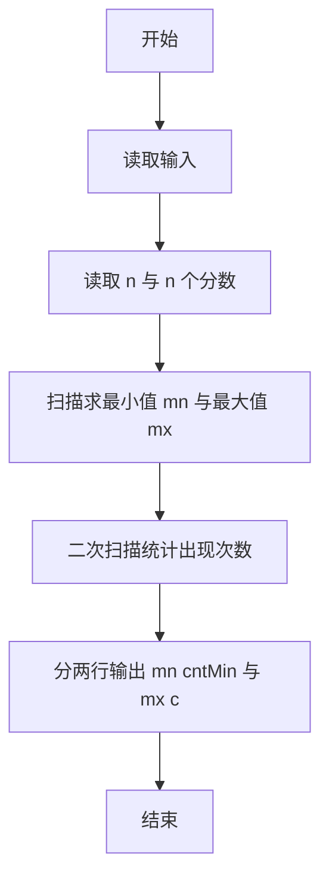
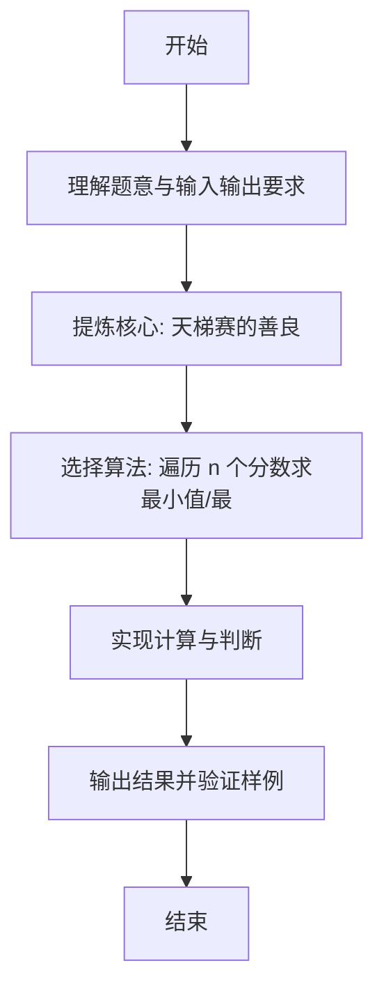

# L1-079 - 天梯赛的善良（20 分）

- **时间限制**: 200 ms
- **内存限制**: 65536 KB
- **代码长度限制**: 16 KB

---

## 题目描述


天梯赛是个善良的比赛。善良的命题组希望将题目难度控制在一个范围内，使得每个参赛的学生都有能做出来的题目，并且最厉害的学生也要非常努力才有可能得到高分。

于是命题组首先将编程能力划分成了 $$10^6$$ 个等级（太疯狂了，这是假的），然后调查了每个参赛学生的编程能力。现在请你写个程序找出所有参赛学生的最小和最大能力值，给命题组作为出题的参考。

### 输入格式:

输入在第一行中给出一个正整数 $$N$$（$$\le 2\times 10^4$$），即参赛学生的总数。随后一行给出 $$N$$ 个不超过 $$10^6$$ 的正整数，是参赛学生的能力值。

### 输出格式:

第一行输出所有参赛学生的最小能力值，以及具有这个能力值的学生人数。第二行输出所有参赛学生的最大能力值，以及具有这个能力值的学生人数。同行数字间以 1 个空格分隔，行首尾不得有多余空格。

### 输入样例:
```in
10
86 75 233 888 666 75 886 888 75 666
```

### 输出样例:
```out
75 3
888 2
```

## 示例

### 示例 1

**输入:**
```
10
86 75 233 888 666 75 886 888 75 666
```

**输出:**
```
75 3
888 2
```

---

### 解题思路

#### 题目分析
本题为“天梯赛的善良”（天梯赛的善良）。题面要求根据给定输入按规则计算并输出结果，输入规模小但需注意格式与边界。天梯赛的善良的判定涉及多分支或字符串处理，需将输入准确分词后逐项处理。仓颉实现中通过 `readToEnd`/`readln` 读取并以空白或行分割，兼顾有无换行与多空格的情况。

#### 核心算法
遍历 n 个分数求最小值/最大值及其出现次数。实现上直接模拟题意：先将原始输入规范化为 Token 或行数组，再按规则遍历计算。例如 读取 n 与 n 个分数，随后 扫描求最小值 mn 与最大值 mx，最后按条件分支输出。算法保持线性遍历，无需复杂数据结构，仅需若干计数器与集合即可完成。

#### 复杂度分析
- **时间复杂度**：O(n)。
- **空间复杂度**：O(n)，仅需常量或线性辅助数组存储输入分词结果。

### 代码流程说明

1. 读取 n 与 n 个分数。
2. 扫描求最小值 mn 与最大值 mx。
3. 二次扫描统计出现次数。
4. 分两行输出 mn cntMin 与 mx cntMax。
5. 输出换行并结束程序。

### 代码实现

完整仓颉源码如下（与 `.cj` 文件一致）：

```cangjie
// L1-079 天梯赛的善良 - 找最小/最大值及个数
import std.env.*
import std.collection.*
import std.convert.*

main() {
    let cin = getStdIn()
    let all = cin.readToEnd() ?? ""
    let cleaned = all.replace("\r", " ").replace("\n", " ").replace("\t", " ")
    var raw = cleaned.split(" ")
    var tokens = ArrayList<String>()
    for (p in raw) { if (p.trimAscii().size > 0) { tokens.add(p.trimAscii()) } }
    if (tokens.size == 0) { return }
    let n = Int64.parse(tokens[0])
    if (n == 0) { return }
    var vals = ArrayList<Int64>()
    var i: Int64 = 1
    while (i < Int64(tokens.size) && Int64(vals.size) < n) {
        vals.add(Int64.parse(tokens[i]))
        i++
    }
    if (vals.size == 0) { return }
    var mn = vals[0]
    var mx = vals[0]
    for (v in vals) {
        if (v < mn) { mn = v }
        if (v > mx) { mx = v }
    }
    var cntMin: Int64 = 0
    var cntMax: Int64 = 0
    for (v in vals) {
        if (v == mn) { cntMin++ }
        if (v == mx) { cntMax++ }
    }
    println("${mn} ${cntMin}")
    println("${mx} ${cntMax}")
}
```

### 代码流程图



### 解题流程图


