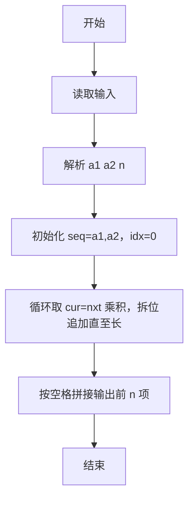
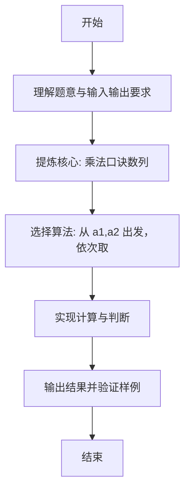

# L1-080 - 乘法口诀数列（20 分）

- **时间限制**: 400 ms
- **内存限制**: 65536 KB
- **代码长度限制**: 16 KB

---

## 题目描述


本题要求你从任意给定的两个 1 位数字 $$a_1$$ 和 $$a_2$$ 开始，用乘法口诀生成一个数列 {$$a_n$$}，规则为从 $$a_1$$ 开始顺次进行，每次将当前数字与后面一个数字相乘，将结果贴在数列末尾。如果结果不是 1 位数，则其每一位都应成为数列的一项。

### 输入格式:

输入在一行中给出 3 个整数，依次为 $$a_1$$、$$a_2$$ 和 $$n$$，满足 $$0\le a_1,a_2\le 9$$，$$0<n\le 10^3$$。

### 输出格式:

在一行中输出数列的前 $$n$$ 项。数字间以 1 个空格分隔，行首尾不得有多余空格。

### 输入样例:
```in
2 3 10
```

### 输出样例:
```out
2 3 6 1 8 6 8 4 8 4
```

## 示例

### 示例 1

**输入:**
```
2 3 10
```

**输出:**
```
2 3 6 1 8 6 8 4 8 4
```

---

### 解题思路

#### 题目分析
本题为“乘法口诀数列”（乘法口诀数列）。题面要求根据给定输入按规则计算并输出结果，输入规模小但需注意格式与边界。乘法口诀数列的判定涉及多分支或字符串处理，需将输入准确分词后逐项处理。仓颉实现中通过 `readToEnd`/`readln` 读取并以空白或行分割，兼顾有无换行与多空格的情况。

#### 核心算法
从 a1,a2 出发，依次取 seq[idx]*seq[idx+1] 拆位追加至长度 n，idx 递增。实现上直接模拟题意：先将原始输入规范化为 Token 或行数组，再按规则遍历计算。例如 解析 a1 a2 n，随后 初始化 seq=[a1,a2]，idx=0，最后按条件分支输出。算法保持线性遍历，无需复杂数据结构，仅需若干计数器与集合即可完成。

#### 复杂度分析
- **时间复杂度**：O(n)。
- **空间复杂度**：O(n)，仅需常量或线性辅助数组存储输入分词结果。

### 代码流程说明

1. 解析 a1 a2 n。
2. 初始化 seq=[a1,a2]，idx=0。
3. 循环取 cur=nxt 乘积，拆位追加直至长度 n。
4. 按空格拼接输出前 n 项。
5. 输出换行并结束程序。

### 代码实现

完整仓颉源码如下（与 `.cj` 文件一致）：

```cangjie
// L1-080 乘法口诀数列 - 按乘法口诀生成数列
import std.env.*
import std.collection.*
import std.convert.*

main() {
    let cin = getStdIn()
    let all = cin.readToEnd() ?? ""
    let cleaned = all.replace("\r", " ").replace("\n", " ").replace("\t", " ")
    var raw = cleaned.split(" ")
    var tokens = ArrayList<String>()
    for (p in raw) { if (p.trimAscii().size > 0) { tokens.add(p.trimAscii()) } }
    if (tokens.size < 3) { return }
    let a1 = Int64.parse(tokens[0])
    let a2 = Int64.parse(tokens[1])
    let n = Int64.parse(tokens[2])
    if (n == 0) { return }
    var seq = ArrayList<Int64>()
    seq.add(a1)
    if (n > 1) { seq.add(a2) }
    if (n == 1) {
        println("${a1}")
        return
    }
    var idx: Int64 = 0
    while (Int64(seq.size) < n) {
        let cur = seq[idx]
        let nxt = seq[idx + 1]
        let prod = cur * nxt
        if (prod < 10) {
            seq.add(prod)
        } else {
            seq.add(prod / 10)
            if (Int64(seq.size) < n) {
                seq.add(prod % 10)
            }
        }
        idx++
    }
    var out = StringBuilder()
    for (i in 0..seq.size) {
        if (i > 0) { out.append(" ") }
        out.append(seq[i])
    }
    println(out.toString())
}
```

### 代码流程图



### 解题流程图


