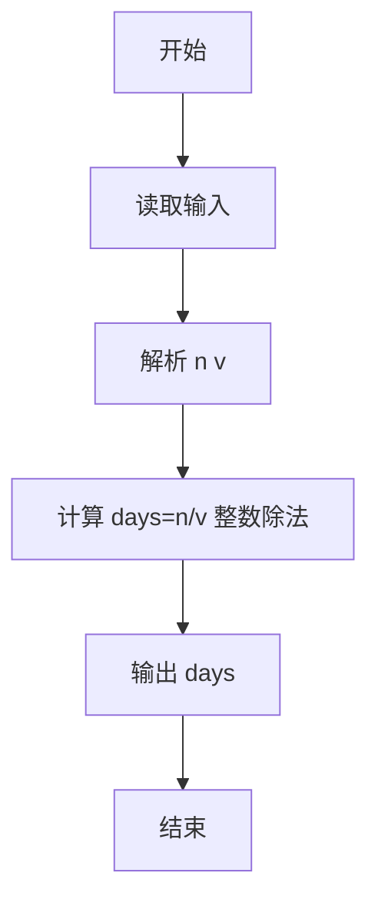
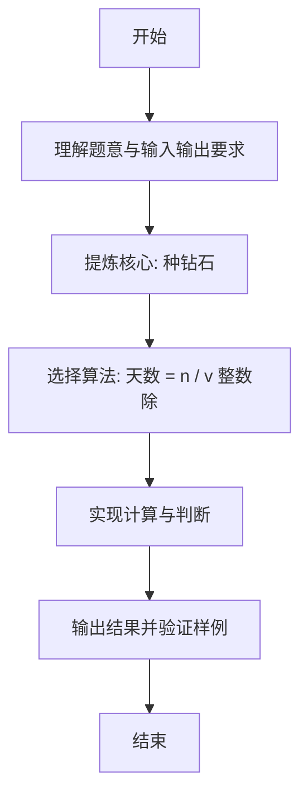

# L1-082 - 种钻石（5 分）

- **时间限制**: 400 ms
- **内存限制**: 65536 KB
- **代码长度限制**: 16 KB

---

## 题目描述


2019年10月29日，中央电视台专题报道，中国科学院在培育钻石领域，取得科技突破。科学家们用金刚石的籽晶片作为种子，利用甲烷气体在能量作用下形成碳的等离子体，慢慢地沉积到钻石种子上，一周“种”出了一颗 1 克拉大小的钻石。

本题给出钻石的需求量和人工培育钻石的速度，请你计算出货需要的时间。

### 输入格式:

输入在一行中给出钻石的需求量 $$N$$（不超过 $$10^7$$ 的正整数，以`微克拉`为单位）和人工培育钻石的速度 $$v$$（$$1\le v \le 200$$，以`微克拉/天`为单位的整数）。

### 输出格式:

在一行中输出培育 $$N$$ 微克拉钻石需要的整数天数。不到一天的时间不算在内。

### 输入样例:
```in
102000 130
```

### 输出样例:
```out
784
```

## 示例

### 示例 1

**输入:**
```
102000 130
```

**输出:**
```
784
```

---

### 解题思路

#### 题目分析
本题为“种钻石”（种钻石）。题面要求根据给定输入按规则计算并输出结果，输入规模小但需注意格式与边界。种钻石的判定涉及多分支或字符串处理，需将输入准确分词后逐项处理。仓颉实现中通过 `readToEnd`/`readln` 读取并以空白或行分割，兼顾有无换行与多空格的情况。

#### 核心算法
天数 = n / v 整数除法，不足一天不计。实现上直接模拟题意：先将原始输入规范化为 Token 或行数组，再按规则遍历计算。例如 解析 n v，随后 计算 days=n/v 整数除法，最后按条件分支输出。算法保持线性遍历，无需复杂数据结构，仅需若干计数器与集合即可完成。

#### 复杂度分析
- **时间复杂度**：O(1)。
- **空间复杂度**：O(1)，仅需常量或线性辅助数组存储输入分词结果。

### 代码流程说明

1. 解析 n v。
2. 计算 days=n/v 整数除法。
3. 输出 days。
4. 输出换行并结束程序。

### 代码实现

完整仓颉源码如下（与 `.cj` 文件一致）：

```cangjie
// L1-082 种钻石 - 计算天数(不足一天不算)
import std.env.*
import std.collection.*
import std.convert.*

main() {
    let cin = getStdIn()
    let all = cin.readToEnd() ?? ""
    let cleaned = all.replace("\r", " ").replace("\n", " ").replace("\t", " ")
    var raw = cleaned.split(" ")
    var tokens = ArrayList<String>()
    for (p in raw) { if (p.trimAscii().size > 0) { tokens.add(p.trimAscii()) } }
    if (tokens.size < 2) { return }
    let n = Int64.parse(tokens[0])
    let v = Int64.parse(tokens[1])
    let days = n / v
    println(days)
}
```

### 代码流程图



### 解题流程图


