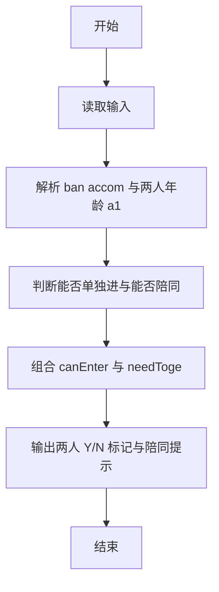
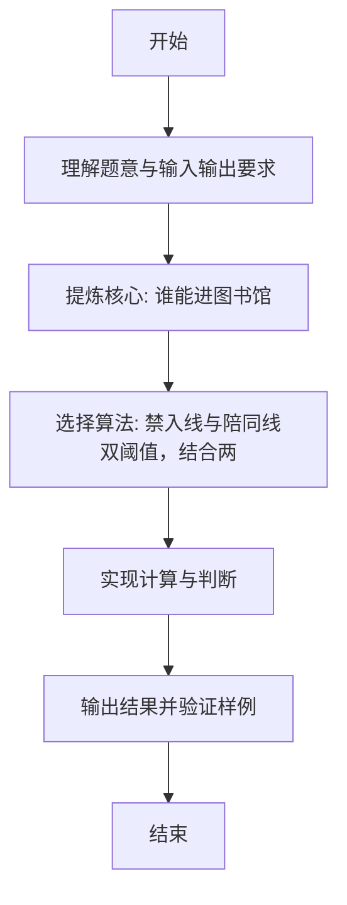

# L1-083 - 谁能进图书馆（10 分）

- **时间限制**: 400 ms
- **内存限制**: 65536 KB
- **代码长度限制**: 16 KB

---

## 题目描述


为了保障安静的阅读环境，有些公共图书馆对儿童入馆做出了限制。例如“12 岁以下儿童禁止入馆，除非有 18 岁以上（包括 18 岁）的成人陪同”。现在有两位小/大朋友跑来问你，他们能不能进去？请你写个程序自动给他们一个回复。

### 输入格式:

输入在一行中给出 4 个整数：
```
禁入年龄线 陪同年龄线 询问者1的年龄 询问者2的年龄
```

这里的`禁入年龄线`是指严格小于该年龄的儿童禁止入馆；`陪同年龄线`是指大于等于该年龄的人士可以陪同儿童入馆。默认两个询问者的编号依次分别为 `1` 和 `2`；年龄和年龄线都是 [1, 200] 区间内的整数，并且保证 `陪同年龄线` 严格大于 `禁入年龄线`。

### 输出格式:

在一行中输出对两位询问者的回答，如果可以进就输出 `年龄-Y`，否则输出 `年龄-N`，中间空 1 格，行首尾不得有多余空格。

在第二行根据两个询问者的情况输出一句话：

- 如果两个人必须一起进，则输出 `qing X zhao gu hao Y`，其中 `X` 是陪同人的编号， `Y` 是小孩子的编号；
- 如果两个人都可以进但不是必须一起的，则输出 `huan ying ru guan`；
- 如果两个人都进不去，则输出 `zhang da zai lai ba`；
- 如果一个人能进一个不能，则输出 `X: huan ying ru guan`，其中 `X` 是可以入馆的那个人的编号。

### 输入样例 1：
```in
12 18 18 8
```

### 输出样例 1：
```out
18-Y 8-Y
qing 1 zhao gu hao 2
```

### 输入样例 2：
```in
12 18 10 15
```

### 输出样例 2：
```out
10-N 15-Y
2: huan ying ru guan
```

## 示例

### 示例 1

**输入:**
```
12 18 18 8
```

**输出:**
```
18-Y 8-Y
qing 1 zhao gu hao 2
```

### 示例 2

**输入:**
```
12 18 10 15
```

**输出:**
```
10-N 15-Y
2: huan ying ru guan
```

---

### 解题思路

#### 题目分析
本题为“谁能进图书馆”（谁能进图书馆）。题面要求根据给定输入按规则计算并输出结果，输入规模小但需注意格式与边界。谁能进图书馆的判定涉及多分支或字符串处理，需将输入准确分词后逐项处理。仓颉实现中通过 `readToEnd`/`readln` 读取并以空白或行分割，兼顾有无换行与多空格的情况。

#### 核心算法
禁入线与陪同线双阈值，结合两人年龄判断 Y/N 及陪同提示。实现上直接模拟题意：先将原始输入规范化为 Token 或行数组，再按规则遍历计算。例如 解析 ban accom 与两人年龄 a，随后 判断能否单独进与能否陪同，最后按条件分支输出。算法保持线性遍历，无需复杂数据结构，仅需若干计数器与集合即可完成。

#### 复杂度分析
- **时间复杂度**：O(1)。
- **空间复杂度**：O(1)，仅需常量或线性辅助数组存储输入分词结果。

### 代码流程说明

1. 解析 ban accom 与两人年龄 a1 a2。
2. 判断能否单独进与能否陪同。
3. 组合 canEnter 与 needTogether 逻辑。
4. 输出两人 Y/N 标记与陪同提示。
5. 输出换行并结束程序。

### 代码实现

完整仓颉源码如下（与 `.cj` 文件一致）：

```cangjie
// L1-083 谁能进图书馆 - 判断能否入馆及陪同逻辑
import std.env.*
import std.collection.*
import std.convert.*

main() {
    let cin = getStdIn()
    let all = cin.readToEnd() ?? ""
    let cleaned = all.replace("\r", " ").replace("\n", " ").replace("\t", " ")
    var raw = cleaned.split(" ")
    var tokens = ArrayList<String>()
    for (p in raw) { if (p.trimAscii().size > 0) { tokens.add(p.trimAscii()) } }
    if (tokens.size < 4) { return }
    let ban = Int64.parse(tokens[0])
    let accom = Int64.parse(tokens[1])
    let a1 = Int64.parse(tokens[2])
    let a2 = Int64.parse(tokens[3])
    let canAlone1 = a1 >= ban
    let canAlone2 = a2 >= ban
    let canEscort1 = a1 >= accom
    let canEscort2 = a2 >= accom
    let canEnter1 = canAlone1 || (!canAlone1 && canEscort2)
    let canEnter2 = canAlone2 || (!canAlone2 && canEscort1)
    var s1 = ""
    var s2 = ""
    if (canEnter1) { s1 = "${a1}-Y" } else { s1 = "${a1}-N" }
    if (canEnter2) { s2 = "${a2}-Y" } else { s2 = "${a2}-N" }
    println("${s1} ${s2}")
    let needTogether = (!canAlone1 && canEscort2) || (!canAlone2 && canEscort1)
    if (canEnter1 && canEnter2 && needTogether) {
        if (!canAlone1 && canEscort2) {
            println("qing 2 zhao gu hao 1")
        } else {
            println("qing 1 zhao gu hao 2")
        }
    } else if (canEnter1 && canEnter2) {
        println("huan ying ru guan")
    } else if (!canEnter1 && !canEnter2) {
        println("zhang da zai lai ba")
    } else {
        if (canEnter1) {
            println("1: huan ying ru guan")
        } else {
            println("2: huan ying ru guan")
        }
    }
}
```

### 代码流程图



### 解题流程图


