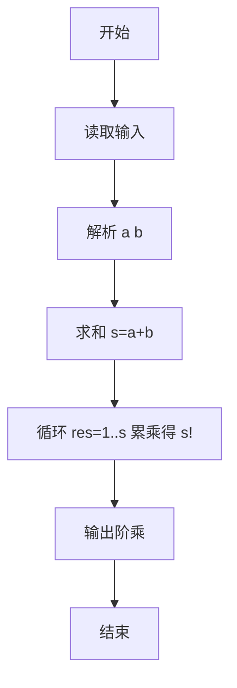

# L1-084 - 拯救外星人（10 分）

- **时间限制**: 400 ms
- **内存限制**: 65536 KB
- **代码长度限制**: 16 KB

---

## 题目描述


你的外星人朋友不认得地球上的加减乘除符号，但是会算阶乘 —— 正整数 N 的阶乘记为 “N!”，是从 1 到 N 的连乘积。所以当他不知道“5+7”等于多少时，如果你告诉他等于“12!”，他就写出了“479001600”这个答案。

本题就请你写程序模仿外星人的行为。

### 输入格式:

输入在一行中给出两个正整数 A 和 B。

### 输出格式:

在一行中输出 (A+B) 的阶乘。题目保证 (A+B) 的值小于 12。

### 输入样例:
```in
3 6
```

### 输出样例:
```out
362880
```

## 示例

### 示例 1

**输入:**
```
3 6
```

**输出:**
```
362880
```

---

### 解题思路

#### 题目分析
本题为“拯救外星人”（拯救外星人）。题面要求根据给定输入按规则计算并输出结果，输入规模小但需注意格式与边界。拯救外星人的判定涉及多分支或字符串处理，需将输入准确分词后逐项处理。仓颉实现中通过 `readToEnd`/`readln` 读取并以空白或行分割，兼顾有无换行与多空格的情况。

#### 核心算法
计算 (A+B)! 阶乘，A+B 较小直接循环累乘。实现上直接模拟题意：先将原始输入规范化为 Token 或行数组，再按规则遍历计算。例如 解析 a b，随后 求和 s=a+b，最后按条件分支输出。算法保持线性遍历，无需复杂数据结构，仅需若干计数器与集合即可完成。

#### 复杂度分析
- **时间复杂度**：O(A+B)。
- **空间复杂度**：O(1)，仅需常量或线性辅助数组存储输入分词结果。

### 代码流程说明

1. 解析 a b。
2. 求和 s=a+b。
3. 循环 res=1..s 累乘得 s!。
4. 输出阶乘。
5. 输出换行并结束程序。

### 代码实现

完整仓颉源码如下（与 `.cj` 文件一致）：

```cangjie
// L1-084 拯救外星人 - 计算 (A+B)!
import std.env.*
import std.collection.*
import std.convert.*

main() {
    let cin = getStdIn()
    let all = cin.readToEnd() ?? ""
    let cleaned = all.replace("\r", " ").replace("\n", " ").replace("\t", " ")
    var raw = cleaned.split(" ")
    var tokens = ArrayList<String>()
    for (p in raw) { if (p.trimAscii().size > 0) { tokens.add(p.trimAscii()) } }
    if (tokens.size < 2) { return }
    let a = Int64.parse(tokens[0])
    let b = Int64.parse(tokens[1])
    let s = a + b
    var res: Int64 = 1
    var i: Int64 = 2
    while (i <= s) {
        res = res * i
        i++
    }
    println(res)
}
```

### 代码流程图



### 解题流程图

```mermaid
flowchart TD
    A[开始] --> B[理解题意与输入输出要求]
    B --> C[提炼核心: 拯救外星人]
    C --> D[选择算法: 计算 (A+B)! 阶乘，A]
    D --> E[实现计算与判断]
    E --> F[输出结果并验证样例]
    F --> G[结束]
```
