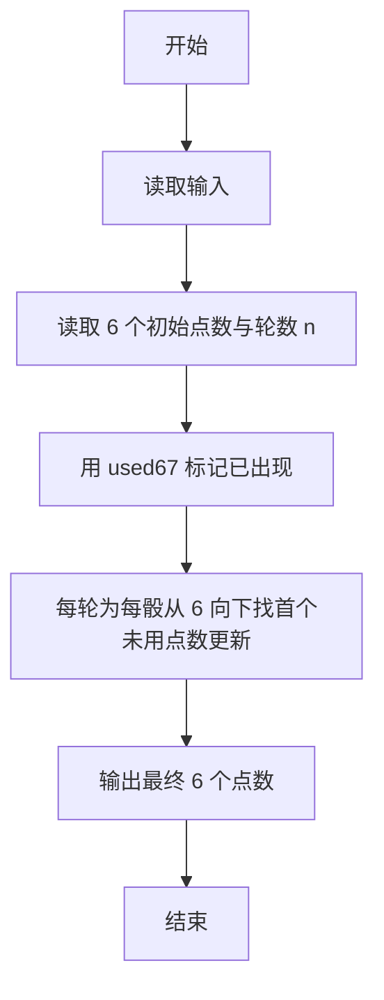
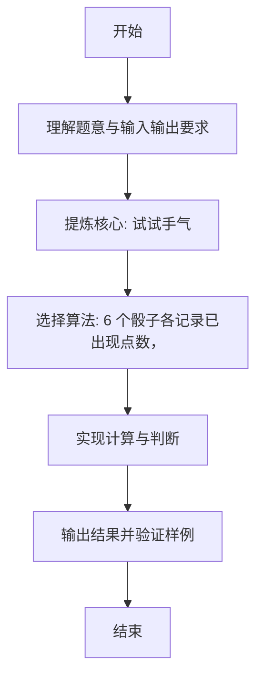

# L1-085 - 试试手气（15 分）

- **时间限制**: 400 ms
- **内存限制**: 65536 KB
- **代码长度限制**: 16 KB

---

## 题目描述


我们知道一个骰子有 6 个面，分别刻了 1 到 6 个点。下面给你 6 个骰子的初始状态，即它们朝上一面的点数，让你一把抓起摇出另一套结果。假设你摇骰子的手段特别精妙，每次摇出的结果都满足以下两个条件：

- 1、每个骰子摇出的点数都跟它之前任何一次出现的点数不同；
- 2、在满足条件 1 的前提下，每次都能让每个骰子得到可能得到的最大点数。

那么你应该可以预知自己第 $$n$$ 次（$$1\le n\le 5$$）摇出的结果。

### 输入格式:

输入第一行给出 6 个骰子的初始点数，即 [1,6] 之间的整数，数字间以空格分隔；第二行给出摇的次数 $$n$$（$$1\le n\le 5$$）。

### 输出格式:

在一行中顺序列出第 $$n$$ 次摇出的每个骰子的点数。数字间必须以 1 个空格分隔，行首位不得有多余空格。

### 输入样例:
```in
3 6 5 4 1 4
3
```

### 输出样例:
```out
4 3 3 3 4 3
```

## 示例

### 示例 1

**输入:**
```
3 6 5 4 1 4
3
```

**输出:**
```
4 3 3 3 4 3
```

---

### 解题思路

#### 题目分析
本题为“试试手气”（试试手气）。题面要求根据给定输入按规则计算并输出结果，输入规模小但需注意格式与边界。试试手气的判定涉及多分支或字符串处理，需将输入准确分词后逐项处理。仓颉实现中通过 `readToEnd`/`readln` 读取并以空白或行分割，兼顾有无换行与多空格的情况。

#### 核心算法
6 个骰子各记录已出现点数，每轮为每骰选未出现过的最大点数，重复 n 轮。实现上直接模拟题意：先将原始输入规范化为 Token 或行数组，再按规则遍历计算。例如 读取 6 个初始点数与轮数 n，随后 用 used[6][7] 标记已出现，最后按条件分支输出。算法保持线性遍历，无需复杂数据结构，仅需若干计数器与集合即可完成。

#### 复杂度分析
- **时间复杂度**：O(n·6·6)。
- **空间复杂度**：O(n)，仅需常量或线性辅助数组存储输入分词结果。

### 代码流程说明

1. 读取 6 个初始点数与轮数 n。
2. 用 used[6][7] 标记已出现。
3. 每轮为每骰从 6 向下找首个未用点数更新。
4. 输出最终 6 个点数。
5. 输出换行并结束程序。

### 代码实现

完整仓颉源码如下（与 `.cj` 文件一致）：

```cangjie
// L1-085 试试手气 - 每轮每骰选最大未出现点数
import std.env.*
import std.collection.*
import std.convert.*

main() {
    let cin = getStdIn()
    let all = cin.readToEnd() ?? ""
    let cleaned = all.replace("\r", " ").replace("\n", " ").replace("\t", " ")
    var raw = cleaned.split(" ")
    var tokens = ArrayList<String>()
    for (p in raw) { if (p.trimAscii().size > 0) { tokens.add(p.trimAscii()) } }
    if (tokens.size < 7) { return }
    var dice = Array<Int64>(6, repeat: 0)
    for (i in 0..6) { dice[i] = Int64.parse(tokens[i]) }
    let n = Int64.parse(tokens[6])
    var used = Array<Array<Bool>>(6, { _ => Array<Bool>(7, repeat: false) })
    for (i in 0..6) {
        let v = dice[i]
        used[i][v] = true
    }
    var round: Int64 = 0
    while (round < n) {
        for (i in 0..6) {
            var p: Int64 = 6
            while (p >= 1) {
                if (!used[i][p]) {
                    dice[i] = p
                    used[i][p] = true
                    break
                }
                p--
            }
        }
        round++
    }
    var out = StringBuilder()
    for (i in 0..6) {
        if (i > 0) { out.append(" ") }
        out.append(dice[i])
    }
    println(out.toString())
}
```

### 代码流程图



### 解题流程图


