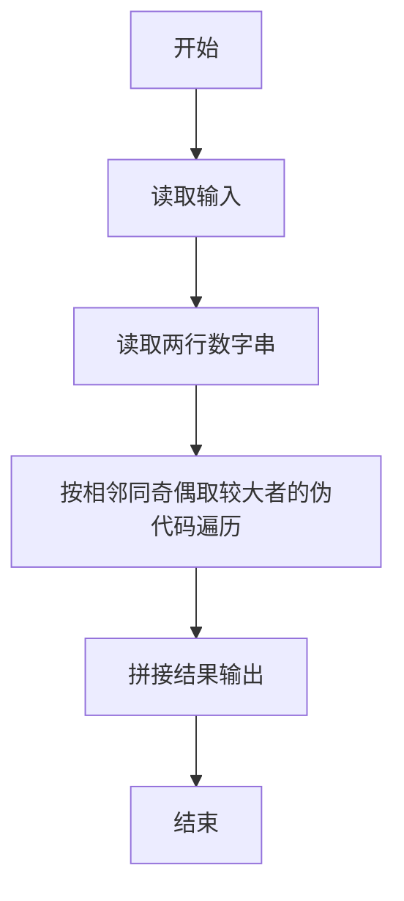
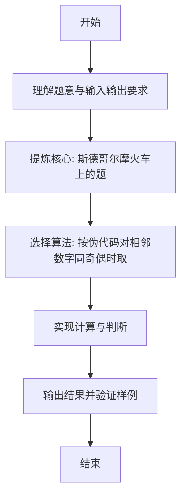

# L1-086 - 斯德哥尔摩火车上的题（15 分）

- **时间限制**: 400 ms
- **内存限制**: 65536 KB
- **代码长度限制**: 16 KB

---

## 题目描述


上图是新浪微博上的一则趣闻，是瑞典斯德哥尔摩火车上的一道题，看上去是段伪代码：

```
s = ''
a = '1112031584'
for (i = 1; i < length(a); i++) {
  if (a[i] % 2 == a[i-1] % 2) {
    s += max(a[i], a[i-1])
  }
}
goto_url('www.multisoft.se/' + s)
```

其中字符串的 `+` 操作是连接两个字符串的意思。所以这道题其实是让大家访问网站 `www.multisoft.se/112358`（**注意：比赛中千万不要访问这个网址！！！**）。

当然，能通过上述算法得到 `112358` 的原始字符串 `a` 是不唯一的。本题就请你判断，两个给定的原始字符串，能否通过上述算法得到相同的输出？

### 输入格式:

输入为两行仅由数字组成的非空字符串，长度均不超过 $$10^4$$，以回车结束。

### 输出格式:

对两个字符串分别采用上述斯德哥尔摩火车上的算法进行处理。如果两个结果是一样的，则在一行中输出那个结果；否则分别输出各自对应的处理结果，每个占一行。题目保证输出结果不为空。

### 输入样例 1：
```in
1112031584
011102315849
```

### 输出样例 1：
```out
112358
```

### 输入样例 2：
```in
111203158412334
12341112031584
```

### 输出样例 2：
```out
1123583
112358
```

## 示例

### 示例 1

**输入:**
```
1112031584
011102315849
```

**输出:**
```
112358
```

### 示例 2

**输入:**
```
111203158412334
12341112031584
```

**输出:**
```
1123583
112358
```

---

### 解题思路

#### 题目分析
本题为“斯德哥尔摩火车上的题”（斯德哥尔摩火车上的题）。题面要求根据给定输入按规则计算并输出结果，输入规模小但需注意格式与边界。斯德哥尔摩火车上的题的判定涉及多分支或字符串处理，需将输入准确分词后逐项处理。仓颉实现中通过 `readToEnd`/`readln` 读取并以空白或行分割，兼顾有无换行与多空格的情况。

#### 核心算法
按伪代码对相邻数字同奇偶时取较大者拼接。实现上直接模拟题意：先将原始输入规范化为 Token 或行数组，再按规则遍历计算。例如 读取两行数字串，随后 按相邻同奇偶取较大者的伪代码遍历，最后按条件分支输出。算法保持线性遍历，无需复杂数据结构，仅需若干计数器与集合即可完成。

#### 复杂度分析
- **时间复杂度**：O(L) L 为字符串长度。
- **空间复杂度**：O(1)，仅需常量或线性辅助数组存储输入分词结果。

### 代码流程说明

1. 读取两行数字串。
2. 按相邻同奇偶取较大者的伪代码遍历。
3. 拼接结果输出。
4. 输出换行并结束程序。

### 代码实现

完整仓颉源码如下（与 `.cj` 文件一致）：

```cangjie
// L1-086 斯德哥尔摩火车上的题 - 按伪代码处理字符串
import std.env.*
import std.collection.*
import std.convert.*

func process(a: String): String {
    let arr = a.toRuneArray()
    var sb = StringBuilder()
    var i = 1
    while (i < arr.size) {
        let prev = arr[i-1]
        let cur = arr[i]
        let pv = Int64.parse("${prev}")
        let cv = Int64.parse("${cur}")
        if ((pv % 2) == (cv % 2)) {
            if (prev > cur) {
                sb.append(prev)
            } else {
                sb.append(cur)
            }
        }
        i++
    }
    return sb.toString()
}

main() {
    let cin = getStdIn()
    var lines = ArrayList<String>()
    while (let Some(line) <- cin.readln()) {
        // trim only trailing \r handled by trimAscii but keep digits
        let t = line.trimAscii()
        if (t.size > 0 || lines.size < 2) {
            // keep as is (including possible empty? but problem says non-empty)
            if (t.size > 0) { lines.add(t) } else { if (lines.size < 2) { /* skip empty */ } }
        }
        if (lines.size == 2) { break }
    }
    // fallback if readln missed due to no newline at end and readToEnd
    if (lines.size < 2) {
        let all = cin.readToEnd() ?? ""
        if (all.size > 0) {
            let cleaned = all.replace("\r", " ").replace("\n", " ").replace("\t", " ")
            var raw = cleaned.split(" ")
            for (p in raw) { if (p.trimAscii().size > 0) { lines.add(p.trimAscii()) } }
        }
    }
    if (lines.size < 2) { return }
    let s1 = lines[0]
    let s2 = lines[1]
    let r1 = process(s1)
    let r2 = process(s2)
    if (r1 == r2) {
        println(r1)
    } else {
        println(r1)
        println(r2)
    }
}
```

### 代码流程图



### 解题流程图


