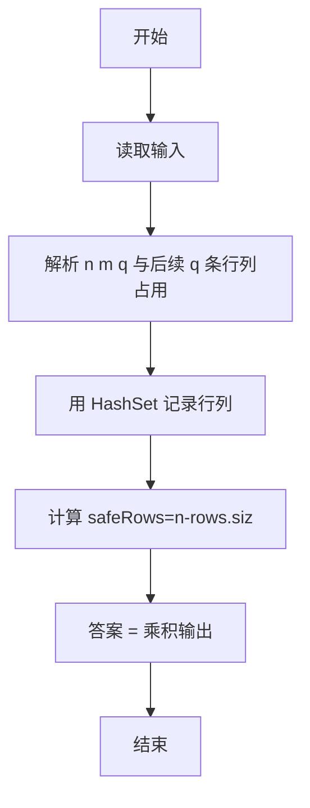
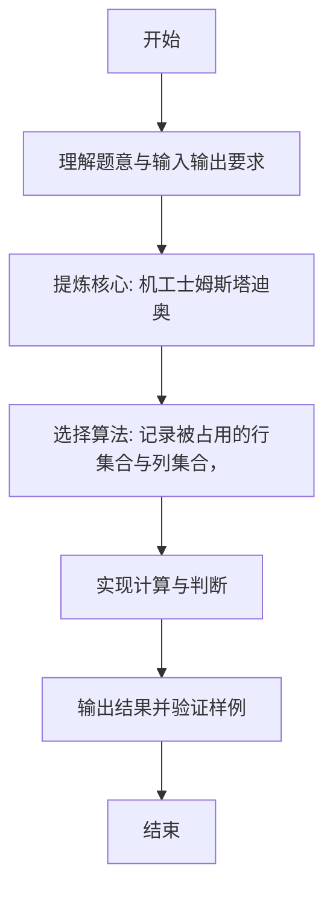

# L1-087 - 机工士姆斯塔迪奥（20 分）

- **时间限制**: 400 ms
- **内存限制**: 65536 KB
- **代码长度限制**: 16 KB

---

## 题目描述


在 MMORPG《最终幻想14》的副本“乐欲之所瓯博讷修道院”里，BOSS 机工士姆斯塔迪奥将会接受玩家的挑战。

你需要处理这个副本其中的一个机制：$N \times M$ 大小的地图被拆分为了 $N \times M$ 个 $1 \times 1$ 的格子，BOSS 会选择若干行或/及若干列释放技能，玩家不能站在释放技能的方格上，否则就会被击中而失败。

给定 BOSS 所有释放技能的行或列信息，请你计算出最后有多少个格子是安全的。

### 输入格式:

输入第一行是三个整数 $N, M, Q$ ($1 \le N \times M \le 10^5$，$0 \le Q \le 1000$)，表示地图为 $N$ 行 $M$ 列大小以及选择的行/列数量。

接下来 $Q$ 行，每行两个数 $T_i, C_i$，其中 $T_i = 0$ 表示 BOSS 选择的是一整行，$T_i = 1$ 表示选择的是一整列，$C_i$ 为选择的行号/列号。行和列的编号均从 1 开始。

### 输出格式:

输出一个数，表示安全格子的数量。

### 输入样例:
```in
5 5 3
0 2
0 4
1 3
```

### 输出样例:
```out
12
```

## 示例

### 示例 1

**输入:**
```
5 5 3
0 2
0 4
1 3
```

**输出:**
```
12
```

---

### 解题思路

#### 题目分析
本题为“机工士姆斯塔迪奥”（机工士姆斯塔迪奥）。题面要求根据给定输入按规则计算并输出结果，输入规模小但需注意格式与边界。机工士姆斯塔迪奥的判定涉及多分支或字符串处理，需将输入准确分词后逐项处理。仓颉实现中通过 `readToEnd`/`readln` 读取并以空白或行分割，兼顾有无换行与多空格的情况。

#### 核心算法
记录被占用的行集合与列集合，安全格 = (n-行占用数)*(m-列占用数)。实现上直接模拟题意：先将原始输入规范化为 Token 或行数组，再按规则遍历计算。例如 解析 n m q 与后续 q 条行列占用，随后 用 HashSet 记录行列，最后按条件分支输出。算法保持线性遍历，无需复杂数据结构，仅需若干计数器与集合即可完成。

#### 复杂度分析
- **时间复杂度**：O(q)。
- **空间复杂度**：O(1)，仅需常量或线性辅助数组存储输入分词结果。

### 代码流程说明

1. 解析 n m q 与后续 q 条行列占用。
2. 用 HashSet 记录行列。
3. 计算 safeRows=n-rows.size, safeCols=m-cols.size。
4. 答案 = 乘积输出。
5. 输出换行并结束程序。

### 代码实现

完整仓颉源码如下（与 `.cj` 文件一致）：

```cangjie
// L1-087 机工士姆斯塔迪奥 - 统计安全格子
import std.env.*
import std.collection.*
import std.convert.*

main() {
    let cin = getStdIn()
    let all = cin.readToEnd() ?? ""
    let cleaned = all.replace("\r", " ").replace("\n", " ").replace("\t", " ")
    var raw = cleaned.split(" ")
    var tokens = ArrayList<String>()
    for (p in raw) { if (p.trimAscii().size > 0) { tokens.add(p.trimAscii()) } }
    if (tokens.size < 3) { return }
    let n = Int64.parse(tokens[0])
    let m = Int64.parse(tokens[1])
    let q = Int64.parse(tokens[2])
    var rows = HashSet<Int64>()
    var cols = HashSet<Int64>()
    var idx: Int64 = 3
    var c: Int64 = 0
    while (c < q && idx + 1 < Int64(tokens.size)) {
        let t = Int64.parse(tokens[idx])
        let v = Int64.parse(tokens[idx+1])
        if (t == 0) { rows.add(v) } else { cols.add(v) }
        idx += 2
        c++
    }
    let safeRows = n - Int64(rows.size)
    let safeCols = m - Int64(cols.size)
    let ans = safeRows * safeCols
    println(ans)
}
```

### 代码流程图



### 解题流程图


