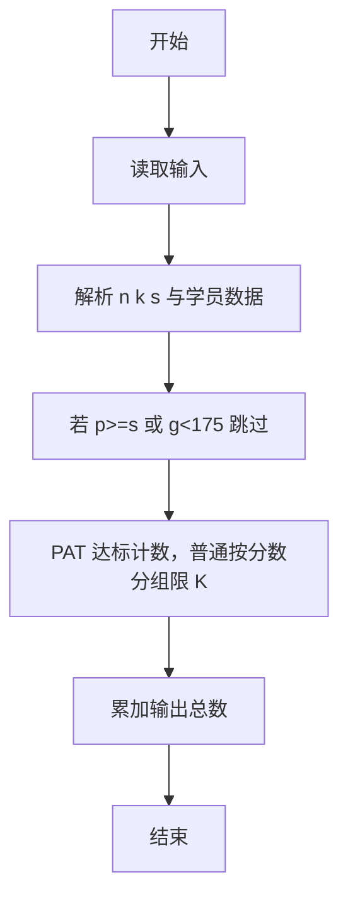
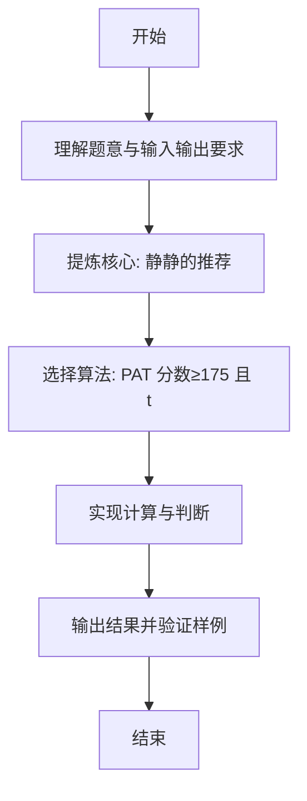

# L1-088 - 静静的推荐（20 分）

- **时间限制**: 200 ms
- **内存限制**: 65536 KB
- **代码长度限制**: 16 KB

---

## 题目描述


天梯赛结束后，某企业的人力资源部希望组委会能推荐一批优秀的学生，这个整理推荐名单的任务就由静静姐负责。企业接受推荐的流程是这样的：

- 只考虑得分不低于 175 分的学生；
- 一共接受 $$K$$ 批次的推荐名单；
- 同一批推荐名单上的学生的成绩原则上应严格递增；
- 如果有的学生天梯赛成绩虽然与前一个人相同，但其参加过 PAT 考试，且成绩达到了该企业的面试分数线，则也可以接受。

给定全体参赛学生的成绩和他们的 PAT 考试成绩，请你帮静静姐算一算，她最多能向企业推荐多少学生？

### 输入格式:

输入第一行给出 3 个正整数：$$N$$（$$\le 10^5$$）为参赛学生人数，$$K$$（$$\le 5\times 10^3$$）为企业接受的推荐批次，$$S$$（$$\le 100$$）为该企业的 PAT 面试分数线。

随后 $$N$$ 行，每行给出两个分数，依次为一位学生的天梯赛分数（最高分 290）和 PAT 分数（最高分 100）。

### 输出格式:

在一行中输出静静姐最多能向企业推荐的学生人数。

### 输入样例:
```in
10 2 90
203 0
169 91
175 88
175 0
175 90
189 0
189 0
189 95
189 89
256 100
```

### 输出样例:
```out
8
```

## 示例

### 示例 1

**输入:**
```
10 2 90
203 0
169 91
175 88
175 0
175 90
189 0
189 0
189 95
189 89
256 100
```

**输出:**
```
8
```

---

### 解题思路

#### 题目分析
本题为“静静的推荐”（静静的推荐）。题面要求根据给定输入按规则计算并输出结果，输入规模小但需注意格式与边界。静静的推荐的判定涉及多分支或字符串处理，需将输入准确分词后逐项处理。仓颉实现中通过 `readToEnd`/`readln` 读取并以空白或行分割，兼顾有无换行与多空格的情况。

#### 核心算法
PAT 分数≥175 且 t≥s 全部推荐，其余按分数限额 K 截断。实现上直接模拟题意：先将原始输入规范化为 Token 或行数组，再按规则遍历计算。例如 解析 n k s 与学员数据，随后 若 p>=s 或 g<175 跳过，最后按条件分支输出。算法保持线性遍历，无需复杂数据结构，仅需若干计数器与集合即可完成。

#### 复杂度分析
- **时间复杂度**：O(n)。
- **空间复杂度**：O(n)，仅需常量或线性辅助数组存储输入分词结果。

### 代码流程说明

1. 解析 n k s 与学员数据。
2. 若 p>=s 或 g<175 跳过。
3. PAT 达标计数，普通按分数分组限 K。
4. 累加输出总数。
5. 输出换行并结束程序。

### 代码实现

完整仓颉源码如下（与 `.cj` 文件一致）：

```cangjie
// L1-088 静静的推荐 - PAT达标全部推荐，普通每分数最多K人
import std.env.*
import std.collection.*
import std.convert.*

main() {
    let cin = getStdIn()
    let all = cin.readToEnd() ?? ""
    let cleaned = all.replace("\r", " ").replace("\n", " ").replace("\t", " ")
    var raw = cleaned.split(" ")
    var tokens = ArrayList<String>()
    for (p in raw) { if (p.trimAscii().size > 0) { tokens.add(p.trimAscii()) } }
    if (tokens.size < 3) { return }
    let k = Int64.parse(tokens[1])
    let s = Int64.parse(tokens[2])
    let n = Int64.parse(tokens[0])
    var cntPat: Int64 = 0
    var ord = HashMap<Int64, Int64>()
    var idx: Int64 = 3
    var i: Int64 = 0
    while (i < n && idx + 1 < Int64(tokens.size)) {
        let g = Int64.parse(tokens[idx])
        let p = Int64.parse(tokens[idx+1])
        idx += 2
        i++
        if (g < 175) { continue }
        if (p >= s) {
            cntPat++
        } else {
            let cur: Int64 = ord.get(g) ?? 0
            ord[g] = cur + 1
        }
    }
    var ans = cntPat
    for ((_, c) in ord) {
        if (c < k) { ans += c } else { ans += k }
    }
    println(ans)
}
```

### 代码流程图



### 解题流程图


