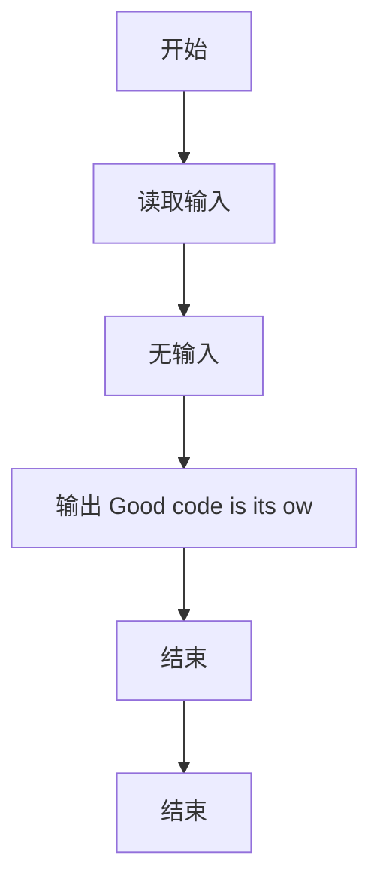
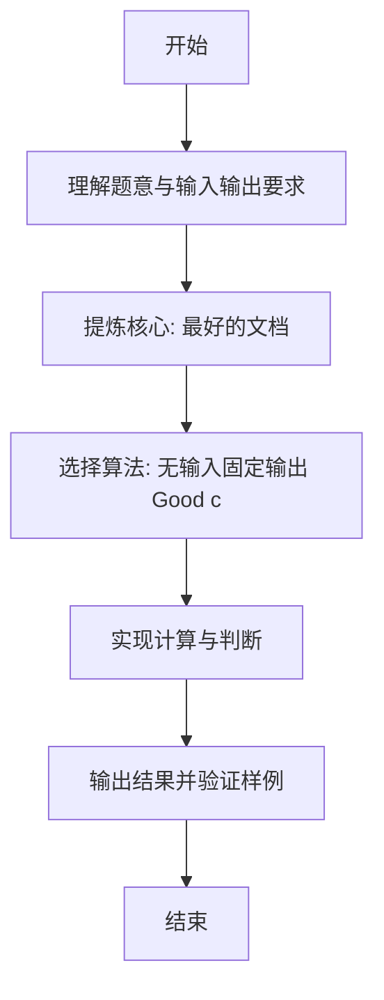

# L1-089 - 最好的文档（5 分）

- **时间限制**: 400 ms
- **内存限制**: 65536 KB
- **代码长度限制**: 16 KB

---

## 题目描述


有一位软件工程师说过一句很有道理的话：“Good code is its own best documentation.”（好代码本身就是最好的文档）。本题就请你直接在屏幕上输出这句话。

### 输入格式:

本题没有输入。

### 输出格式:

在一行中输出 `Good code is its own best documentation.`。

### 输入样例:
```in
无
```

### 输出样例:
```out
Good code is its own best documentation.
```

## 示例

### 示例 1

**输入:**
```
无
```

**输出:**
```
Good code is its own best documentation.
```

---

### 解题思路

#### 题目分析
本题为“最好的文档”（最好的文档）。题面要求根据给定输入按规则计算并输出结果，输入规模小但需注意格式与边界。最好的文档的判定涉及多分支或字符串处理，需将输入准确分词后逐项处理。仓颉实现中通过 `readToEnd`/`readln` 读取并以空白或行分割，兼顾有无换行与多空格的情况。

#### 核心算法
无输入固定输出 Good code is its own best documentation.。实现上直接模拟题意：先将原始输入规范化为 Token 或行数组，再按规则遍历计算。例如 无输入，随后 输出 Good code is its own best documentation.，最后按条件分支输出。算法保持线性遍历，无需复杂数据结构，仅需若干计数器与集合即可完成。

#### 复杂度分析
- **时间复杂度**：O(1)。
- **空间复杂度**：O(1)，仅需常量或线性辅助数组存储输入分词结果。

### 代码流程说明

1. 无输入。
2. 输出 Good code is its own best documentation.。
3. 结束。
4. 输出换行并结束程序。

### 代码实现

完整仓颉源码如下（与 `.cj` 文件一致）：

```cangjie
/*
 * L1-089 - 最好的文档（5 分）
 * 
 * 题目描述：
 * 本题没有输入。输出"Good code is its own best documentation."
 * 
 * 实现原理：
 * 1. 直接输出固定字符串
 */

// 程序入口函数，没有参数，返回类型为 Unit（无返回值）
main() {
    // 输出结果
    println("Good code is its own best documentation.")
}
```

### 代码流程图



### 解题流程图


