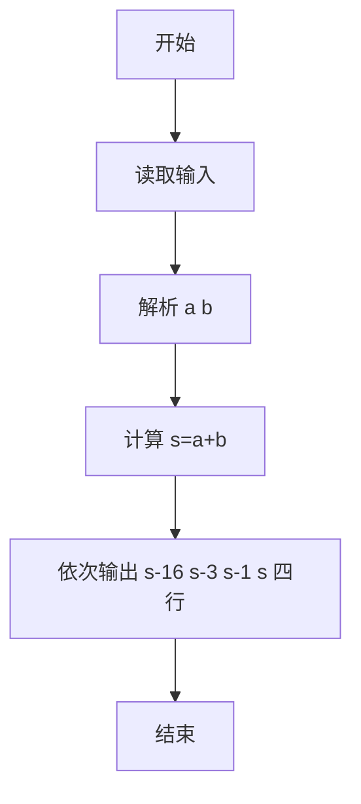
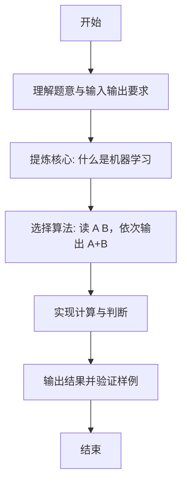

# L1-090 - 什么是机器学习（5 分）

- **时间限制**: 400 ms
- **内存限制**: 65536 KB
- **代码长度限制**: 16 KB

---

## 题目描述


什么是机器学习？上图展示了一段面试官与“机器学习程序”的对话：
```
面试官：9 + 10 等于多少？
答：3
面试官：差远了，是19。
答：16
面试官：错了，是19。
答：18
面试官：不，是19。
答：19
```
本题就请你模仿这个“机器学习程序”的行为。

### 输入格式:

输入在一行中给出两个整数，绝对值都不超过 100，中间用一个空格分开，分别表示面试官给出的两个数字 A 和 B。

### 输出格式:

要求你输出 4 行，每行一个数字。第 1 行比正确结果少 16，第 2 行少 3，第 3 行少 1，最后一行才输出 A+B 的正确结果。

### 输入样例:
```in
9 10
```

### 输出样例:
```out
3
16
18
19
```

## 示例

### 示例 1

**输入:**
```
9 10
```

**输出:**
```
3
16
18
19
```

---

### 解题思路

#### 题目分析
本题为“什么是机器学习”（什么是机器学习）。题面要求根据给定输入按规则计算并输出结果，输入规模小但需注意格式与边界。什么是机器学习的判定涉及多分支或字符串处理，需将输入准确分词后逐项处理。仓颉实现中通过 `readToEnd`/`readln` 读取并以空白或行分割，兼顾有无换行与多空格的情况。

#### 核心算法
读 A B，依次输出 A+B-16、-3、-1、原和四行。实现上直接模拟题意：先将原始输入规范化为 Token 或行数组，再按规则遍历计算。例如 解析 a b，随后 计算 s=a+b，最后按条件分支输出。算法保持线性遍历，无需复杂数据结构，仅需若干计数器与集合即可完成。

#### 复杂度分析
- **时间复杂度**：O(1)。
- **空间复杂度**：O(1)，仅需常量或线性辅助数组存储输入分词结果。

### 代码流程说明

1. 解析 a b。
2. 计算 s=a+b。
3. 依次输出 s-16 s-3 s-1 s 四行。
4. 输出换行并结束程序。

### 代码实现

完整仓颉源码如下（与 `.cj` 文件一致）：

```cangjie
// L1-090 什么是机器学习 - 输出 A+B-16, -3, -1, 正确值
import std.env.*
import std.collection.*
import std.convert.*

main() {
    let cin = getStdIn()
    let all = cin.readToEnd() ?? ""
    let cleaned = all.replace("\r", " ").replace("\n", " ").replace("\t", " ")
    var raw = cleaned.split(" ")
    var tokens = ArrayList<String>()
    for (p in raw) { if (p.trimAscii().size > 0) { tokens.add(p.trimAscii()) } }
    if (tokens.size < 2) { return }
    let a = Int64.parse(tokens[0])
    let b = Int64.parse(tokens[1])
    let s = a + b
    println(s - 16)
    println(s - 3)
    println(s - 1)
    println(s)
}
```

### 代码流程图



### 解题流程图


