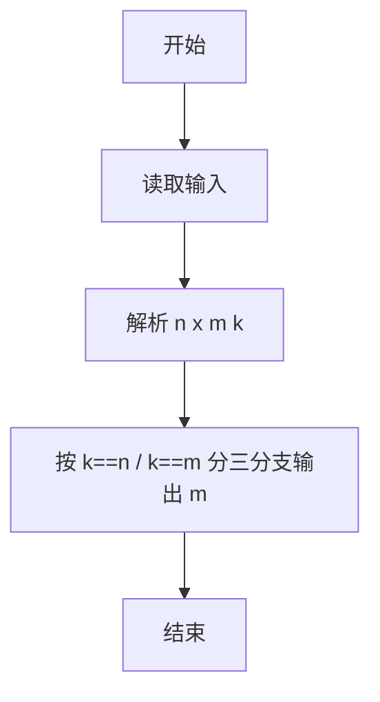
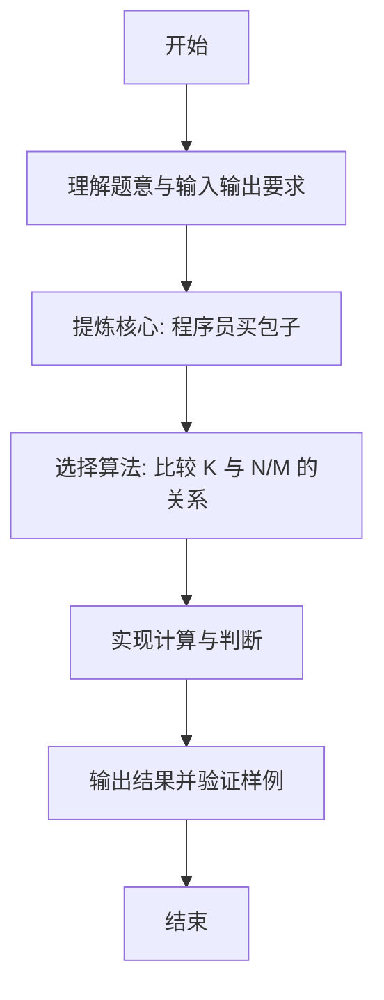

# L1-091 - 程序员买包子（10 分）

- **时间限制**: 400 ms
- **内存限制**: 65536 KB
- **代码长度限制**: 16 KB

---

## 题目描述


这是一条检测真正程序员的段子：假如你被家人要求下班顺路买十只包子，如果看到卖西瓜的，买一只。那么你会在什么情况下只买一只包子回家？
本题要求你考虑这个段子的通用版：假如你被要求下班顺路买 $$N$$ 只包子，如果看到卖 $$X$$ 的，买 $$M$$ 只。那么如果你最后买了 $$K$$ 只包子回家，说明你看到卖 $$X$$ 的没有呢？

### 输入格式:

输入在一行中顺序给出题面中的 $$N$$、$$X$$、$$M$$、$$K$$，以空格分隔。其中 $$N$$、$$M$$ 和 $$K$$ 为不超过 1000 的正整数，$$X$$ 是一个长度不超过 10 的、仅由小写英文字母组成的字符串。题目保证 $$N\neq M$$。

### 输出格式:

在一行中输出结论，格式为：
- 如果 $$K=N$$，输出 `mei you mai X de`；
- 如果 $$K=M$$，输出 `kan dao le mai X de`；
- 否则输出 `wang le zhao mai X de`.
其中 `X` 是输入中给定的字符串 $$X$$。

### 输入样例 1：
```in
10 xigua 1 10
```

### 输出样例 1：
```out
mei you mai xigua de
```

### 输入样例 2：
```in
10 huanggua 1 1
```

### 输出样例 2：
```out
kan dao le mai huanggua de
```

### 输入样例 3：
```in
10 shagua 1 250
```

### 输出样例 3：
```out
wang le zhao mai shagua de
```

## 示例

### 示例 1

**输入:**
```
10 xigua 1 10
```

**输出:**
```
mei you mai xigua de
```

### 示例 2

**输入:**
```
10 huanggua 1 1
```

**输出:**
```
kan dao le mai huanggua de
```

### 示例 3

**输入:**
```
10 shagua 1 250
```

**输出:**
```
wang le zhao mai shagua de
```

---

### 解题思路

#### 题目分析
本题为“程序员买包子”（程序员买包子）。题面要求根据给定输入按规则计算并输出结果，输入规模小但需注意格式与边界。程序员买包子的判定涉及多分支或字符串处理，需将输入准确分词后逐项处理。仓颉实现中通过 `readToEnd`/`readln` 读取并以空白或行分割，兼顾有无换行与多空格的情况。

#### 核心算法
比较 K 与 N/M 的关系判断是否看到卖 X 的。实现上直接模拟题意：先将原始输入规范化为 Token 或行数组，再按规则遍历计算。例如 解析 n x m k，随后 按 k==n / k==m 分三分支输出 mei you mai / kan dao le mai / wang le zhao mai，最后按条件分支输出。算法保持线性遍历，无需复杂数据结构，仅需若干计数器与集合即可完成。

#### 复杂度分析
- **时间复杂度**：O(1)。
- **空间复杂度**：O(1)，仅需常量或线性辅助数组存储输入分词结果。

### 代码流程说明

1. 解析 n x m k。
2. 按 k==n / k==m 分三分支输出 mei you mai / kan dao le mai / wang le zhao mai。
3. 输出换行并结束程序。

### 代码实现

完整仓颉源码如下（与 `.cj` 文件一致）：

```cangjie
// L1-091 程序员买包子 - 根据K判断是否看到X
import std.env.*
import std.collection.*
import std.convert.*

main() {
    let cin = getStdIn()
    let all = cin.readToEnd() ?? ""
    let cleaned = all.replace("\r", " ").replace("\n", " ").replace("\t", " ")
    var raw = cleaned.split(" ")
    var tokens = ArrayList<String>()
    for (p in raw) { if (p.trimAscii().size > 0) { tokens.add(p.trimAscii()) } }
    if (tokens.size < 4) { return }
    let n = Int64.parse(tokens[0])
    let x = tokens[1]
    let m = Int64.parse(tokens[2])
    let k = Int64.parse(tokens[3])
    if (k == n) {
        println("mei you mai ${x} de")
    } else if (k == m) {
        println("kan dao le mai ${x} de")
    } else {
        println("wang le zhao mai ${x} de")
    }
}
```

### 代码流程图



### 解题流程图


