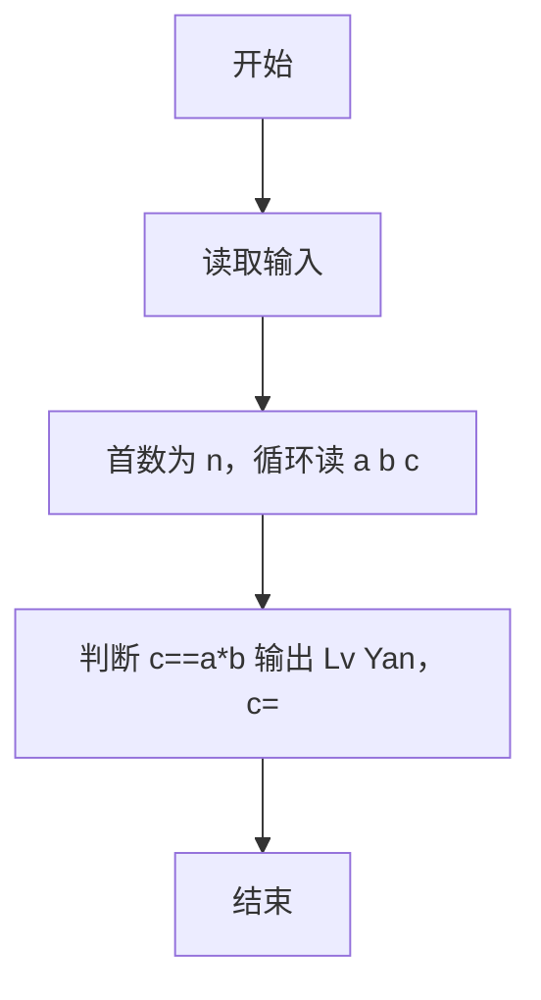
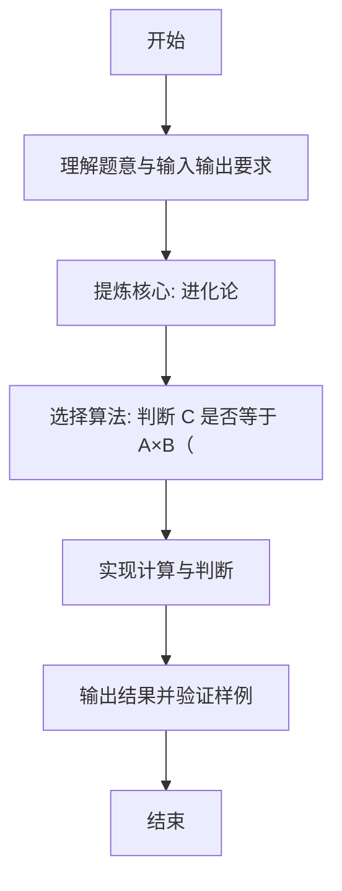

# L1-092 - 进化论（10 分）

- **时间限制**: 400 ms
- **内存限制**: 65536 KB
- **代码长度限制**: 16 KB

---

## 题目描述


在“一年一度喜剧大赛”上有一部作品《进化论》，讲的是动物园两只猩猩进化的故事。猩猩吕严说自己已经进化了 9 年了，因为“三年又三年”。猩猩土豆指出“三年又三年是六年呐”……
本题给定两个数字，以及用这两个数字计算的结果，要求你根据结果判断，这是吕严算出来的，还是土豆算出来的。

### 输入格式:

输入第一行给出一个正整数 $$N$$，随后 $$N$$ 行，每行给出三个正整数 $$A$$、$$B$$ 和 $$C$$。其中 $$C$$ 不超过 10000，其他三个数字都不超过 100。

### 输出格式:

对每一行给出的三个数，如果 $$C$$ 是 $$A\times B$$，就在一行中输出 `Lv Yan`；如果是 $$A+B$$，就在一行中输出 `Tu Dou`；如果都不是，就在一行中输出 `zhe du shi sha ya!`。

### 输入样例:
```in
3
3 3 9
3 3 6
3 3 12
```

### 输出样例:
```out
Lv Yan
Tu Dou
zhe du shi sha ya!
```

## 示例

### 示例 1

**输入:**
```
3
3 3 9
3 3 6
3 3 12
```

**输出:**
```
Lv Yan
Tu Dou
zhe du shi sha ya!
```

---

### 解题思路

#### 题目分析
本题为“进化论”（进化论）。题面要求根据给定输入按规则计算并输出结果，输入规模小但需注意格式与边界。进化论的判定涉及多分支或字符串处理，需将输入准确分词后逐项处理。仓颉实现中通过 `readToEnd`/`readln` 读取并以空白或行分割，兼顾有无换行与多空格的情况。

#### 核心算法
判断 C 是否等于 A×B（Lv Yan）、A+B（Tu Dou）或皆否。实现上直接模拟题意：先将原始输入规范化为 Token 或行数组，再按规则遍历计算。例如 首数为 n，循环读 a b c，随后 判断 c==a*b 输出 Lv Yan，c==a+b 输出 Tu Dou 否则 zhe du shi sha ya!，最后按条件分支输出。算法保持线性遍历，无需复杂数据结构，仅需若干计数器与集合即可完成。

#### 复杂度分析
- **时间复杂度**：O(n)。
- **空间复杂度**：O(n)，仅需常量或线性辅助数组存储输入分词结果。

### 代码流程说明

1. 首数为 n，循环读 a b c。
2. 判断 c==a*b 输出 Lv Yan，c==a+b 输出 Tu Dou 否则 zhe du shi sha ya!。
3. 输出换行并结束程序。

### 代码实现

完整仓颉源码如下（与 `.cj` 文件一致）：

```cangjie
// L1-092 进化论 - 判断 C 是 A*B 还是 A+B
import std.env.*
import std.collection.*
import std.convert.*

main() {
    let cin = getStdIn()
    let all = cin.readToEnd() ?? ""
    let cleaned = all.replace("\r", " ").replace("\n", " ").replace("\t", " ")
    var raw = cleaned.split(" ")
    var tokens = ArrayList<String>()
    for (p in raw) { if (p.trimAscii().size > 0) { tokens.add(p.trimAscii()) } }
    if (tokens.size == 0) { return }
    let n = Int64.parse(tokens[0])
    var idx: Int64 = 1
    var i: Int64 = 0
    while (i < n && idx + 2 < Int64(tokens.size)) {
        let a = Int64.parse(tokens[idx])
        let b = Int64.parse(tokens[idx+1])
        let c = Int64.parse(tokens[idx+2])
        idx += 3
        i++
        if (c == a * b) {
            println("Lv Yan")
        } else if (c == a + b) {
            println("Tu Dou")
        } else {
            println("zhe du shi sha ya!")
        }
    }
}
```

### 代码流程图



### 解题流程图


