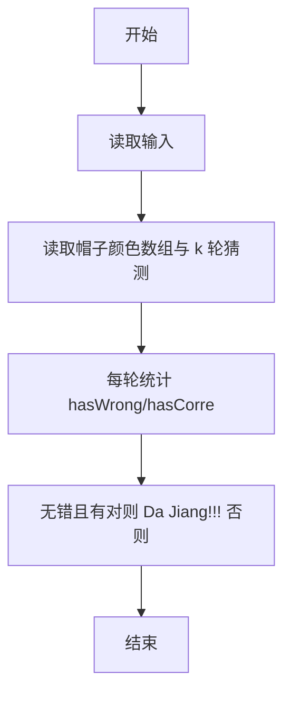
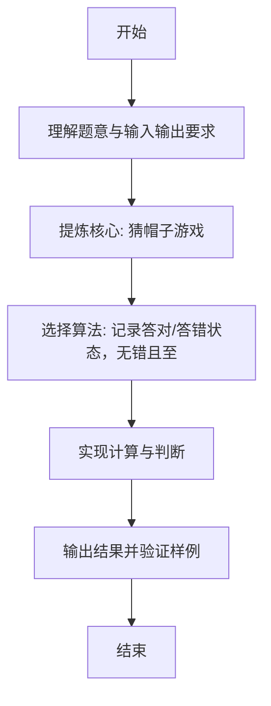

# L1-093 - 猜帽子游戏（15 分）

- **时间限制**: 400 ms
- **内存限制**: 65536 KB
- **代码长度限制**: 16 KB

---

## 题目描述


宝宝们在一起玩一个猜帽子游戏。每人头上被扣了一顶帽子，有的是黑色的，有的是黄色的。每个人可以看到别人头上的帽子，但是看不到自己的。游戏开始后，每个人可以猜自己头上的帽子是什么颜色，或者可以弃权不猜。如果没有一个人猜错、并且至少有一个人猜对了，那么所有的宝宝共同获得一个大奖。如果所有人都不猜，或者只要有一个人猜错了，所有宝宝就都没有奖。
下面顺序给出一排帽子的颜色，假设每一群宝宝来玩的时候，都是按照这个顺序发帽子的。然后给出每一群宝宝们猜的结果，请你判断他们能不能得大奖。

### 输入格式:

输入首先在一行中给出一个正整数 $$N$$（$$2 < N \le 100$$），是帽子的个数。第二行给出 $$N$$ 顶帽子的颜色，数字 `1` 表示黑色，`2` 表示黄色。
再下面给出一个正整数 $$K$$（$$\le 10$$），随后 $$K$$ 行，每行给出一群宝宝们猜的结果，除了仍然用数字 `1` 表示黑色、`2` 表示黄色之外，`0` 表示这个宝宝弃权不猜。
同一行中的数字用空格分隔。

### 输出格式:

对于每一群玩游戏的宝宝，如果他们能获得大奖，就在一行中输出 `Da Jiang!!!`，否则输出 `Ai Ya`。

### 输入样例:
```in
5
1 1 2 1 2
3
0 1 2 0 0
0 0 0 0 0
1 2 2 0 2
```

### 输出样例:
```out
Da Jiang!!!
Ai Ya
Ai Ya
```

## 示例

### 示例 1

**输入:**
```
5
1 1 2 1 2
3
0 1 2 0 0
0 0 0 0 0
1 2 2 0 2
```

**输出:**
```
Da Jiang!!!
Ai Ya
Ai Ya
```

---

### 解题思路

#### 题目分析
本题为“猜帽子游戏”（猜帽子游戏）。题面要求根据给定输入按规则计算并输出结果，输入规模小但需注意格式与边界。猜帽子游戏的判定涉及多分支或字符串处理，需将输入准确分词后逐项处理。仓颉实现中通过 `readToEnd`/`readln` 读取并以空白或行分割，兼顾有无换行与多空格的情况。

#### 核心算法
记录答对/答错状态，无错且至少一对则 Da Jiang!!! 否则 Ai Ya。实现上直接模拟题意：先将原始输入规范化为 Token 或行数组，再按规则遍历计算。例如 读取帽子颜色数组与 k 轮猜测，随后 每轮统计 hasWrong/hasCorrect，最后按条件分支输出。算法保持线性遍历，无需复杂数据结构，仅需若干计数器与集合即可完成。

#### 复杂度分析
- **时间复杂度**：O(k·n)。
- **空间复杂度**：O(1)，仅需常量或线性辅助数组存储输入分词结果。

### 代码流程说明

1. 读取帽子颜色数组与 k 轮猜测。
2. 每轮统计 hasWrong/hasCorrect。
3. 无错且有对则 Da Jiang!!! 否则 Ai Ya。
4. 输出换行并结束程序。

### 代码实现

完整仓颉源码如下（与 `.cj` 文件一致）：

```cangjie
// L1-093 猜帽子游戏 - 无猜错且至少一猜对则大奖
import std.env.*
import std.collection.*
import std.convert.*

main() {
    let cin = getStdIn()
    let all = cin.readToEnd() ?? ""
    let cleaned = all.replace("\r", " ").replace("\n", " ").replace("\t", " ")
    var raw = cleaned.split(" ")
    var tokens = ArrayList<String>()
    for (p in raw) { if (p.trimAscii().size > 0) { tokens.add(p.trimAscii()) } }
    if (tokens.size == 0) { return }
    let n = Int64.parse(tokens[0])
    var colors = Array<Int64>(n, repeat: 0)
    var idx: Int64 = 1
    for (i in 0..n) {
        if (idx < Int64(tokens.size)) {
            colors[i] = Int64.parse(tokens[idx])
            idx++
        }
    }
    if (idx >= Int64(tokens.size)) { return }
    let k = Int64.parse(tokens[idx])
    idx++
    for (_ in 0..k) {
        var hasWrong = false
        var hasCorrect = false
        for (j in 0..n) {
            if (idx >= Int64(tokens.size)) { break }
            let g = Int64.parse(tokens[idx])
            idx++
            if (g != 0) {
                if (g == colors[j]) { hasCorrect = true } else { hasWrong = true }
            }
        }
        if (!hasWrong && hasCorrect) {
            println("Da Jiang!!!")
        } else {
            println("Ai Ya")
        }
    }
}
```

### 代码流程图



### 解题流程图


