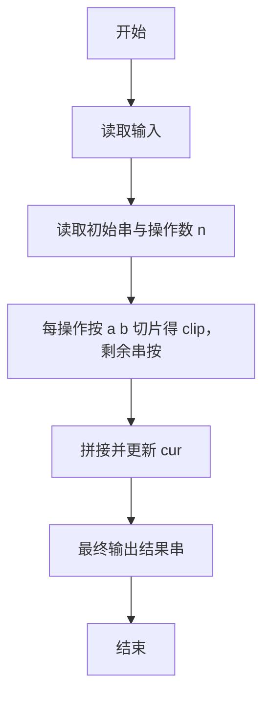
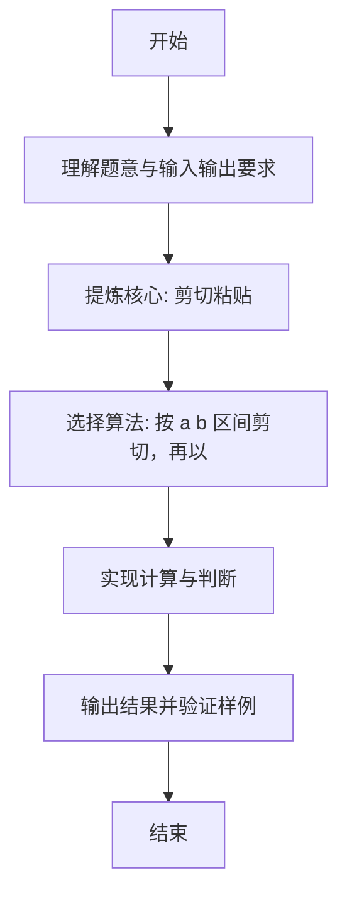

# L1-094 - 剪切粘贴（15 分）

- **时间限制**: 400 ms
- **内存限制**: 65536 KB
- **代码长度限制**: 16 KB

---

## 题目描述


使用计算机进行文本编辑时常见的功能是剪切功能（快捷键：Ctrl + X）。请实现一个简单的具有剪切和粘贴功能的文本编辑工具。

工具需要完成一系列剪切后粘贴的操作，每次操作分为两步：

* 剪切：给定需操作的起始位置和结束位置，将当前字符串中起始位置到结束位置部分的字符串放入剪贴板中，并删除当前字符串对应位置的内容。例如，当前字符串为 `abcdefg`，起始位置为 3，结束位置为 5，则剪贴操作后， 剪贴板内容为 `cde`，操作后字符串变为 `abfg`。字符串位置从 1 开始编号。
* 粘贴：给定插入位置的前后字符串，寻找到插入位置，将剪贴板内容插入到位置中，并清除剪贴板内容。例如，对于上面操作后的结果，给定插入位置前为 `bf`，插入位置后为 `g`，则插入后变为 `abfcdeg`。如找不到应该插入的位置，则直接将插入位置设置为字符串最后，仍然完成插入操作。查找字符串时区分大小写。

每次操作后的字符串即为新的当前字符串。在若干次操作后，请给出最后的编辑结果。

### 输入格式:

输入第一行是一个长度小于等于 200 的字符串 $S$，表示原始字符串。字符串只包含所有可见 ASCII 字符，不包含回车与空格。

第二行是一个正整数 $N$ ($1 \le N \le 100$)，表示要进行的操作次数。

接下来的 $N$ 行，每行是两个数字和两个**长度不大于 5** 的不包含空格的非空字符串，前两个数字表示需要剪切的位置，后两个字符串表示插入位置前和后的字符串，用一个空格隔开。如果有多个可插入的位置，选择最靠近当前操作字符串开头的一个。

剪切的位置保证总是合法的。

### 输出格式:

输出一行，表示操作后的字符串。

### 输入样例:
```in
AcrosstheGreatWall,wecanreacheverycornerintheworld
5
10 18 ery cor
32 40 , we
1 6 tW all
14 18 rnerr eache
1 1 e r
```

### 输出样例:
```out
he,allcornetrrwecaneacheveryGreatWintheworldAcross
```

## 示例

### 示例 1

**输入:**
```
AcrosstheGreatWall,wecanreacheverycornerintheworld
5
10 18 ery cor
32 40 , we
1 6 tW all
14 18 rnerr eache
1 1 e r
```

**输出:**
```
he,allcornetrrwecaneacheveryGreatWintheworldAcross
```

---

### 解题思路

#### 题目分析
本题为“剪切粘贴”（剪切粘贴）。题面要求根据给定输入按规则计算并输出结果，输入规模小但需注意格式与边界。剪切粘贴的判定涉及多分支或字符串处理，需将输入准确分词后逐项处理。仓颉实现中通过 `readToEnd`/`readln` 读取并以空白或行分割，兼顾有无换行与多空格的情况。

#### 核心算法
按 a b 区间剪切，再以 before/after 为锚点在剩余串中查找插入位置。实现上直接模拟题意：先将原始输入规范化为 Token 或行数组，再按规则遍历计算。例如 读取初始串与操作数 n，随后 每操作按 a b 切片得 clip，剩余串按 before/after 找插入点，最后按条件分支输出。算法保持线性遍历，无需复杂数据结构，仅需若干计数器与集合即可完成。

#### 复杂度分析
- **时间复杂度**：O(L) 字符串操作。
- **空间复杂度**：O(1)，仅需常量或线性辅助数组存储输入分词结果。

### 代码流程说明

1. 读取初始串与操作数 n。
2. 每操作按 a b 切片得 clip，剩余串按 before/after 找插入点。
3. 拼接并更新 cur。
4. 最终输出结果串。
5. 输出换行并结束程序。

### 代码实现

完整仓颉源码如下（与 `.cj` 文件一致）：

```cangjie
// L1-094 剪切粘贴 - 剪切后按前后串查找插入
import std.env.*
import std.collection.*
import std.convert.*

func indexOf(s: Array<Rune>, pat: Array<Rune>): Int64 {
    if (pat.size == 0) { return 0 }
    if (pat.size > s.size) { return -1 }
    var i: Int64 = 0
    while (i <= Int64(s.size) - Int64(pat.size)) {
        var j: Int64 = 0
        while (j < Int64(pat.size) && s[j + i] == pat[j]) { j++ }
        if (j == Int64(pat.size)) { return i }
        i++
    }
    return -1
}

main() {
    let cin = getStdIn()
    let firstOpt = cin.readln()
    if (let None <- firstOpt) { return }
    let firstLine = match (firstOpt) { case Some(v) => v; case None => "" }
    var cur = firstLine.toRuneArray()
    let secondOpt = cin.readln()
    if (let None <- secondOpt) { return }
    let secondLine = match (secondOpt) { case Some(v) => v; case None => "" }
    let n = Int64.parse(secondLine.trimAscii())
    var op: Int64 = 0
    while (op < n) {
        let lineOpt = cin.readln()
        if (let None <- lineOpt) { break }
        let line = match (lineOpt) { case Some(v) => v; case None => "" }
        var raw = line.trimAscii().split(" ")
        var toks = ArrayList<String>()
        for (p in raw) { if (p.size > 0) { toks.add(p) } }
        if (toks.size < 4) { op++; continue }
        let a = Int64.parse(toks[0])
        let b = Int64.parse(toks[1])
        let before = toks[2]
        let after = toks[3]
        let start: Int64 = a - 1
        let end: Int64 = b - 1
        var clip = Array<Rune>(0, repeat: " ".toRuneArray()[0])
        // clear placeholder
        clip = Array<Rune>(0, repeat: " ".toRuneArray()[0])
        // actually build correctly without placeholder
        var tmpClip = Array<Rune>(0, repeat: " ".toRuneArray()[0])
        tmpClip = Array<Rune>(0, repeat: " ".toRuneArray()[0])
        // To avoid repeat complexity, rebuild from scratch using dynamic
        var clip2 = ArrayList<Rune>()
        var ii = start
        while (ii <= end && ii < Int64(cur.size)) {
            clip2.add(cur[ii])
            ii++
        }
        var next = ArrayList<Rune>()
        var j: Int64 = 0
        while (j < start) {
            next.add(cur[j])
            j++
        }
        var k = end + 1
        while (k < Int64(cur.size)) {
            next.add(cur[k])
            k++
        }
        var nextArr = Array<Rune>(next.size, repeat: " ".toRuneArray()[0])
        for (t in 0..next.size) { nextArr[t] = next[t] }
        cur = nextArr
        let beforeArr = before.toRuneArray()
        let afterArr = after.toRuneArray()
        var targetList = ArrayList<Rune>()
        for (r in beforeArr) { targetList.add(r) }
        for (r in afterArr) { targetList.add(r) }
        var target = Array<Rune>(targetList.size, repeat: " ".toRuneArray()[0])
        for (t in 0..targetList.size) { target[t] = targetList[t] }
        let pos = indexOf(cur, target)
        if (pos != -1) {
            let insertAt = pos + Int64(beforeArr.size)
            var merged = ArrayList<Rune>()
            var t1: Int64 = 0
            while (t1 < insertAt) { merged.add(cur[t1]); t1++ }
            for (r in clip2) { merged.add(r) }
            var t2 = insertAt
            while (t2 < Int64(cur.size)) { merged.add(cur[t2]); t2++ }
            var mergedArr = Array<Rune>(merged.size, repeat: " ".toRuneArray()[0])
            for (t in 0..merged.size) { mergedArr[t] = merged[t] }
            cur = mergedArr
        } else {
            var ext = ArrayList<Rune>()
            for (r in cur) { ext.add(r) }
            for (r in clip2) { ext.add(r) }
            var extArr = Array<Rune>(ext.size, repeat: " ".toRuneArray()[0])
            for (t in 0..ext.size) { extArr[t] = ext[t] }
            cur = extArr
        }
        op++
    }
    var out = StringBuilder()
    for (r in cur) { out.append(r) }
    println(out.toString())
}
```

### 代码流程图



### 解题流程图


