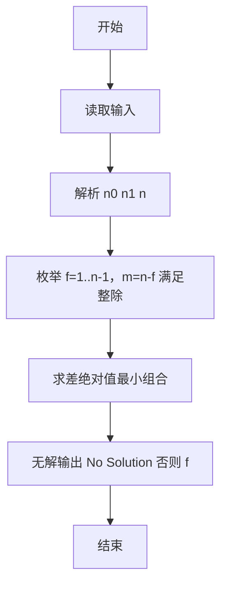
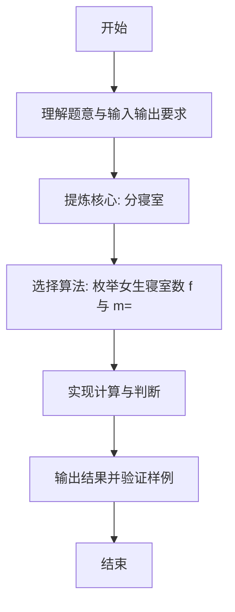

# L1-095 - 分寝室（20 分）

- **时间限制**: 400 ms
- **内存限制**: 65536 KB
- **代码长度限制**: 16 KB

---

## 题目描述


学校新建了宿舍楼，共有 $n$ 间寝室。等待分配的学生中，有女生 $n_0$ 位、男生 $n_1$ 位。所有待分配的学生都必须分到一间寝室。所有的寝室都要分出去，最后不能有寝室留空。\
现请你写程序完成寝室的自动分配。分配规则如下：

* 男女生不能混住；
* 不允许单人住一间寝室；
* 对每种性别的学生，每间寝室入住的人数都必须相同；例如不能出现一部分寝室住 2 位女生，一部分寝室住 3 位女生的情况。但女生寝室都是 2 人一间，男生寝室都是 3 人一间，则是允许的；
* 在有多种分配方案满足前面三项要求的情况下，要求两种性别每间寝室入住的人数差最小。

### 输入格式:

输入在一行中给出 3 个正整数 $n_0$、$n_1$、$n$，分别对应女生人数、男生人数、寝室数。数字间以空格分隔，均不超过 $10^5$。

### 输出格式:

在一行中顺序输出女生和男生被分配的寝室数量，其间以 1 个空格分隔。行首尾不得有多余空格。\
如果有解，题目保证解是唯一的。如果无解，则在一行中输出 `No Solution`。

### 输入样例 1：
```in
24 60 10
```

### 输出样例 1：
```out
4 6
```

### 输入样例 2：
```in
29 30 10
```

### 输出样例 2：
```out
No Solution
```

## 示例

### 示例 1

**输入:**
```
24 60 10
```

**输出:**
```
4 6
```

### 示例 2

**输入:**
```
29 30 10
```

**输出:**
```
No Solution
```

---

### 解题思路

#### 题目分析
本题为“分寝室”（分寝室）。题面要求根据给定输入按规则计算并输出结果，输入规模小但需注意格式与边界。分寝室的判定涉及多分支或字符串处理，需将输入准确分词后逐项处理。仓颉实现中通过 `readToEnd`/`readln` 读取并以空白或行分割，兼顾有无换行与多空格的情况。

#### 核心算法
枚举女生寝室数 f 与 m=n-f，满足整除且人均≥2 时求人均差最小组合。实现上直接模拟题意：先将原始输入规范化为 Token 或行数组，再按规则遍历计算。例如 解析 n0 n1 n，随后 枚举 f=1..n-1，m=n-f 满足整除且人均≥2，最后按条件分支输出。算法保持线性遍历，无需复杂数据结构，仅需若干计数器与集合即可完成。

#### 复杂度分析
- **时间复杂度**：O(n)。
- **空间复杂度**：O(n)，仅需常量或线性辅助数组存储输入分词结果。

### 代码流程说明

1. 解析 n0 n1 n。
2. 枚举 f=1..n-1，m=n-f 满足整除且人均≥2。
3. 求差绝对值最小组合。
4. 无解输出 No Solution 否则 f m。
5. 输出换行并结束程序。

### 代码实现

完整仓颉源码如下（与 `.cj` 文件一致）：

```cangjie
// L1-095 分寝室 - 枚举女生寝室数求差最小
import std.env.*
import std.collection.*
import std.convert.*

main() {
    let cin = getStdIn()
    let all = cin.readToEnd() ?? ""
    let cleaned = all.replace("\r", " ").replace("\n", " ").replace("\t", " ")
    var raw = cleaned.split(" ")
    var tokens = ArrayList<String>()
    for (p in raw) { if (p.trimAscii().size > 0) { tokens.add(p.trimAscii()) } }
    if (tokens.size < 3) { return }
    let n0 = Int64.parse(tokens[0])
    let n1 = Int64.parse(tokens[1])
    let n = Int64.parse(tokens[2])
    var bestF: Int64 = -1
    var bestM: Int64 = -1
    var minDiff: Int64 = 1000000000
    var f: Int64 = 1
    while (f < n) {
        let m = n - f
        if (n0 % f == 0 && n1 % m == 0) {
            let pf = n0 / f
            let pm = n1 / m
            if (pf >= 2 && pm >= 2) {
                var diff = pf - pm
                if (diff < 0) { diff = -diff }
                if (diff < minDiff) {
                    minDiff = diff
                    bestF = f
                    bestM = m
                }
            }
        }
        f++
    }
    if (bestF == -1) {
        println("No Solution")
    } else {
        println("${bestF} ${bestM}")
    }
}
```

### 代码流程图



### 解题流程图


