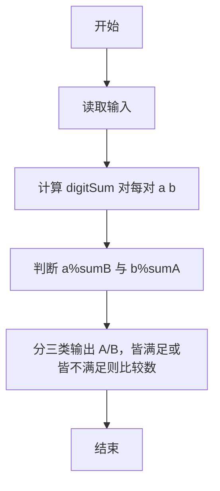
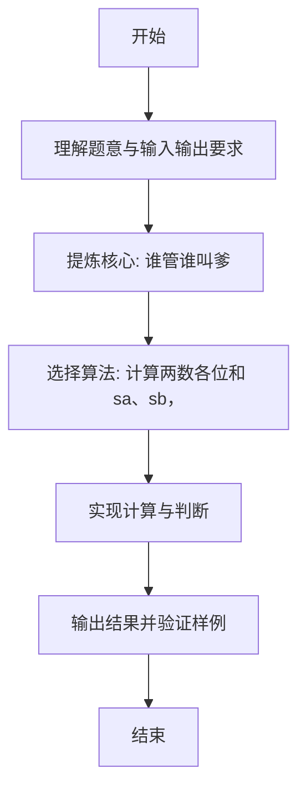

# L1-096 - 谁管谁叫爹（20 分）

- **时间限制**: 400 ms
- **内存限制**: 65536 KB
- **代码长度限制**: 16 KB

---

## 题目描述


《咱俩谁管谁叫爹》是网上一首搞笑饶舌歌曲，来源于东北酒桌上的助兴游戏。现在我们把这个游戏的难度拔高一点，多耗一些智商。
不妨设游戏中的两个人为 A 和 B。游戏开始后，两人同时报出两个整数 $$N_A$$ 和 $$N_B$$。判断谁是爹的标准如下：
- 将两个整数的各位数字分别相加，得到两个和 $$S_A$$ 和 $$S_B$$。如果 $$N_A$$ 正好是 $$S_B$$ 的整数倍，则 A 是爹；如果 $$N_B$$ 正好是 $$S_A$$ 的整数倍，则 B 是爹；
- 如果两人同时满足、或同时不满足上述判定条件，则原始数字大的那个是爹。
本题就请你写一个自动裁判程序，判定谁是爹。

### 输入格式:

输入第一行给出一个正整数 $$N$$（$$\le 100$$），为游戏的次数。以下 $$N$$ 行，每行给出一对不超过 9 位数的正整数，对应 A 和 B 给出的原始数字。题目保证两个数字不相等。

### 输出格式:

对每一轮游戏，在一行中给出赢得“爹”称号的玩家（`A` 或 `B`）。

### 输入样例:
```in
4
999999999 891
78250 3859
267537 52654299
6666 120
```

### 输出样例:
```out
B
A
B
A
```

## 示例

### 示例 1

**输入:**
```
4
999999999 891
78250 3859
267537 52654299
6666 120
```

**输出:**
```
B
A
B
A
```

---

### 解题思路

#### 题目分析
本题为“谁管谁叫爹”（谁管谁叫爹）。题面要求根据给定输入按规则计算并输出结果，输入规模小但需注意格式与边界。谁管谁叫爹的判定涉及多分支或字符串处理，需将输入准确分词后逐项处理。仓颉实现中通过 `readToEnd`/`readln` 读取并以空白或行分割，兼顾有无换行与多空格的情况。

#### 核心算法
计算两数各位和 sa、sb，若 a%sb==0 与 b%sa==0 组合判定胜负。实现上直接模拟题意：先将原始输入规范化为 Token 或行数组，再按规则遍历计算。例如 计算 digitSum 对每对 a b，随后 判断 a%sumB 与 b%sumA，最后按条件分支输出。算法保持线性遍历，无需复杂数据结构，仅需若干计数器与集合即可完成。

#### 复杂度分析
- **时间复杂度**：O(n·d) d 位数。
- **空间复杂度**：O(n)，仅需常量或线性辅助数组存储输入分词结果。

### 代码流程说明

1. 计算 digitSum 对每对 a b。
2. 判断 a%sumB 与 b%sumA。
3. 分三类输出 A/B，皆满足或皆不满足则比较数值大小。
4. 输出换行并结束程序。

### 代码实现

完整仓颉源码如下（与 `.cj` 文件一致）：

```cangjie
// L1-096 谁管谁叫爹 - 按数字和倍数判定
import std.env.*
import std.collection.*
import std.convert.*

func digitSum(s: String): Int64 {
    var sum: Int64 = 0
    let arr = s.toRuneArray()
    for (r in arr) {
        sum += Int64.parse("${r}")
    }
    return sum
}

main() {
    let cin = getStdIn()
    let all = cin.readToEnd() ?? ""
    let cleaned = all.replace("\r", " ").replace("\n", " ").replace("\t", " ")
    var raw = cleaned.split(" ")
    var tokens = ArrayList<String>()
    for (p in raw) { if (p.trimAscii().size > 0) { tokens.add(p.trimAscii()) } }
    if (tokens.size == 0) { return }
    let n = Int64.parse(tokens[0])
    var idx: Int64 = 1
    var i: Int64 = 0
    while (i < n && idx + 1 < Int64(tokens.size)) {
        let aStr = tokens[idx]
        let bStr = tokens[idx+1]
        idx += 2
        i++
        let na = Int64.parse(aStr)
        let nb = Int64.parse(bStr)
        let sa = digitSum(aStr)
        let sb2 = digitSum(bStr)
        let aWin = (na % sb2 == 0)
        let bWin = (nb % sa == 0)
        if (aWin && !bWin) {
            println("A")
        } else if (!aWin && bWin) {
            println("B")
        } else {
            if (na > nb) {
                println("A")
            } else {
                println("B")
            }
        }
    }
}
```

### 代码流程图



### 解题流程图


