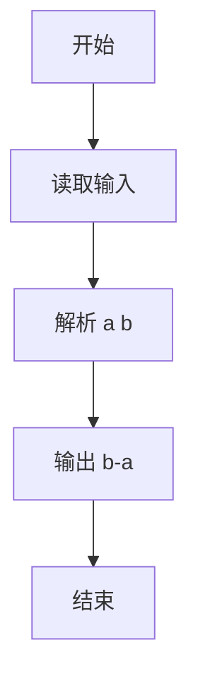
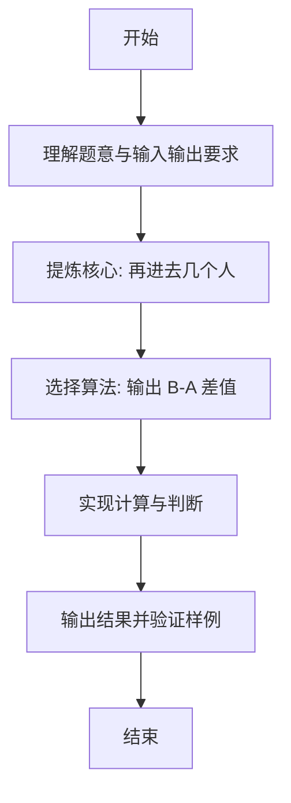

# L1-098 - 再进去几个人（5 分）

- **时间限制**: 400 ms
- **内存限制**: 65536 KB
- **代码长度限制**: 16 KB

---

## 题目描述


数学家、生物学家和物理学家坐在街头咖啡屋里，看着人们从街对面的一间房子走进走出。他们先看到两个人进去。时光流逝。他们又看到三个人出来。
物理学家:“测量不够准确。”
生物学家:“他们进行了繁殖。”
数学家:“如果现在再进去一个人，那房子就空了。”
下面就请你写个程序，根据进去和出来的人数，帮数学家算出来，再进去几个人，那房子就空了。

### 输入格式:

输入在一行中给出 2 个不超过 100 的正整数 A 和 B，其中 A 是进去的人数，B 是出来的人数。题目保证 B 比 A 要大。

### 输出格式:

在一行中输出使得房子变空的、需要再进去的人数。

### 输入样例:
```in
4 7
```

### 输出样例:
```out
3
```

## 示例

### 示例 1

**输入:**
```
4 7
```

**输出:**
```
3
```

---

### 解题思路

#### 题目分析
本题为“再进去几个人”（再进去几个人）。题面要求根据给定输入按规则计算并输出结果，输入规模小但需注意格式与边界。再进去几个人的判定涉及多分支或字符串处理，需将输入准确分词后逐项处理。仓颉实现中通过 `readToEnd`/`readln` 读取并以空白或行分割，兼顾有无换行与多空格的情况。

#### 核心算法
输出 B-A 差值。实现上直接模拟题意：先将原始输入规范化为 Token 或行数组，再按规则遍历计算。例如 解析 a b，随后 输出 b-a，最后按条件分支输出。算法保持线性遍历，无需复杂数据结构，仅需若干计数器与集合即可完成。

#### 复杂度分析
- **时间复杂度**：O(1)。
- **空间复杂度**：O(1)，仅需常量或线性辅助数组存储输入分词结果。

### 代码流程说明

1. 解析 a b。
2. 输出 b-a。
3. 输出换行并结束程序。

### 代码实现

完整仓颉源码如下（与 `.cj` 文件一致）：

```cangjie
/* L1-098 再进去几个人 - approach: answer = B - A, stdin read */
import std.env.*
import std.collection.*
import std.convert.*
main() {
    let cin = getStdIn()
    var tokens = ArrayList<String>()
    while (let Some(line) <- cin.readln()) {
        let parts = line.split(" ")
        for (p in parts) {
            let t = p.trimAscii()
            if (t.size != 0) {
                tokens.add(t)
            }
        }
    }
    if (tokens.size < 2) {
        return
    }
    let a = Int64.parse(tokens[0])
    let b = Int64.parse(tokens[1])
    println(b - a)
}
```

### 代码流程图



### 解题流程图


