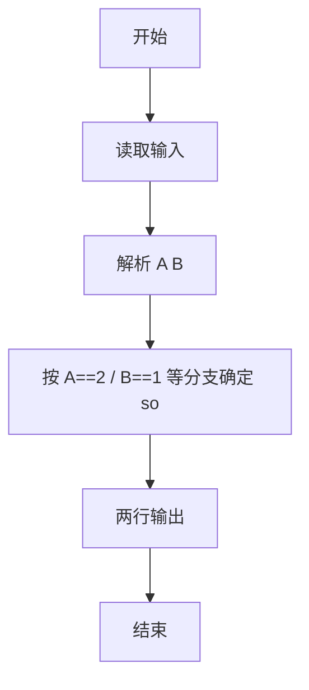
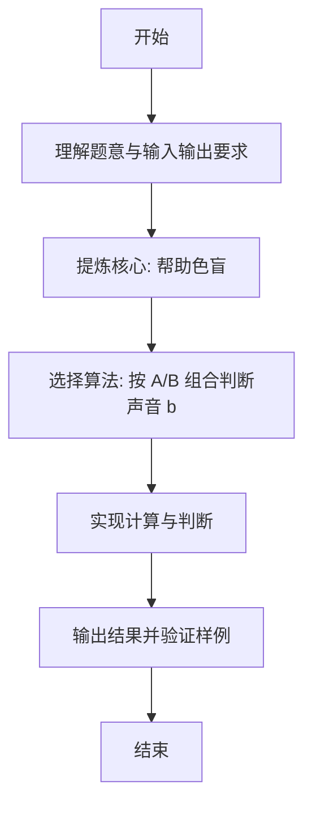

# L1-099 - 帮助色盲（10 分）

- **时间限制**: 400 ms
- **内存限制**: 65536 KB
- **代码长度限制**: 16 KB

---

## 题目描述


在古老的红绿灯面前，红绿色盲患者无法分辨当前亮起的灯是红色还是绿色，有些聪明人通过路口的策略是这样的：当红灯或绿灯亮起时，灯的颜色无法判断，但前方两米内有同向行走的人，就跟着前面那人行动，人家走就跟着走，人家停就跟着停；如果当前是黄灯，那么很快就要变成红灯了，于是应该停下来。麻烦的是，当灯的颜色无法判断时，前方两米内没有人……
本题就请你写一个程序，通过产生不同的提示音来帮助红绿色盲患者判断当前交通灯的颜色；但当患者可以自行判断的时候（例如黄灯或者前方两米内有人），就不做多余的打扰。具体要求的功能为：当前交通灯为红灯或绿灯时，检测其前方两米内是否有同向行走的人 —— 如果有，则患者自己可以判断，程序就不做提示；如果没有，则根据灯的颜色给出不同的提示音。黄灯也不需要给出提示。

### 输入格式:

输入在一行中给出两个数字 A 和 B，其间以空格分隔。其中 A 是当前交通灯的颜色，取值为 0 表示红灯、1 表示绿灯、2 表示黄灯；B 是前方行人的状态，取值为 0 表示前方两米内没有同向行走的人、1 表示有。

### 输出格式:

根据输入的状态在第一行中输出提示音：`dudu` 表示前方为绿灯，可以继续前进；`biii` 表示前方为红灯，应该止步；`-` 表示不做提示。在第二行输出患者应该执行的动作：`move` 表示继续前进、`stop` 表示止步。

### 输入样例 1：
```in
0 0
```

### 输出样例 1：
```out
biii
stop
```

### 输入样例 2：
```in
1 1
```

### 输出样例 2：
```out
-
move
```

## 示例

### 示例 1

**输入:**
```
0 0
```

**输出:**
```
biii
stop
```

### 示例 2

**输入:**
```
1 1
```

**输出:**
```
-
move
```

---

### 解题思路

#### 题目分析
本题为“帮助色盲”（帮助色盲）。题面要求根据给定输入按规则计算并输出结果，输入规模小但需注意格式与边界。帮助色盲的判定涉及多分支或字符串处理，需将输入准确分词后逐项处理。仓颉实现中通过 `readToEnd`/`readln` 读取并以空白或行分割，兼顾有无换行与多空格的情况。

#### 核心算法
按 A/B 组合判断声音 biii/dudu/- 与动作 move/stop。实现上直接模拟题意：先将原始输入规范化为 Token 或行数组，再按规则遍历计算。例如 解析 A B，随后 按 A==2 / B==1 等分支确定 sound 与 action，最后按条件分支输出。算法保持线性遍历，无需复杂数据结构，仅需若干计数器与集合即可完成。

#### 复杂度分析
- **时间复杂度**：O(1)。
- **空间复杂度**：O(1)，仅需常量或线性辅助数组存储输入分词结果。

### 代码流程说明

1. 解析 A B。
2. 按 A==2 / B==1 等分支确定 sound 与 action。
3. 两行输出。
4. 输出换行并结束程序。

### 代码实现

完整仓颉源码如下（与 `.cj` 文件一致）：

```cangjie
/* L1-099 帮助色盲 - approach: decide sound/action by A,B */
import std.env.*
import std.collection.*
import std.convert.*
main() {
    let cin = getStdIn()
    var tokens = ArrayList<String>()
    while (let Some(line) <- cin.readln()) {
        let parts = line.split(" ")
        for (p in parts) {
            let t = p.trimAscii()
            if (t.size != 0) {
                tokens.add(t)
            }
        }
    }
    if (tokens.size < 2) { return }
    let a = Int64.parse(tokens[0])
    let b = Int64.parse(tokens[1])
    var sound: String = ""
    var action: String = ""
    if (a == 2) {
        sound = "-"
        action = "stop"
    } else if (b == 1) {
        sound = "-"
        if (a == 1) {
            action = "move"
        } else {
            action = "stop"
        }
    } else {
        if (a == 0) {
            sound = "biii"
            action = "stop"
        } else {
            sound = "dudu"
            action = "move"
        }
    }
    println(sound)
    println(action)
}
```

### 代码流程图



### 解题流程图


