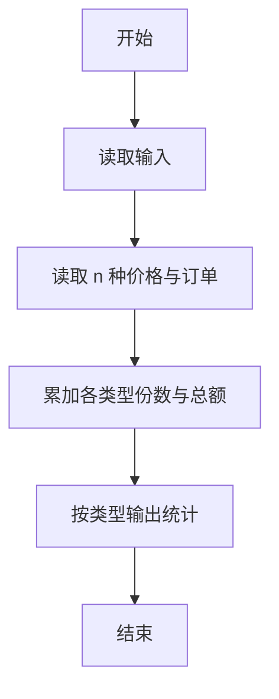
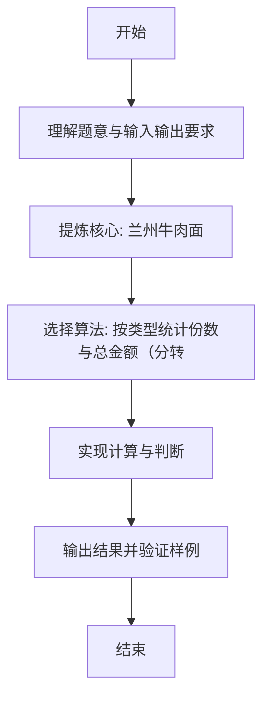

# L1-102 - 兰州牛肉面（15 分）

- **时间限制**: 400 ms
- **内存限制**: 65536 KB
- **代码长度限制**: 16 KB

---

## 题目描述


兰州牛肉面是历史悠久的美食，根据牛肉面的宽窄、配料的种类，可以细分为上百个不同的品种。你进到兰州的任何一家牛肉面馆，只说：“来一碗牛肉面！”就好像进到加州的咖啡馆说“来一杯咖啡”一样，会被店主人当成外星人……
本题的任务是，请你写程序帮助一家牛肉面馆的老板统计一下，他们一天卖出各种品种的牛肉面有多少碗，营业额一共有多少。

### 输入格式:

输入第一行给出一个正整数 $$N$$（$$\le 100$$），为牛肉面的种类数量。这里为了简单起见，我们把不同种类的牛肉面从 1 到 $$N$$ 编号，以后就用编号代替牛肉面品种的名称。第二行给出 $$N$$ 个价格，第 $$i$$ 个价格对应第 $$i$$ 种牛肉面一碗的单价。这里的价格是 [0.01, 200.00] 区间内的实数，以元为单位，精确到分。
随后是一天内客人买面的记录，每条记录占一行，格式为：
```
品种编号 碗数
```
其中`碗数`保证是正整数。当对应的 `品种编号` 为 `0` 时，表示输入结束。这个记录不算在内。

### 输出格式:

首先输出 $$N$$ 行，第 $$i$$ 行输出第 $$i$$ 种牛肉面卖出了多少碗。最后一行输出当天的总营业额，仍然是以元为单位，精确到分。题目保证总营业额不超过 $$10^6$$。

### 输入样例:
```in
5
4.00 8.50 3.20 12.00 14.10
3 5
5 2
1 1
2 3
2 2
1 9
0 0
```

### 输出样例:
```out
10
5
5
0
2
126.70
```

## 示例

### 示例 1

**输入:**
```
5
4.00 8.50 3.20 12.00 14.10
3 5
5 2
1 1
2 3
2 2
1 9
0 0
```

**输出:**
```
10
5
5
0
2
126.70
```

---

### 解题思路

#### 题目分析
本题为“兰州牛肉面”（兰州牛肉面）。题面要求根据给定输入按规则计算并输出结果，输入规模小但需注意格式与边界。兰州牛肉面的判定涉及多分支或字符串处理，需将输入准确分词后逐项处理。仓颉实现中通过 `readToEnd`/`readln` 读取并以空白或行分割，兼顾有无换行与多空格的情况。

#### 核心算法
按类型统计份数与总金额（分转元），逐类输出。实现上直接模拟题意：先将原始输入规范化为 Token 或行数组，再按规则遍历计算。例如 读取 n 种价格与订单，随后 累加各类型份数与总额，最后按条件分支输出。算法保持线性遍历，无需复杂数据结构，仅需若干计数器与集合即可完成。

#### 复杂度分析
- **时间复杂度**：O(n)。
- **空间复杂度**：O(n)，仅需常量或线性辅助数组存储输入分词结果。

### 代码流程说明

1. 读取 n 种价格与订单。
2. 累加各类型份数与总额。
3. 按类型输出统计。
4. 输出换行并结束程序。

### 代码实现

完整仓颉源码如下（与 `.cj` 文件一致）：

```cangjie
/* L1-102 兰州牛肉面 - approach: count per type and total cents */
import std.env.*
import std.collection.*
import std.convert.*
main() {
    let cin = getStdIn()
    var allLines = ArrayList<String>()
    while (let Some(line) <- cin.readln()) {
        allLines.add(line)
    }
    if (allLines.size == 0) { return }
    let n = Int64.parse(allLines[0].trimAscii())
    var priceStrs = ArrayList<String>()
    var idx: Int64 = 1
    // collect price tokens until we have n
    while (priceStrs.size < n && idx < Int64(allLines.size)) {
        let parts = allLines[Int64(idx)].split(" ")
        for (p in parts) {
            let t = p.trimAscii()
            if (t.size != 0) {
                priceStrs.add(t)
            }
        }
        idx += 1
    }
    var priceCents = Array<Int64>(Int64(n), repeat: 0)
    for (i in 0..n) {
        let s = priceStrs[Int64(i)]
        // parse price like "4.00"
        var cents: Int64 = 0
        let dotParts = s.split(".")
        if (dotParts.size == 1) {
            cents = Int64.parse(dotParts[0]) * 100
        } else {
            let intPart = Int64.parse(dotParts[0])
            var frac = dotParts[1]
            // pad or trim to 2 digits
            if (frac.size == 0) {
                frac = "00"
            } else if (frac.size == 1) {
                frac = frac + "0"
            } else if (frac.size > 2) {
                frac = frac[0..2]
            }
            let fracVal = Int64.parse(frac)
            cents = intPart * 100 + fracVal
        }
        priceCents[Int64(i)] = cents
    }
    var counts = Array<Int64>(Int64(n), repeat: 0)
    // remaining lines from idx onward are records
    while (idx < Int64(allLines.size)) {
        let line = allLines[Int64(idx)]
        idx += 1
        if (line.trimAscii().size == 0) { continue }
        let parts = line.split(" ")
        var nums = ArrayList<String>()
        for (p in parts) {
            let t = p.trimAscii()
            if (t.size != 0) { nums.add(t) }
        }
        if (nums.size < 2) { continue }
        let t = Int64.parse(nums[0])
        let b = Int64.parse(nums[1])
        if (t == 0) { break }
        if (t >= 1 && t <= n) {
            counts[Int64(t - 1)] += b
        }
    }
    let sb = StringBuilder()
    var totalCents: Int64 = 0
    for (i in 0..n) {
        println(counts[Int64(i)])
        totalCents += priceCents[Int64(i)] * counts[Int64(i)]
    }
    let dollars = totalCents / 100
    let cents = totalCents % 100
    let centsStr = cents.toString().padStart(2, padding: '0')
    println("${dollars}.${centsStr}")
}
```

### 代码流程图



### 解题流程图


