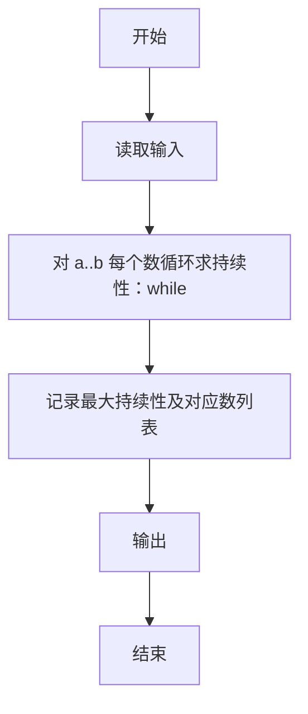

# L1-103 - 整数的持续性（20 分）

- **时间限制**: 400 ms
- **内存限制**: 65536 KB
- **代码长度限制**: 16 KB

---

## 题目描述


从任一给定的正整数 $n$ 出发，将其每一位数字相乘，记得到的乘积为 $n_1$。以此类推，令 $n_{i+1}$ 为 $n_i$ 的各位数字的乘积，直到最后得到一个个位数 $n_m$，则 $m$ 就称为 $n$ 的**持续性**。例如 $679$ 的持续性就是 5，因为我们从 $679$ 开始，得到 $6\times 7\times 9 = 378$，随后得到 $3\times 7\times 8 = 168$、$1\times 6\times 8 = 48$、$4\times 8 = 32$，最后得到 $3\times 2 = 6$，一共用了 5 步。
本题就请你编写程序，找出任一给定区间内持续性最长的整数。

### 输入格式:

输入在一行中给出两个正整数 $a$ 和 $b$（$1\le a \le b \le 10^9$ 且 $(b-a)<10^3$），为给定区间的两个端点。

### 输出格式:

首先在第一行输出区间 $[a, b]$ 内整数最长的持续性。随后在第二行中输出持续性最长的整数。如果这样的整数不唯一，则按照递增序输出，数字间以 1 个空格分隔，行首尾不得有多余空格。

### 输入样例:
```in
500 700
```

### 输出样例:
```out
5
679 688 697
```

## 示例

### 示例 1

**输入:**
```
500 700
```

**输出:**
```
5
679 688 697
```

---

### 解题思路

#### 题目分析
本题为“整数的持续性”（整数的持续性）。题面要求根据给定输入按规则计算并输出结果，输入规模小但需注意格式与边界。整数的持续性的判定涉及多分支或字符串处理，需将输入准确分词后逐项处理。仓颉实现中通过 `readToEnd`/`readln` 读取并以空白或行分割，兼顾有无换行与多空格的情况。

#### 核心算法
对区间 [a,b] 内每个数迭代求各位积直至个位数，统计持续性最大值及对应数。实现上直接模拟题意：先将原始输入规范化为 Token 或行数组，再按规则遍历计算。例如 对 a..b 每个数循环求持续性：whi，随后 记录最大持续性及对应数列表，最后按条件分支输出。算法保持线性遍历，无需复杂数据结构，仅需若干计数器与集合即可完成。

#### 复杂度分析
- **时间复杂度**：O((b-a)·log n)。
- **空间复杂度**：O(1)，仅需常量或线性辅助数组存储输入分词结果。

### 代码流程说明

1. 对 a..b 每个数循环求持续性：while≥10 求各位积计数。
2. 记录最大持续性及对应数列表。
3. 输出。
4. 输出换行并结束程序。

### 代码实现

完整仓颉源码如下（与 `.cj` 文件一致）：

```cangjie
/* L1-103 整数的持续性 - approach: brute persistence for interval */
import std.env.*
import std.collection.*
import std.convert.*
func digitProduct(n: Int64): Int64 {
    if (n < 10) {
        return n
    }
    var product: Int64 = 1
    var num: Int64 = n
    while (num > 0) {
        let d: Int64 = num % 10
        if (d == 0) {
            return 0
        }
        product *= d
        num /= 10
    }
    return product
}
func persistence(n: Int64): Int64 {
    if (n < 10) {
        return 0
    }
    var cnt: Int64 = 0
    var cur: Int64 = n
    while (cur >= 10) {
        cur = digitProduct(cur)
        cnt += 1
    }
    return cnt
}
main() {
    let cin = getStdIn()
    var tokens = ArrayList<String>()
    while (let Some(line) <- cin.readln()) {
        let parts = line.split(" ")
        for (p in parts) {
            let t = p.trimAscii()
            if (t.size != 0) { tokens.add(t) }
        }
    }
    if (tokens.size < 2) { return }
    let a = Int64.parse(tokens[0])
    let b = Int64.parse(tokens[1])
    var maxP: Int64 = -1
    var res = ArrayList<Int64>()
    var num = a
    while (num <= b) {
        let p = persistence(num)
        if (p > maxP) {
            maxP = p
            res.clear()
            res.add(num)
        } else if (p == maxP) {
            res.add(num)
        }
        num += 1
    }
    println(maxP)
    let sb = StringBuilder()
    for (i in 0..Int64(res.size)) {
        if (i > 0) { sb.append(" ") }
        sb.append(res[Int64(i)].toString())
    }
    println(sb.toString())
}
```

### 代码流程图



### 解题流程图

```mermaid
flowchart TD
    A[开始] --> B[理解题意与输入输出要求]
    B --> C[提炼核心: 整数的持续性]
    C --> D[选择算法: 对区间 [a,b] 内每个数]
    D --> E[实现计算与判断]
    E --> F[输出结果并验证样例]
    F --> G[结束]
```
