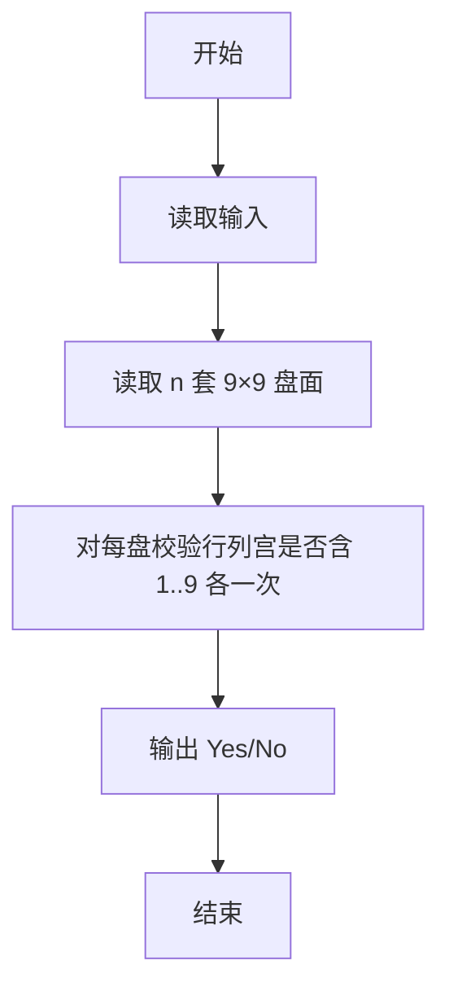
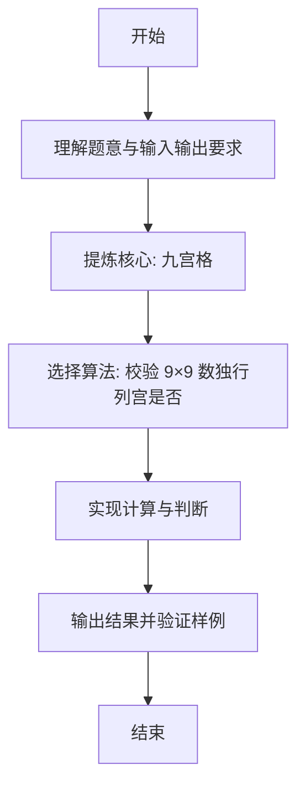

# L1-104 - 九宫格（20 分）

- **时间限制**: 400 ms
- **内存限制**: 65536 KB
- **代码长度限制**: 16 KB

---

## 题目描述


九宫格是一款数字游戏，传说起源于河图洛书，现代数学中称之为三阶幻方。游戏规则是：将一个 $9\times 9$ 的正方形区域划分为 9 个 $3\times 3$ 的正方形宫位，要求 1 到 9 这九个数字中的每个数字在每一行、每一列、每个宫位中都只能出现一次。
本题并不要求你写程序解决这个问题，只是对每个填好数字的九宫格，判断其是否满足游戏规则的要求。

### 输入格式:

输入首先在第一行给出一个正整数 $n$（$\le 10$），随后给出 $n$ 个填好数字的九宫格。每个九宫格分 9 行给出，每行给出 9 个数字，其间以空格分隔。

### 输出格式:

对每个给定的九宫格，判断其中的数字是否满足游戏规则的要求。满足则在一行中输出 1，否则输出 0。

### 输入样例:
```in
3
5 1 9 2 8 3 4 6 7
7 2 8 9 6 4 3 5 1
3 4 6 5 7 1 9 2 8
8 9 2 1 4 5 7 3 6
4 7 3 6 2 8 1 9 5
6 5 1 7 3 9 2 8 4
9 3 4 8 1 6 5 7 2
1 6 7 3 5 2 8 4 9
2 8 5 4 9 7 6 1 3
8 2 5 4 9 7 1 3 6
7 9 6 5 1 3 8 2 4
3 4 1 6 8 2 7 9 5
6 8 4 2 7 1 3 5 9
9 1 2 8 3 5 6 4 7
5 3 7 9 6 4 2 1 8
2 7 9 1 5 8 4 6 3
4 5 8 3 2 6 9 7 1
1 6 3 7 4 9 5 8 3
81 2 5 4 9 7 1 3 6
7 9 6 5 1 3 8 2 4
3 4 1 6 8 2 7 9 5
6 8 4 2 7 1 3 5 9
9 1 2 8 3 5 6 4 7
5 3 7 9 6 4 2 1 8
2 7 9 1 5 8 4 6 3
4 5 8 3 2 6 9 7 1
1 6 3 7 4 9 5 8 2
```

### 输出样例:
```out
1
0
0
```

## 示例

### 示例 1

**输入:**
```
3
5 1 9 2 8 3 4 6 7
7 2 8 9 6 4 3 5 1
3 4 6 5 7 1 9 2 8
8 9 2 1 4 5 7 3 6
4 7 3 6 2 8 1 9 5
6 5 1 7 3 9 2 8 4
9 3 4 8 1 6 5 7 2
1 6 7 3 5 2 8 4 9
2 8 5 4 9 7 6 1 3
8 2 5 4 9 7 1 3 6
7 9 6 5 1 3 8 2 4
3 4 1 6 8 2 7 9 5
6 8 4 2 7 1 3 5 9
9 1 2 8 3 5 6 4 7
5 3 7 9 6 4 2 1 8
2 7 9 1 5 8 4 6 3
4 5 8 3 2 6 9 7 1
1 6 3 7 4 9 5 8 3
81 2 5 4 9 7 1 3 6
7 9 6 5 1 3 8 2 4
3 4 1 6 8 2 7 9 5
6 8 4 2 7 1 3 5 9
9 1 2 8 3 5 6 4 7
5 3 7 9 6 4 2 1 8
2 7 9 1 5 8 4 6 3
4 5 8 3 2 6 9 7 1
1 6 3 7 4 9 5 8 2
```

**输出:**
```
1
0
0
```

---

### 解题思路

#### 题目分析
本题为“九宫格”（九宫格）。题面要求根据给定输入按规则计算并输出结果，输入规模小但需注意格式与边界。九宫格的判定涉及多分支或字符串处理，需将输入准确分词后逐项处理。仓颉实现中通过 `readToEnd`/`readln` 读取并以空白或行分割，兼顾有无换行与多空格的情况。

#### 核心算法
校验 9×9 数独行列宫是否均为 1..9 各一次。实现上直接模拟题意：先将原始输入规范化为 Token 或行数组，再按规则遍历计算。例如 读取 n 套 9×9 盘面，随后 对每盘校验行列宫是否含 1..9 各一次，最后按条件分支输出。算法保持线性遍历，无需复杂数据结构，仅需若干计数器与集合即可完成。

#### 复杂度分析
- **时间复杂度**：O(81)。
- **空间复杂度**：O(1)，仅需常量或线性辅助数组存储输入分词结果。

### 代码流程说明

1. 读取 n 套 9×9 盘面。
2. 对每盘校验行列宫是否含 1..9 各一次。
3. 输出 Yes/No。
4. 输出换行并结束程序。

### 代码实现

完整仓颉源码如下（与 `.cj` 文件一致）：

```cangjie
/* L1-104 九宫格 - approach: check rows/cols/boxes contain 1..9 exactly once */
import std.env.*
import std.collection.*
import std.convert.*
func isValid(arr: Array<Int64>): Bool {
    var seen = Array<Bool>(10, repeat: false)
    for (num in arr) {
        if (num < 1 || num > 9) { return false }
        let idx = Int64(num)
        if (seen[idx]) { return false }
        seen[idx] = true
    }
    return true
}
func checkSudoku(grid: Array<Array<Int64>>): Bool {
    for (row in grid) {
        if (!isValid(row)) { return false }
    }
    for (col in 0..9) {
        var column = Array<Int64>(9, repeat: 0)
        for (row in 0..9) {
            column[row] = grid[row][col]
        }
        if (!isValid(column)) { return false }
    }
    for (br in 0..3) {
        for (bc in 0..3) {
            var box = Array<Int64>(9, repeat: 0)
            var idx = 0
            for (i in 0..3) {
                for (j in 0..3) {
                    box[idx] = grid[br*3 + i][bc*3 + j]
                    idx += 1
                }
            }
            if (!isValid(box)) { return false }
        }
    }
    return true
}
main() {
    let cin = getStdIn()
    var tokens = ArrayList<String>()
    while (let Some(line) <- cin.readln()) {
        let parts = line.split(" ")
        for (p in parts) {
            let t = p.trimAscii()
            if (t.size != 0) { tokens.add(t) }
        }
    }
    if (tokens.size == 0) { return }
    let n = Int64.parse(tokens[0])
    var pos: Int64 = 1
    for (_ in 0..n) {
        var grid = Array<Array<Int64>>(9, { _ => Array<Int64>(9, repeat: 0) })
        for (r in 0..9) {
            for (c in 0..9) {
                if (pos < Int64(tokens.size)) {
                    grid[r][c] = Int64.parse(tokens[Int64(pos)])
                    pos += 1
                }
            }
        }
        if (checkSudoku(grid)) {
            println(1)
        } else {
            println(0)
        }
    }
}
```

### 代码流程图



### 解题流程图


