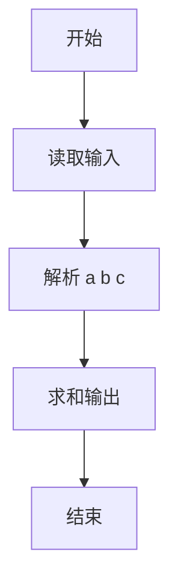
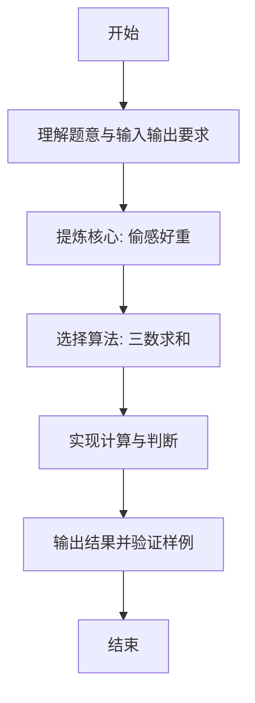

# L1-106 - 偷感好重（5 分）

- **时间限制**: 400 ms
- **内存限制**: 65536 KB
- **代码长度限制**: 16 KB

---

## 题目描述


以上图片截自新浪微博“iPanda 熊猫频道”，说“大熊猫吃苹果边吃边拿偷感好重。滚滚嘴里含 2 块，右手拿 1 块，左手捂 3 块…… 请问，它一共得到了多少块小苹果？”本题就请你计算一下这个问题的答案。

### 输入格式:

输入在一行中给出 3 个不超过 100 的正整数，分别为熊猫嘴里含的、右手拿的、左手捂的小苹果块数。同行数字间以空格分隔。

### 输出格式:

在一行中输出熊猫一共得到的小苹果块数。

### 输入样例:
```in
2 1 3
```

### 输出样例:
```out
6
```

## 示例

### 示例 1

**输入:**
```
2 1 3
```

**输出:**
```
6
```

---

### 解题思路

#### 题目分析
本题为“偷感好重”（偷感好重）。题面要求根据给定输入按规则计算并输出结果，输入规模小但需注意格式与边界。偷感好重的判定涉及多分支或字符串处理，需将输入准确分词后逐项处理。仓颉实现中通过 `readToEnd`/`readln` 读取并以空白或行分割，兼顾有无换行与多空格的情况。

#### 核心算法
三数求和。实现上直接模拟题意：先将原始输入规范化为 Token 或行数组，再按规则遍历计算。例如 解析 a b c，随后 求和输出，最后按条件分支输出。算法保持线性遍历，无需复杂数据结构，仅需若干计数器与集合即可完成。

#### 复杂度分析
- **时间复杂度**：O(1)。
- **空间复杂度**：O(1)，仅需常量或线性辅助数组存储输入分词结果。

### 代码流程说明

1. 解析 a b c。
2. 求和输出。
3. 输出换行并结束程序。

### 代码实现

完整仓颉源码如下（与 `.cj` 文件一致）：

```cangjie
/* L1-106 偷感好重 - approach: sum three ints */
import std.env.*
import std.collection.*
import std.convert.*
main() {
    let cin = getStdIn()
    var tokens = ArrayList<String>()
    while (let Some(line) <- cin.readln()) {
        let parts = line.split(" ")
        for (p in parts) {
            let t = p.trimAscii()
            if (t.size != 0) { tokens.add(t) }
        }
    }
    if (tokens.size < 3) { return }
    let a = Int64.parse(tokens[0])
    let b = Int64.parse(tokens[1])
    let c = Int64.parse(tokens[2])
    println(a + b + c)
}
```

### 代码流程图



### 解题流程图


