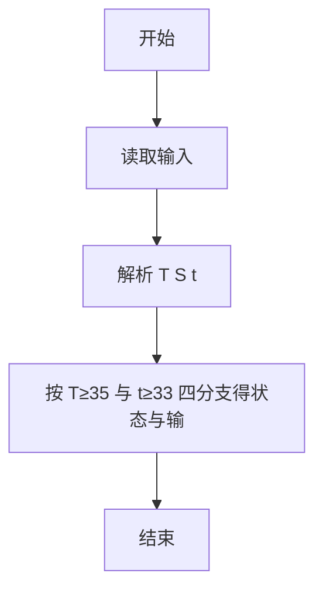
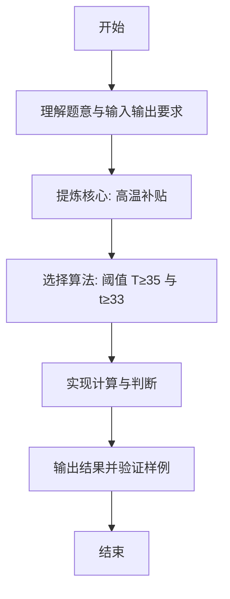

# L1-107 - 高温补贴（10 分）

- **时间限制**: 400 ms
- **内存限制**: 65536 KB
- **代码长度限制**: 16 KB

---

## 题目描述


高温补贴是为保证炎夏季节高温条件下经济建设和企业生产经营活动的正常进行，保障企业职工在劳动生产过程中的安全和身体健康进行的补贴。国家规定，用人单位安排劳动者在高温天气下（日最高气温达到 35° 以上），露天工作，以及不能采取有效措施将工作场所温度降低到 33° 以下的，应当向劳动者支付高温补贴。
给定当日最高气温、以及某用人单位的工作条件，请你写个程序判断，该单位员工能否获得高温补贴。

### 输入格式:

输入在一行中给出 3 个整数，即当日最高气温 $T$、工作场所状态 $S$、工作场所温度 $t$。其中温度为 $[-40, 50]$ 区间内的整数；工作场所状态为 1 表示露天，0 表示室内。

### 输出格式:

根据输入情况，如果可以获得高温补贴，则在一行中输出 `Bu Tie`（补贴），第二行输出 $T$ 的值；否则输出不补贴的原因：如果室内外温度都超标，仅仅是因为室内工作就不补贴，则输出 `Shi Nei`（室内），第二行输出 $T$ 的值；如果在室外工作但天气不热、或工作场所温度不高，则输出 `Bu Re`（不热），第二行输出 $t$ 的值；如果天气不热、或工作场所温度不高，且在室内工作，则输出 `Shu Shi`（舒适），第二行输出 $t$ 的值。

### 输入样例 1：
```in
36 1 33
```

### 输出样例 1：
```out
Bu Tie
36
```

### 输入样例 2：
```in
36 0 33
```

### 输出样例 2：
```out
Shi Nei
36
```

### 输入样例 3：
```in
36 1 27
```

### 输出样例 3：
```out
Bu Re
27
```

### 输入样例 4：
```in
36 0 24
```

### 输出样例 4：
```out
Shu Shi
24
```

## 示例

### 示例 1

**输入:**
```
36 1 33
```

**输出:**
```
Bu Tie
36
```

### 示例 2

**输入:**
```
36 0 33
```

**输出:**
```
Shi Nei
36
```

### 示例 3

**输入:**
```
36 1 27
```

**输出:**
```
Bu Re
27
```

### 示例 4

**输入:**
```
36 0 24
```

**输出:**
```
Shu Shi
24
```

---

### 解题思路

#### 题目分析
本题为“高温补贴”（高温补贴）。题面要求根据给定输入按规则计算并输出结果，输入规模小但需注意格式与边界。高温补贴的判定涉及多分支或字符串处理，需将输入准确分词后逐项处理。仓颉实现中通过 `readToEnd`/`readln` 读取并以空白或行分割，兼顾有无换行与多空格的情况。

#### 核心算法
阈值 T≥35 与 t≥33 结合办公类型 S 输出状态与温度。实现上直接模拟题意：先将原始输入规范化为 Token 或行数组，再按规则遍历计算。例如 解析 T S t，随后 按 T≥35 与 t≥33 四分支得状态与输出温度，最后按条件分支输出。算法保持线性遍历，无需复杂数据结构，仅需若干计数器与集合即可完成。

#### 复杂度分析
- **时间复杂度**：O(1)。
- **空间复杂度**：O(1)，仅需常量或线性辅助数组存储输入分词结果。

### 代码流程说明

1. 解析 T S t。
2. 按 T≥35 与 t≥33 四分支得状态与输出温度。
3. 输出换行并结束程序。

### 代码实现

完整仓颉源码如下（与 `.cj` 文件一致）：

```cangjie
/* L1-107 高温补贴 - approach: thresholds T>=35 and t>=33 */
import std.env.*
import std.collection.*
import std.convert.*
main() {
    let cin = getStdIn()
    var tokens = ArrayList<String>()
    while (let Some(line) <- cin.readln()) {
        let parts = line.split(" ")
        for (p in parts) {
            let t = p.trimAscii()
            if (t.size != 0) { tokens.add(t) }
        }
    }
    if (tokens.size < 3) { return }
    let T = Int64.parse(tokens[0])
    let S = Int64.parse(tokens[1])
    let t = Int64.parse(tokens[2])
    let hot = T >= 35
    let hotWork = t >= 33
    var status: String = ""
    var outTemp: Int64 = 0
    if (hot && hotWork && S == 1) {
        status = "Bu Tie"
        outTemp = T
    } else if (hot && hotWork && S == 0) {
        status = "Shi Nei"
        outTemp = T
    } else if (S == 1) {
        status = "Bu Re"
        outTemp = t
    } else {
        status = "Shu Shi"
        outTemp = t
    }
    println(status)
    println(outTemp)
}
```

### 代码流程图



### 解题流程图


