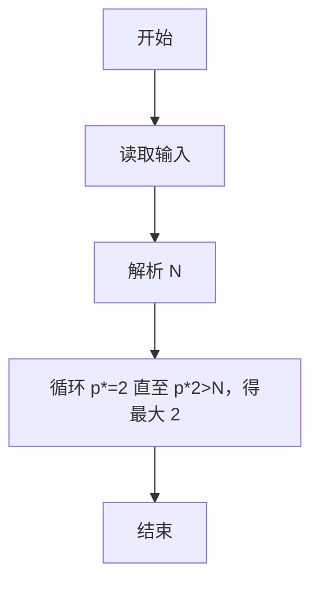
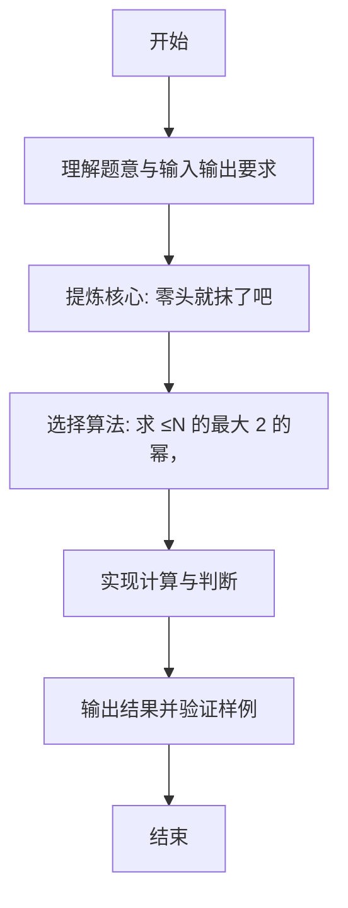

# L1-108 - 零头就抹了吧（10 分）

- **时间限制**: 400 ms
- **内存限制**: 65536 KB
- **代码长度限制**: 16 KB

---

## 题目描述


这是知乎上看到的：前几天去肉店灌香肠，结账一共258元。我说：“都是老顾客了，零头就抹了吧。”老板也很爽快：“行，凑个整，你给256块吧。”我顿时肃然起敬：“您以前当过程序员吧？在哪个公司啊？”老板看了看我，有点不好意思地说：“XX”。

本题就请你写个程序，帮老板计算他怎么抹零头。

### 输入格式:

输入在一行中给出一个正整数 $$N$$（$$\le 10^9$$），为客人应该付的钱。

### 输出格式:

在一行中输出老板抹掉零头后应收的钱。

### 输入样例:
```in
258
```

### 输出样例:
```out
256
```

## 示例

### 示例 1

**输入:**
```
258
```

**输出:**
```
256
```

---

### 解题思路

#### 题目分析
本题为“零头就抹了吧”（零头就抹了吧）。题面要求根据给定输入按规则计算并输出结果，输入规模小但需注意格式与边界。零头就抹了吧的判定涉及多分支或字符串处理，需将输入准确分词后逐项处理。仓颉实现中通过 `readToEnd`/`readln` 读取并以空白或行分割，兼顾有无换行与多空格的情况。

#### 核心算法
求 ≤N 的最大 2 的幂，循环倍增或位运算。实现上直接模拟题意：先将原始输入规范化为 Token 或行数组，再按规则遍历计算。例如 解析 N，随后 循环 p*=2 直至 p*2>N，得最大 2 幂输出，最后按条件分支输出。算法保持线性遍历，无需复杂数据结构，仅需若干计数器与集合即可完成。

#### 复杂度分析
- **时间复杂度**：O(1)。
- **空间复杂度**：O(1)，仅需常量或线性辅助数组存储输入分词结果。

### 代码流程说明

1. 解析 N。
2. 循环 p*=2 直至 p*2>N，得最大 2 幂输出。
3. 输出换行并结束程序。

### 代码实现

完整仓颉源码如下（与 `.cj` 文件一致）：

```cangjie
/* L1-108 零头就抹了吧 - approach: largest power of two <= N */
import std.env.*
import std.collection.*
import std.convert.*
main() {
    let cin = getStdIn()
    var tokens = ArrayList<String>()
    while (let Some(line) <- cin.readln()) {
        let parts = line.split(" ")
        for (p in parts) {
            let t = p.trimAscii()
            if (t.size != 0) { tokens.add(t) }
        }
    }
    if (tokens.size == 0) { return }
    let n = Int64.parse(tokens[0])
    var p: Int64 = 1
    while (p * 2 <= n) {
        p *= 2
    }
    println(p)
}
```

### 代码流程图



### 解题流程图


