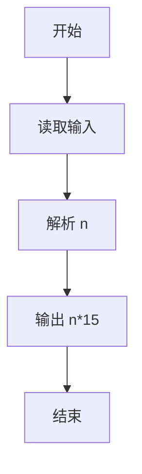
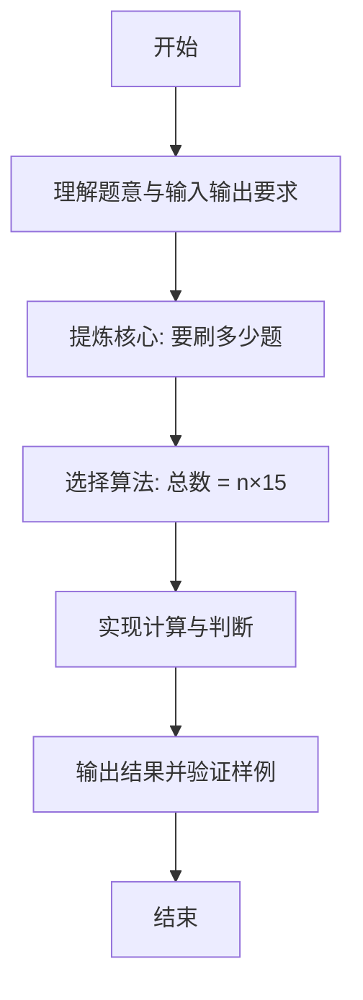

# L1-114 - 要刷多少题（5 分）

- **时间限制**: 400 ms
- **内存限制**: 65536 KB
- **代码长度限制**: 16 KB

---

## 题目描述


老师说：想在天梯赛取得好成绩，第一件事是把前面 $n$ 年的天梯赛真题做一遍。
已知每年的天梯赛有 15 道题目，全新不重复。请你算一下，一共要刷多少道真题？

### 输入格式:

输入第一行给出一个正整数 $n$（$\le 10$），为题面中所述老师提出的比赛年数。

### 输出格式:

在一行中输出学生需要做完的题目总数。

### 输入样例:
```in
2
```

### 输出样例:
```out
30
```

## 示例

### 示例 1

**输入:**
```
2
```

**输出:**
```
30
```

---

### 解题思路

#### 题目分析
本题为“要刷多少题”（要刷多少题）。题面要求根据给定输入按规则计算并输出结果，输入规模小但需注意格式与边界。要刷多少题的判定涉及多分支或字符串处理，需将输入准确分词后逐项处理。仓颉实现中通过 `readToEnd`/`readln` 读取并以空白或行分割，兼顾有无换行与多空格的情况。

#### 核心算法
总数 = n×15。实现上直接模拟题意：先将原始输入规范化为 Token 或行数组，再按规则遍历计算。例如 解析 n，随后 输出 n*15，最后按条件分支输出。算法保持线性遍历，无需复杂数据结构，仅需若干计数器与集合即可完成。

#### 复杂度分析
- **时间复杂度**：O(1)。
- **空间复杂度**：O(1)，仅需常量或线性辅助数组存储输入分词结果。

### 代码流程说明

1. 解析 n。
2. 输出 n*15。
3. 输出换行并结束程序。

### 代码实现

完整仓颉源码如下（与 `.cj` 文件一致）：

```cangjie
/* L1-114 要刷多少题 - approach: total = n * 15 */
import std.env.*
import std.collection.*
import std.convert.*
main() {
    let cin = getStdIn()
    var tokens = ArrayList<String>()
    while (let Some(line) <- cin.readln()) {
        let parts = line.split(" ")
        for (p in parts) {
            let t = p.trimAscii()
            if (t.size != 0) { tokens.add(t) }
        }
    }
    if (tokens.size == 0) { return }
    let n = Int64.parse(tokens[0])
    println(n * 15)
}
```

### 代码流程图



### 解题流程图


