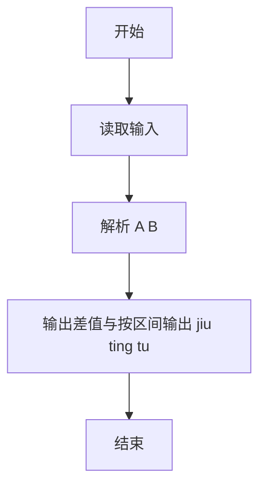
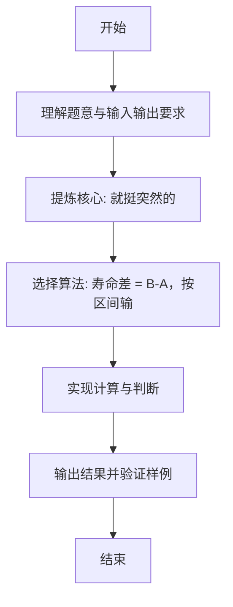

# L1-115 - 就挺突然的（10 分）

- **时间限制**: 400 ms
- **内存限制**: 65536 KB
- **代码长度限制**: 16 KB

---

## 题目描述


上面是新浪微博上的一张图，内容是“蹲厕所时突然想到，2026 年出生的孩子，能活到 3001 年”，就，挺突然的……

本题假设人类最长寿命为 250 岁，请你编写程序判断一下墙上的标语是否合理。

### 输入格式:

输入在一行给出 2 个不超过 5000 的正整数 $A$ 和 $B$，对应的标语为“蹲厕所时突然想到，$A$ 年出生的孩子，能活到 $B$ 年”。

### 输出格式:

首先在第一行输出写标语的人认为 $A$ 年出生的孩子有多长的寿命。如果该寿命超过了人类最长寿命，在第二行中输出 `jiu ting tu ran de...`；如果该寿命不是正数，输出 `hai sheng ma?`；如果寿命在正常范围内，输出 `nin tai cong ming le!`

### 输入样例 1：
```in
2026 3001
```

### 输出样例 1：
```out
975
jiu ting tu ran de...
```

### 输入样例 2：
```in
3001 2026
```

### 输出样例 2：
```out
-975
hai sheng ma?
```

### 输入样例 3：
```in
2025 2275
```

### 输出样例 3：
```out
250
nin tai cong ming le!
```

## 示例

### 示例 1

**输入:**
```
2026 3001
```

**输出:**
```
975
jiu ting tu ran de...
```

### 示例 2

**输入:**
```
3001 2026
```

**输出:**
```
-975
hai sheng ma?
```

### 示例 3

**输入:**
```
2025 2275
```

**输出:**
```
250
nin tai cong ming le!
```

---

### 解题思路

#### 题目分析
本题为“就挺突然的”（就挺突然的）。题面要求根据给定输入按规则计算并输出结果，输入规模小但需注意格式与边界。就挺突然的的判定涉及多分支或字符串处理，需将输入准确分词后逐项处理。仓颉实现中通过 `readToEnd`/`readln` 读取并以空白或行分割，兼顾有无换行与多空格的情况。

#### 核心算法
寿命差 = B-A，按区间输出不同感叹句。实现上直接模拟题意：先将原始输入规范化为 Token 或行数组，再按规则遍历计算。例如 解析 A B，随后 输出差值与按区间输出 jiu ting tu ran de.../hai sheng ma?/nin tai cong ming le!，最后按条件分支输出。算法保持线性遍历，无需复杂数据结构，仅需若干计数器与集合即可完成。

#### 复杂度分析
- **时间复杂度**：O(1)。
- **空间复杂度**：O(1)，仅需常量或线性辅助数组存储输入分词结果。

### 代码流程说明

1. 解析 A B。
2. 输出差值与按区间输出 jiu ting tu ran de.../hai sheng ma?/nin tai cong ming le!。
3. 输出换行并结束程序。

### 代码实现

完整仓颉源码如下（与 `.cj` 文件一致）：

```cangjie
/* L1-115 就挺突然的 - approach: lifespan = B-A, classify */
import std.env.*
import std.collection.*
import std.convert.*
main() {
    let cin = getStdIn()
    var tokens = ArrayList<String>()
    while (let Some(line) <- cin.readln()) {
        let parts = line.split(" ")
        for (p in parts) {
            let t = p.trimAscii()
            if (t.size != 0) { tokens.add(t) }
        }
    }
    if (tokens.size < 2) { return }
    let A = Int64.parse(tokens[0])
    let B = Int64.parse(tokens[1])
    let diff = B - A
    println(diff)
    if (diff > 250) {
        println("jiu ting tu ran de...")
    } else if (diff <= 0) {
        println("hai sheng ma?")
    } else {
        println("nin tai cong ming le!")
    }
}
```

### 代码流程图



### 解题流程图


