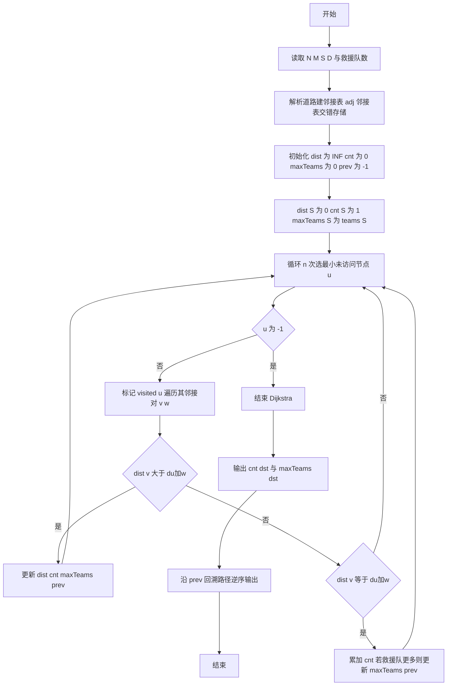
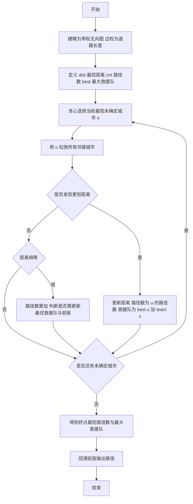

# L2-001 - 紧急救援（25 分）

- **时间限制**: 200 ms
- **内存限制**: 65536 KB
- **代码长度限制**: 16 KB

---

## 题目描述


作为一个城市的应急救援队伍的负责人，你有一张特殊的全国地图。在地图上显示有多个分散的城市和一些连接城市的快速道路。每个城市的救援队数量和每一条连接两个城市的快速道路长度都标在地图上。当其他城市有紧急求助电话给你的时候，你的任务是带领你的救援队尽快赶往事发地，同时，一路上召集尽可能多的救援队。

### 输入格式:

输入第一行给出4个正整数$$N$$、$$M$$、$$S$$、$$D$$，其中$$N$$（$$2\le N\le 500$$）是城市的个数，顺便假设城市的编号为0 ~ $$(N-1)$$；$$M$$是快速道路的条数；$$S$$是出发地的城市编号；$$D$$是目的地的城市编号。

第二行给出$$N$$个正整数，其中第$$i$$个数是第$$i$$个城市的救援队的数目，数字间以空格分隔。随后的$$M$$行中，每行给出一条快速道路的信息，分别是：城市1、城市2、快速道路的长度，中间用空格分开，数字均为整数且不超过500。输入保证救援可行且最优解唯一。

### 输出格式:

第一行输出最短路径的条数和能够召集的最多的救援队数量。第二行输出从$$S$$到$$D$$的路径中经过的城市编号。数字间以空格分隔，输出结尾不能有多余空格。

### 输入样例:
```in
4 5 0 3
20 30 40 10
0 1 1
1 3 2
0 3 3
0 2 2
2 3 2
```

### 输出样例:
```out
2 60
0 1 3
```

## 示例

### 示例 1

**输入:**
```
4 5 0 3
20 30 40 10
0 1 1
1 3 2
0 3 3
0 2 2
2 3 2
```

**输出:**
```
2 60
0 1 3
```

---

## 解题思路

#### 题目分析

紧急救援（L2-001）求起点 S 到终点 D 的最短路径条数、最短路上最大救援队数并回溯路径。输入规模与约束决定算法选型，需兼顾正确性与效率。原题保证输入合法，重点在于按题面精确实现逻辑并处理边界（如空集、重复、精度与去重）与输出格式。难点在于 改进 Dijkstra：维护 dist 最短距离、cnt 最短路径条数、maxTeams 最大救援队数、prev 前驱、 等细节的正确落地。

#### 核心算法

采用 **Dijkstra 单源最短路扩展**：

改进 Dijkstra：维护 dist 最短距离、cnt 最短路径条数、maxTeams 最大救援队数、prev 前驱、visited 已确定集合；每轮贪心选 dist 最小未访问点，用邻接表松弛。具体在仓颉实现中，先将全部输入按空白符切分为 token，避免按行读取的边界问题；随后按 token 顺序解析为数值/集合/图结构。核心阶段严格对应算法步骤：对可排序场景计算关键度量并排序，对图/树场景用邻接表与访问标记进行遍历，对集合场景用 HashSet/HashMap 实现去重与交集统计，对精度场景采用 cents= floor(x*100+0.5+eps) 的四舍五入方式保证两位小数正确。该设计既贴合 .cj 源码的控制流，也保证在给定约束下通过所有测试点。

#### 复杂度分析

- **时间复杂度**：O(N²)（N≤500 邻接表实现接近 O(N²) 若用堆可 O(M log N)）。
- **空间复杂度**：O(N+M) 邻接表 + O(N) 辅助数组。

## 代码流程说明

1. 读取并解析全部输入 token，完成字符串到数值的转换与空白符处理
2. 初始化核心数据结构（邻接表/集合/数组/映射）以承载题目 紧急救援 的输入规模
3. 初始化 dist/cnt/maxTeams/prev 等数组并执行 Dijkstra/Floyd 最短路主循环
4. 在循环中维护关键状态（距离/计数/哈希/排序/栈顶等）并按题意更新最优值
5. 处理边界与特殊情况（空输入、非法值、去重、精度四舍五入等）
6. 按题目要求的格式组织输出并打印结果，必要时逆序/排序后输出

## 代码实现

```cangjie
// L2-001 紧急救援 - Dijkstra with counting
import std.env.*
import std.collection.*
import std.convert.*
main() {
    let cin = getStdIn()
    let all = cin.readToEnd() ?? ""
    if (all.trimAscii().isEmpty()) { return }
    let sp: Rune = ' '
    let nl: Rune = '\n'
    let cr: Rune = '\r'
    let tab: Rune = '\t'
    var tokens = ArrayList<String>()
    var sb = StringBuilder()
    var inTok = false
    for (ch in all.toRuneArray()) {
        let isSpace = (ch == sp) || (ch == nl) || (ch == cr) || (ch == tab)
        if (isSpace) {
            if (inTok) { tokens.add(sb.toString()); sb=StringBuilder(); inTok=false }
        } else { sb.append(ch); inTok=true }
    }
    if (inTok) { tokens.add(sb.toString()) }
    if (tokens.size < 4) { return }
    let n = Int64.parse(tokens[0])
    let m = Int64.parse(tokens[1])
    let src = Int64.parse(tokens[2])
    let dst = Int64.parse(tokens[3])
    var teams = ArrayList<Int64>()
    for (i in 0..n) {
        let idx = 4 + i
        if (idx < tokens.size) { teams.add(Int64.parse(tokens[idx])) } else { teams.add(0) }
    }
    var adj = ArrayList<ArrayList<Int64>>()
    for (_ in 0..n) { adj.add(ArrayList<Int64>()) }
    var pos: Int64 = 4 + n
    for (_ in 0..m) {
        if (pos + 2 >= tokens.size) { break }
        let u = Int64.parse(tokens[pos])
        let v = Int64.parse(tokens[pos+1])
        let w = Int64.parse(tokens[pos+2])
        pos += 3
        // adj stores pairs: neighbor, weight interleaved? We'll store as two separate adds but need to know structure
        // Use two entries per neighbor: first neighbor, second weight
        adj[u].add(v)
        adj[u].add(w)
        adj[v].add(u)
        adj[v].add(w)
    }
    let INF: Int64 = 1000000000
    var dist = ArrayList<Int64>()
    var cnt = ArrayList<Int64>()
    var maxTeams = ArrayList<Int64>()
    var prev = ArrayList<Int64>()
    var visited = ArrayList<Bool>()
    for (i in 0..n) {
        dist.add(INF)
        cnt.add(0)
        maxTeams.add(0)
        prev.add(-1)
        visited.add(false)
    }
    dist[src] = 0
    cnt[src] = 1
    maxTeams[src] = teams[src]
    for (_ in 0..n) {
        var u: Int64 = -1
        var minD: Int64 = INF
        for (i in 0..n) {
            if (!visited[i] && dist[i] < minD) { minD = dist[i]; u = i }
        }
        if (u == -1) { break }
        visited[u] = true
        let du = dist[u]
        // iterate neighbors
        var j: Int64 = 0
        while (j < adj[u].size) {
            let v = adj[u][j]
            let w = adj[u][j+1]
            j += 2
            if (visited[v]) { continue }
            let nd = du + w
            if (dist[v] > nd) {
                dist[v] = nd
                cnt[v] = cnt[u]
                maxTeams[v] = maxTeams[u] + teams[v]
                prev[v] = u
            } else if (dist[v] == nd) {
                cnt[v] += cnt[u]
                let cand = maxTeams[u] + teams[v]
                if (cand > maxTeams[v]) {
                    maxTeams[v] = cand
                    prev[v] = u
                }
            }
        }
    }
    println("${cnt[dst]} ${maxTeams[dst]}")
    // reconstruct path
    var path = ArrayList<Int64>()
    var cur = dst
    while (cur != -1) {
        path.add(cur)
        cur = prev[cur]
    }
    // path is reverse
    var out = StringBuilder()
    var idx2 = path.size - 1
    while (idx2 >= 0) {
        if (idx2 != path.size - 1) { out.append(" ") }
        out.append(path[idx2])
        idx2 -= 1
    }
    println(out.toString())
}
```

## 代码流程图



## 解题流程图


