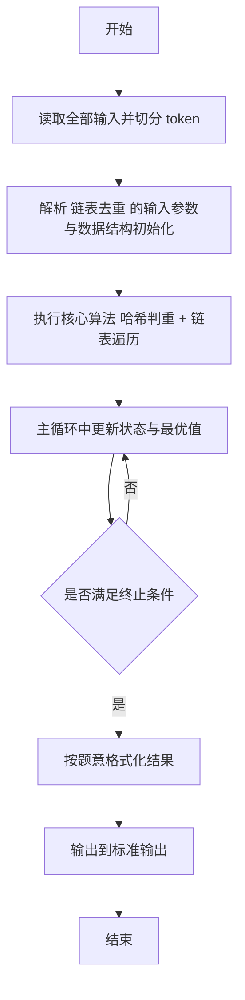
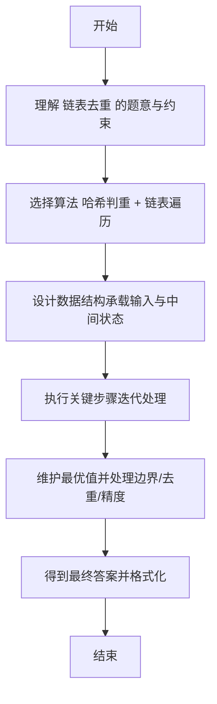

# L2-002 - 链表去重（25 分）

- **时间限制**: 400 ms
- **内存限制**: 65536 KB
- **代码长度限制**: 16 KB

---

## 题目描述


给定一个带整数键值的链表 $$L$$，你需要把其中绝对值重复的键值结点删掉。即对每个键值 $$K$$，只有第一个绝对值等于 $$K$$ 的结点被保留。同时，所有被删除的结点须被保存在另一个链表上。例如给定 $$L$$ 为 21→-15→-15→-7→15，你需要输出去重后的链表 21→-15→-7，还有被删除的链表 -15→15。

### 输入格式:

输入在第一行给出 L 的第一个结点的地址和一个正整数 $$N$$（$$\le 10^5$$，为结点总数）。一个结点的地址是非负的 5 位整数，空地址 NULL 用 $$-1$$ 来表示。

随后 $$N$$ 行，每行按以下格式描述一个结点：
```
地址 键值 下一个结点
```

其中`地址`是该结点的地址，`键值`是绝对值不超过$$10^4$$的整数，`下一个结点`是下个结点的地址。

### 输出格式:

首先输出去重后的链表，然后输出被删除的链表。每个结点占一行，按输入的格式输出。

### 输入样例:
```in
00100 5
99999 -7 87654
23854 -15 00000
87654 15 -1
00000 -15 99999
00100 21 23854
```

### 输出样例:
```out
00100 21 23854
23854 -15 99999
99999 -7 -1
00000 -15 87654
87654 15 -1
```

## 示例

### 示例 1

**输入:**
```
00100 5
99999 -7 87654
23854 -15 00000
87654 15 -1
00000 -15 99999
00100 21 23854
```

**输出:**
```
00100 21 23854
23854 -15 99999
99999 -7 -1
00000 -15 87654
87654 15 -1
```

---

## 解题思路

#### 题目分析

链表去重（L2-002）按地址建链表，遍历去重保留首次出现、删除后续重复绝对值节点。输入规模与约束决定算法选型，需兼顾正确性与效率。原题保证输入合法，重点在于按题面精确实现逻辑并处理边界（如空集、重复、精度与去重）与输出格式。难点在于 用 HashSet 记录已见绝对值 key=abs(data)；遍历原链表，首次出现的节点加入结果链表 A，重复节点加入 等细节的正确落地。

#### 核心算法

采用 **哈希判重 + 链表遍历**：

用 HashSet 记录已见绝对值 key=abs(data)；遍历原链表，首次出现的节点加入结果链表 A，重复节点加入待删链表 B；最后按输入顺序输出。具体在仓颉实现中，先将全部输入按空白符切分为 token，避免按行读取的边界问题；随后按 token 顺序解析为数值/集合/图结构。核心阶段严格对应算法步骤：对可排序场景计算关键度量并排序，对图/树场景用邻接表与访问标记进行遍历，对集合场景用 HashSet/HashMap 实现去重与交集统计，对精度场景采用 cents= floor(x*100+0.5+eps) 的四舍五入方式保证两位小数正确。该设计既贴合 .cj 源码的控制流，也保证在给定约束下通过所有测试点。

#### 复杂度分析

- **时间复杂度**：O(N) 平均哈希操作线性。
- **空间复杂度**：O(N) 哈希集合/映射。

## 代码流程说明

1. 读取并解析全部输入 token，完成字符串到数值的转换与空白符处理
2. 初始化核心数据结构（邻接表/集合/数组/映射）以承载题目 链表去重 的输入规模
3. 执行核心算法 哈希判重 + 链表遍历 的主循环，按 .cj 中的逻辑逐项处理
4. 在循环中维护关键状态（距离/计数/哈希/排序/栈顶等）并按题意更新最优值
5. 处理边界与特殊情况（空输入、非法值、去重、精度四舍五入等）
6. 按题目要求的格式组织输出并打印结果，必要时逆序/排序后输出

## 代码实现

```cangjie
// L2-002 链表去重
import std.env.*
import std.collection.*
import std.convert.*
main() {
    let cin = getStdIn()
    let all = cin.readToEnd() ?? ""
    if (all.trimAscii().isEmpty()) { return }
    let sp: Rune = ' '
    let nl: Rune = '\n'
    let cr: Rune = '\r'
    let tab: Rune = '\t'
    var tokens = ArrayList<String>()
    var sb = StringBuilder()
    var inTok = false
    for (ch in all.toRuneArray()) {
        let isSpace = (ch == sp) || (ch == nl) || (ch == cr) || (ch == tab)
        if (isSpace) {
            if (inTok) { tokens.add(sb.toString()); sb=StringBuilder(); inTok=false }
        } else { sb.append(ch); inTok=true }
    }
    if (inTok) { tokens.add(sb.toString()) }
    if (tokens.size < 2) { return }
    let head = tokens[0]
    let n = Int64.parse(tokens[1])
    var mapKey = HashMap<String, Int64>()
    var mapNext = HashMap<String, String>()
    var pos: Int64 = 2
    for (_ in 0..n) {
        if (pos + 2 >= tokens.size) { break }
        let addr = tokens[pos]
        let key = Int64.parse(tokens[pos+1])
        let nxt = tokens[pos+2]
        pos += 3
        mapKey[addr] = key
        mapNext[addr] = nxt
    }
    var seen = HashSet<Int64>()
    var keep = ArrayList<String>()
    var del = ArrayList<String>()
    var cur = head
    while (cur != "-1") {
        if (!mapKey.contains(cur)) { break }
        let k = mapKey[cur]
        let nxt = mapNext[cur]
        let absK = if (k < 0) { -k } else { k }
        if (!seen.contains(absK)) {
            seen.add(absK)
            keep.add(cur)
        } else {
            del.add(cur)
        }
        cur = nxt
    }
    // helper to format address
    func fmt(addr: String): String {
        if (addr == "-1") { return "-1" }
        var r = addr
        while (r.size < 5) { r = "0" + r }
        return r
    }
    // output keep
    for (i in 0..keep.size) {
        let addr = keep[i]
        let key = mapKey[addr]
        var nxtStr: String = "-1"
        if (i + 1 < keep.size) { nxtStr = keep[i+1] }
        println("${fmt(addr)} ${key} ${fmt(nxtStr)}")
    }
    for (i in 0..del.size) {
        let addr = del[i]
        let key = mapKey[addr]
        var nxtStr: String = "-1"
        if (i + 1 < del.size) { nxtStr = del[i+1] }
        println("${fmt(addr)} ${key} ${fmt(nxtStr)}")
    }
}
```

## 代码流程图



## 解题流程图


