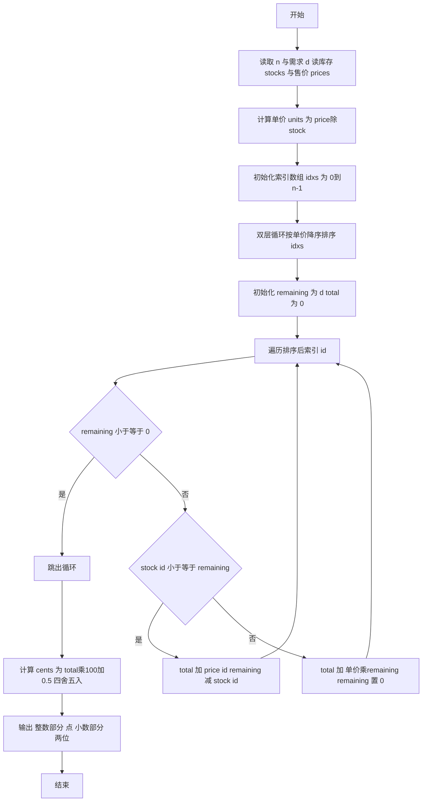
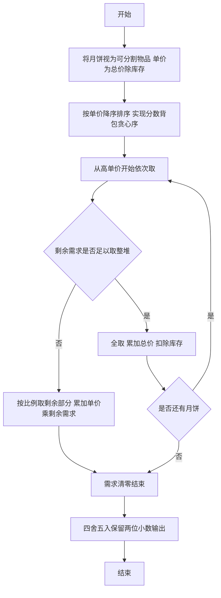

# L2-003 - 月饼（25 分）

- **时间限制**: 150 ms
- **内存限制**: 65536 KB
- **代码长度限制**: 16 KB

---

## 题目描述


月饼是中国人在中秋佳节时吃的一种传统食品，不同地区有许多不同风味的月饼。现给定所有种类月饼的库存量、总售价、以及市场的最大需求量，请你计算可以获得的最大收益是多少。

注意：销售时允许取出一部分库存。样例给出的情形是这样的：假如我们有 3 种月饼，其库存量分别为 18、15、10 万吨，总售价分别为 75、72、45 亿元。如果市场的最大需求量只有 20 万吨，那么我们最大收益策略应该是卖出全部 15 万吨第 2 种月饼、以及 5 万吨第 3 种月饼，获得 72 + 45/2 = 94.5（亿元）。

### 输入格式:

每个输入包含一个测试用例。每个测试用例先给出一个不超过 1000 的正整数 $$N$$ 表示月饼的种类数、以及不超过 500（以万吨为单位）的正整数 $$D$$ 表示市场最大需求量。随后一行给出 $$N$$ 个正数表示每种月饼的库存量（以万吨为单位）；最后一行给出 $$N$$ 个正数表示每种月饼的总售价（以亿元为单位）。数字间以空格分隔。

### 输出格式:

对每组测试用例，在一行中输出最大收益，以亿元为单位并精确到小数点后 2 位。

### 输入样例:
```in
3 20
18 15 10
75 72 45
```

### 输出样例:
```out
94.50
```

## 示例

### 示例 1

**输入:**
```
3 20
18 15 10
75 72 45
```

**输出:**
```
94.50
```

---

## 解题思路

#### 题目分析

月饼（L2-003）给定各种月饼库存与总售价及市场需求 D，求最大收益。输入规模与约束决定算法选型，需兼顾正确性与效率。原题保证输入合法，重点在于按题面精确实现逻辑并处理边界（如空集、重复、精度与去重）与输出格式。难点在于 计算单价 p/stock，按单价降序排序；贪心依次取：能全取则全取，否则按比例取剩余需求；浮点求和后四舍五入到分 等细节的正确落地。

#### 核心算法

采用 **贪心 + 按单价排序（分数背包）**：

计算单价 p/stock，按单价降序排序；贪心依次取：能全取则全取，否则按比例取剩余需求；浮点求和后四舍五入到分。具体在仓颉实现中，先将全部输入按空白符切分为 token，避免按行读取的边界问题；随后按 token 顺序解析为数值/集合/图结构。核心阶段严格对应算法步骤：对可排序场景计算关键度量并排序，对图/树场景用邻接表与访问标记进行遍历，对集合场景用 HashSet/HashMap 实现去重与交集统计，对精度场景采用 cents= floor(x*100+0.5+eps) 的四舍五入方式保证两位小数正确。该设计既贴合 .cj 源码的控制流，也保证在给定约束下通过所有测试点。

#### 复杂度分析

- **时间复杂度**：O(N²) 冒泡排序 若用快排为 O(N log N)，N 为月饼种类。
- **空间复杂度**：O(N) 存储库存 单价 索引。

## 代码流程说明

1. 读取并解析全部输入 token，完成字符串到数值的转换与空白符处理
2. 初始化核心数据结构（邻接表/集合/数组/映射）以承载题目 月饼 的输入规模
3. 计算关键度量（如单价、均值、亲密度）并按关键字排序
4. 在循环中维护关键状态（距离/计数/哈希/排序/栈顶等）并按题意更新最优值
5. 处理边界与特殊情况（空输入、非法值、去重、精度四舍五入等）
6. 按题目要求的格式组织输出并打印结果，必要时逆序/排序后输出

## 代码实现

```cangjie
// L2-003 月饼 - greedy
import std.env.*
import std.collection.*
import std.convert.*
main() {
    let cin = getStdIn()
    let all = cin.readToEnd() ?? ""
    if (all.trimAscii().isEmpty()) { return }
    let sp: Rune = ' '
    let nl: Rune = '\n'
    let cr: Rune = '\r'
    let tab: Rune = '\t'
    var tokens = ArrayList<String>()
    var sb = StringBuilder()
    var inTok = false
    for (ch in all.toRuneArray()) {
        let isSpace = (ch == sp) || (ch == nl) || (ch == cr) || (ch == tab)
        if (isSpace) {
            if (inTok) { tokens.add(sb.toString()); sb=StringBuilder(); inTok=false }
        } else { sb.append(ch); inTok=true }
    }
    if (inTok) { tokens.add(sb.toString()) }
    if (tokens.size < 2) { return }
    let n = Int64.parse(tokens[0])
    let d = Float64.parse(tokens[1])
    var stocks = ArrayList<Float64>()
    var prices = ArrayList<Float64>()
    for (i in 0..n) {
        let idx = 2 + i
        if (idx < tokens.size) { stocks.add(Float64.parse(tokens[idx])) } else { stocks.add(0.0) }
    }
    for (i in 0..n) {
        let idx = 2 + n + i
        if (idx < tokens.size) { prices.add(Float64.parse(tokens[idx])) } else { prices.add(0.0) }
    }
    var units = ArrayList<Float64>()
    for (i in 0..n) {
        let st = stocks[i]
        let pr = prices[i]
        if (st == 0.0) { units.add(0.0) } else { units.add(pr / st) }
    }
    // sort indices by units descending
    var idxs = ArrayList<Int64>()
    for (i in 0..n) { idxs.add(i) }
    for (i in 0..n) {
        for (j in (i+1)..n) {
            if (units[idxs[i]] < units[idxs[j]]) {
                let tmp = idxs[i]
                idxs[i] = idxs[j]
                idxs[j] = tmp
            }
        }
    }
    var remaining = d
    var total: Float64 = 0.0
    for (k in 0..n) {
        if (remaining <= 0.0) { break }
        let id = idxs[k]
        let st = stocks[id]
        let pr = prices[id]
        if (st <= remaining) {
            total += pr
            remaining -= st
        } else {
            total += pr / st * remaining
            remaining = 0.0
        }
    }
    // format to 2 decimals
    // rounding: cents = Int64(total*100 + 0.5 + 1e-9)
    let scaled = total * 100.0
    // add small epsilon to handle floating error like 94.4999999
    let cents = Int64(scaled + 0.5 + 0.000001)
    let intPart = cents / 100
    let frac = cents % 100
    var fracStr = "${frac}"
    if (frac < 10) { fracStr = "0${frac}" }
    // handle negative? not needed (prices positive)
    println("${intPart}.${fracStr}")
}
```

## 代码流程图



## 解题流程图


