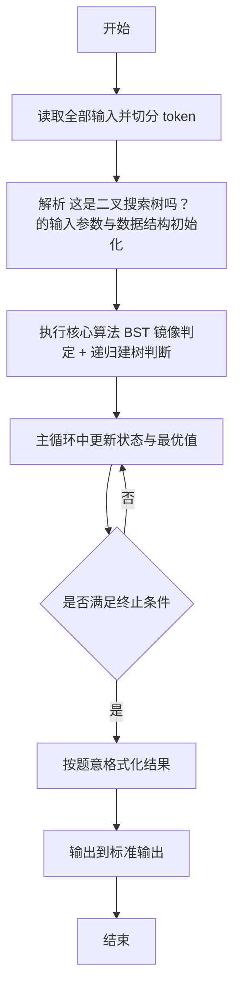
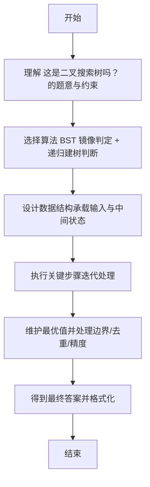

# L2-004 - 这是二叉搜索树吗？（25 分）

- **时间限制**: 400 ms
- **内存限制**: 65536 KB
- **代码长度限制**: 16 KB

---

## 题目描述


一棵二叉搜索树可被递归地定义为具有下列性质的二叉树：对于任一结点，

- 其左子树中所有结点的键值小于该结点的键值；
- 其右子树中所有结点的键值大于等于该结点的键值；
- 其左右子树都是二叉搜索树。

所谓二叉搜索树的“镜像”，即将所有结点的左右子树对换位置后所得到的树。

给定一个整数键值序列，现请你编写程序，判断这是否是对一棵二叉搜索树或其镜像进行前序遍历的结果。

### 输入格式:

输入的第一行给出正整数 $$N$$（$$\le 1000$$）。随后一行给出 $$N$$ 个整数键值，其间以空格分隔。

### 输出格式:

如果输入序列是对一棵二叉搜索树或其镜像进行前序遍历的结果，则首先在一行中输出 `YES` ，然后在下一行输出该树后序遍历的结果。数字间有 1 个空格，一行的首尾不得有多余空格。若答案是否，则输出 `NO`。

### 输入样例 1：
```in
7
8 6 5 7 10 8 11
```

### 输出样例 1：
```out
YES
5 7 6 8 11 10 8
```

### 输入样例 2：
```in
7
8 10 11 8 6 7 5
```

### 输出样例 2：
```out
YES
11 8 10 7 5 6 8
```

### 输入样例 3：
```in
7
8 6 8 5 10 9 11
```

### 输出样例 3：
```out
NO
```

## 示例

### 示例 1

**输入:**
```
7
8 6 5 7 10 8 11
```

**输出:**
```
YES
5 7 6 8 11 10 8
```

### 示例 2

**输入:**
```
7
8 10 11 8 6 7 5
```

**输出:**
```
YES
11 8 10 7 5 6 8
```

### 示例 3

**输入:**
```
7
8 6 8 5 10 9 11
```

**输出:**
```
NO
```

---

## 解题思路

#### 题目分析

这是二叉搜索树吗？（L2-004）给定先序序列判断是否为 BST 或镜像 BST 的先序，若是输出后序。输入规模与约束决定算法选型，需兼顾正确性与效率。原题保证输入合法，重点在于按题面精确实现逻辑并处理边界（如空集、重复、精度与去重）与输出格式。难点在于 尝试按 BST 规则划分左右子树：BST 要求左 < 根、右 >= 根，镜像则相反；递归验证并生成后序，任一成功即输出 等细节的正确落地。

#### 核心算法

采用 **BST 镜像判定 + 递归建树判断**：

尝试按 BST 规则划分左右子树：BST 要求左 < 根、右 >= 根，镜像则相反；递归验证并生成后序，任一成功即输出。具体在仓颉实现中，先将全部输入按空白符切分为 token，避免按行读取的边界问题；随后按 token 顺序解析为数值/集合/图结构。核心阶段严格对应算法步骤：对可排序场景计算关键度量并排序，对图/树场景用邻接表与访问标记进行遍历，对集合场景用 HashSet/HashMap 实现去重与交集统计，对精度场景采用 cents= floor(x*100+0.5+eps) 的四舍五入方式保证两位小数正确。该设计既贴合 .cj 源码的控制流，也保证在给定约束下通过所有测试点。

#### 复杂度分析

- **时间复杂度**：O(N log N) 或 O(N) 视实现而定。
- **空间复杂度**：O(N)。

## 代码流程说明

1. 读取并解析全部输入 token，完成字符串到数值的转换与空白符处理
2. 初始化核心数据结构（邻接表/集合/数组/映射）以承载题目 这是二叉搜索树吗？ 的输入规模
3. 执行核心算法 BST 镜像判定 + 递归建树判断 的主循环，按 .cj 中的逻辑逐项处理
4. 在循环中维护关键状态（距离/计数/哈希/排序/栈顶等）并按题意更新最优值
5. 处理边界与特殊情况（空输入、非法值、去重、精度四舍五入等）
6. 按题目要求的格式组织输出并打印结果，必要时逆序/排序后输出

## 代码实现

```cangjie
// L2-004 这是二叉搜索树吗？
import std.env.*
import std.collection.*
import std.convert.*
main() {
    let cin = getStdIn()
    let all = cin.readToEnd() ?? ""
    if (all.trimAscii().isEmpty()) { return }
    let sp: Rune = ' '
    let nl: Rune = '\n'
    let cr: Rune = '\r'
    let tab: Rune = '\t'
    var tokens = ArrayList<String>()
    var sb = StringBuilder()
    var inTok = false
    for (ch in all.toRuneArray()) {
        let isSpace = (ch == sp) || (ch == nl) || (ch == cr) || (ch == tab)
        if (isSpace) {
            if (inTok) { tokens.add(sb.toString()); sb=StringBuilder(); inTok=false }
        } else { sb.append(ch); inTok=true }
    }
    if (inTok) { tokens.add(sb.toString()) }
    if (tokens.size == 0) { return }
    let n = Int64.parse(tokens[0])
    var nums = ArrayList<Int64>()
    for (i in 1..(n+1)) {
        if (i < tokens.size) { nums.add(Int64.parse(tokens[i])) }
    }
    var post = ArrayList<Int64>()
    if (checkBST(nums, 0, n-1, post, false)) {
        println("YES")
        printArr(post)
    } else {
        post = ArrayList<Int64>()
        if (checkBST(nums, 0, n-1, post, true)) {
            println("YES")
            printArr(post)
        } else {
            println("NO")
        }
    }
}
func checkBST(a: ArrayList<Int64>, l: Int64, r: Int64, post: ArrayList<Int64>, isMirror: Bool): Bool {
    if (l > r) { return true }
    if (l == r) { post.add(a[l]); return true }
    let root = a[l]
    var i: Int64 = l + 1
    if (!isMirror) {
        while (i <= r && a[i] < root) { i += 1 }
        // check remaining >= root
        var j = i
        while (j <= r) {
            if (a[j] < root) { return false }
            j += 1
        }
        if (!checkBST(a, l+1, i-1, post, isMirror)) { return false }
        if (!checkBST(a, i, r, post, isMirror)) { return false }
        post.add(root)
        return true
    } else {
        while (i <= r && a[i] >= root) { i += 1 }
        var j = i
        while (j <= r) {
            if (a[j] >= root) { return false }
            j += 1
        }
        if (!checkBST(a, l+1, i-1, post, isMirror)) { return false }
        if (!checkBST(a, i, r, post, isMirror)) { return false }
        post.add(root)
        return true
    }
}
func printArr(a: ArrayList<Int64>) {
    var out = StringBuilder()
    for (i in 0..a.size) {
        if (i != 0) { out.append(" ") }
        out.append(a[i])
    }
    println(out.toString())
}
```

## 代码流程图



## 解题流程图


