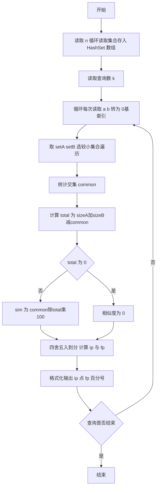
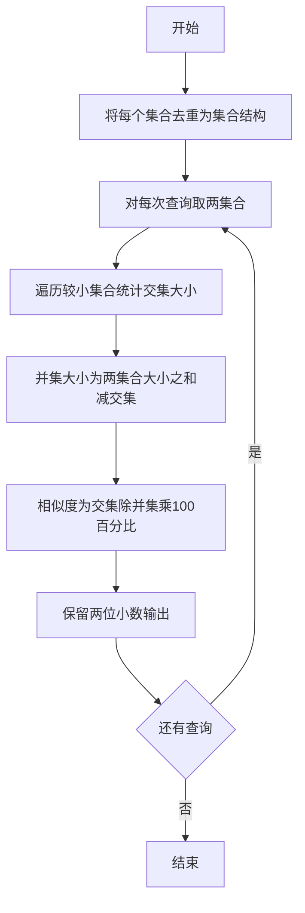

# L2-005 - 集合相似度（25 分）

- **时间限制**: 400 ms
- **内存限制**: 65536 KB
- **代码长度限制**: 16 KB

---

## 题目描述


给定两个整数集合，它们的相似度定义为：$$N_c / N_t \times 100\%$$。其中$$N_c$$是两个集合都有的不相等整数的个数，$$N_t$$是两个集合一共有的不相等整数的个数。你的任务就是计算任意一对给定集合的相似度。

### 输入格式:

输入第一行给出一个正整数$$N$$（$$\le 50$$），是集合的个数。随后$$N$$行，每行对应一个集合。每个集合首先给出一个正整数$$M$$（$$\le 10^4$$），是集合中元素的个数；然后跟$$M$$个$$[0, 10^9]$$区间内的整数。

之后一行给出一个正整数$$K$$（$$\le 2000$$），随后$$K$$行，每行对应一对需要计算相似度的集合的编号（集合从1到$$N$$编号）。数字间以空格分隔。

### 输出格式:

对每一对需要计算的集合，在一行中输出它们的相似度，为保留小数点后2位的百分比数字。

### 输入样例:
```in
3
3 99 87 101
4 87 101 5 87
7 99 101 18 5 135 18 99
2
1 2
1 3
```

### 输出样例:
```out
50.00%
33.33%
```

## 示例

### 示例 1

**输入:**
```
3
3 99 87 101
4 87 101 5 87
7 99 101 18 5 135 18 99
2
1 2
1 3
```

**输出:**
```
50.00%
33.33%
```

---

## 解题思路

#### 题目分析

集合相似度（L2-005）N 个整数集合，K 次查询求两集合相似度 Nc/Nt*100%。输入规模与约束决定算法选型，需兼顾正确性与效率。原题保证输入合法，重点在于按题面精确实现逻辑并处理边界（如空集、重复、精度与去重）与输出格式。难点在于 用 HashSet 存每个集合去重；查询时遍历较小集合统计交集大小 common，total = sizeA+sizeB 等细节的正确落地。

#### 核心算法

采用 **哈希集合 + Jaccard 相似度**：

用 HashSet 存每个集合去重；查询时遍历较小集合统计交集大小 common，total = sizeA+sizeB-common；sim=common/total*100 保留两位小数。具体在仓颉实现中，先将全部输入按空白符切分为 token，避免按行读取的边界问题；随后按 token 顺序解析为数值/集合/图结构。核心阶段严格对应算法步骤：对可排序场景计算关键度量并排序，对图/树场景用邻接表与访问标记进行遍历，对集合场景用 HashSet/HashMap 实现去重与交集统计，对精度场景采用 cents= floor(x*100+0.5+eps) 的四舍五入方式保证两位小数正确。该设计既贴合 .cj 源码的控制流，也保证在给定约束下通过所有测试点。

#### 复杂度分析

- **时间复杂度**：O(N·M_avg + K·min(|A|,|B|)) 集合去重与查询交集。
- **空间复杂度**：O(N·M_avg) 存储所有集合。

## 代码流程说明

1. 读取并解析全部输入 token，完成字符串到数值的转换与空白符处理
2. 初始化核心数据结构（邻接表/集合/数组/映射）以承载题目 集合相似度 的输入规模
3. 执行核心算法 哈希集合 + Jaccard 相似度 的主循环，按 .cj 中的逻辑逐项处理
4. 在循环中维护关键状态（距离/计数/哈希/排序/栈顶等）并按题意更新最优值
5. 处理边界与特殊情况（空输入、非法值、去重、精度四舍五入等）
6. 按题目要求的格式组织输出并打印结果，必要时逆序/排序后输出

## 代码实现

```cangjie
// L2-005 集合相似度
import std.env.*
import std.collection.*
import std.convert.*
main() {
    let cin = getStdIn()
    let all = cin.readToEnd() ?? ""
    if (all.trimAscii().isEmpty()) { return }
    let sp: Rune = ' '
    let nl: Rune = '\n'
    let cr: Rune = '\r'
    let tab: Rune = '\t'
    var tokens = ArrayList<String>()
    var sb = StringBuilder()
    var inTok = false
    for (ch in all.toRuneArray()) {
        let isSpace = (ch == sp) || (ch == nl) || (ch == cr) || (ch == tab)
        if (isSpace) {
            if (inTok) { tokens.add(sb.toString()); sb=StringBuilder(); inTok=false }
        } else { sb.append(ch); inTok=true }
    }
    if (inTok) { tokens.add(sb.toString()) }
    var pos: Int64 = 0
    if (pos >= tokens.size) { return }
    let n = Int64.parse(tokens[pos]); pos+=1
    var sets = ArrayList<HashSet<Int64>>()
    for (_ in 0..n) {
        if (pos >= tokens.size) { break }
        let m = Int64.parse(tokens[pos]); pos+=1
        var hs = HashSet<Int64>()
        for (_ in 0..m) {
            if (pos >= tokens.size) { break }
            hs.add(Int64.parse(tokens[pos])); pos+=1
        }
        sets.add(hs)
    }
    if (pos >= tokens.size) { return }
    let k = Int64.parse(tokens[pos]); pos+=1
    for (_ in 0..k) {
        if (pos+1 >= tokens.size) { break }
        let a = Int64.parse(tokens[pos])-1; let b = Int64.parse(tokens[pos+1])-1; pos+=2
        if (a < 0 || a >= sets.size || b < 0 || b >= sets.size) { println("0.00%"); continue }
        let setA = sets[a]
        let setB = sets[b]
        var common: Int64 = 0
        if (setA.size < setB.size) {
            for (elem in setA) { if (setB.contains(elem)) { common+=1 } }
        } else {
            for (elem in setB) { if (setA.contains(elem)) { common+=1 } }
        }
        let total = setA.size + setB.size - common
        var sim: Float64 = 0.0
        if (total != 0) {
            let cf = Float64.parse("${common}")
            let tf = Float64.parse("${total}")
            sim = cf / tf * 100.0
        }
        let cents = Int64(sim*100.0 + 0.5 + 0.000001)
        let ip = cents / 100
        let fp = cents % 100
        var fpStr = "${fp}"
        if (fp < 10) { fpStr = "0${fp}" }
        println("${ip}.${fpStr}%")
    }
}
```

## 代码流程图



## 解题流程图


