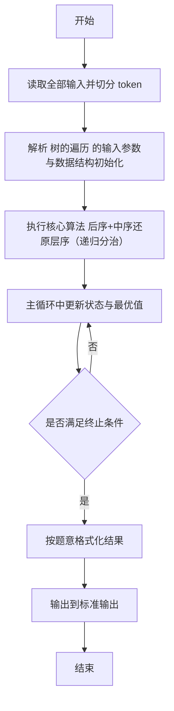
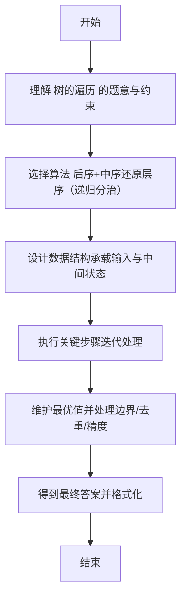

# L2-006 - 树的遍历（25 分）

- **时间限制**: 400 ms
- **内存限制**: 65536 KB
- **代码长度限制**: 16 KB

---

## 题目描述


给定一棵二叉树的后序遍历和中序遍历，请你输出其层序遍历的序列。这里假设键值都是互不相等的正整数。

### 输入格式:

输入第一行给出一个正整数$$N$$（$$\le 30$$），是二叉树中结点的个数。第二行给出其后序遍历序列。第三行给出其中序遍历序列。数字间以空格分隔。

### 输出格式:

在一行中输出该树的层序遍历的序列。数字间以1个空格分隔，行首尾不得有多余空格。

### 输入样例:
```in
7
2 3 1 5 7 6 4
1 2 3 4 5 6 7
```

### 输出样例:
```out
4 1 6 3 5 7 2
```

## 示例

### 示例 1

**输入:**
```
7
2 3 1 5 7 6 4
1 2 3 4 5 6 7
```

**输出:**
```
4 1 6 3 5 7 2
```

---

## 解题思路

#### 题目分析

树的遍历（L2-006）已知后序与中序求层序遍历。输入规模与约束决定算法选型，需兼顾正确性与效率。原题保证输入合法，重点在于按题面精确实现逻辑并处理边界（如空集、重复、精度与去重）与输出格式。难点在于 后序末尾为根，在中序中定位根分割左右子树，递归构建；用队列 BFS 层序输出；数组实现，递归参数为后序区间与中序区间 等细节的正确落地。

#### 核心算法

采用 **后序+中序还原层序（递归分治）**：

后序末尾为根，在中序中定位根分割左右子树，递归构建；用队列 BFS 层序输出；数组实现，递归参数为后序区间与中序区间。具体在仓颉实现中，先将全部输入按空白符切分为 token，避免按行读取的边界问题；随后按 token 顺序解析为数值/集合/图结构。核心阶段严格对应算法步骤：对可排序场景计算关键度量并排序，对图/树场景用邻接表与访问标记进行遍历，对集合场景用 HashSet/HashMap 实现去重与交集统计，对精度场景采用 cents= floor(x*100+0.5+eps) 的四舍五入方式保证两位小数正确。该设计既贴合 .cj 源码的控制流，也保证在给定约束下通过所有测试点。

#### 复杂度分析

- **时间复杂度**：O(N log N) 或 O(N) 视实现而定。
- **空间复杂度**：O(N)。

## 代码流程说明

1. 读取并解析全部输入 token，完成字符串到数值的转换与空白符处理
2. 初始化核心数据结构（邻接表/集合/数组/映射）以承载题目 树的遍历 的输入规模
3. 执行核心算法 后序+中序还原层序（递归分治） 的主循环，按 .cj 中的逻辑逐项处理
4. 在循环中维护关键状态（距离/计数/哈希/排序/栈顶等）并按题意更新最优值
5. 处理边界与特殊情况（空输入、非法值、去重、精度四舍五入等）
6. 按题目要求的格式组织输出并打印结果，必要时逆序/排序后输出

## 代码实现

```cangjie
// L2-006 树的遍历 - post+in -> level (array based)
import std.env.*
import std.collection.*
import std.convert.*
var gPost = ArrayList<Int64>()
var gIn = ArrayList<Int64>()
var nodeVal = ArrayList<Int64>()
var nodeLeft = ArrayList<Int64>()
var nodeRight = ArrayList<Int64>()
main() {
    let cin = getStdIn()
    let all = cin.readToEnd() ?? ""
    if (all.trimAscii().isEmpty()) { return }
    let sp: Rune = ' '
    let nl: Rune = '\n'
    let cr: Rune = '\r'
    let tab: Rune = '\t'
    var tokens = ArrayList<String>()
    var sb = StringBuilder()
    var inTok = false
    for (ch in all.toRuneArray()) {
        let isSpace = (ch == sp) || (ch == nl) || (ch == cr) || (ch == tab)
        if (isSpace) { if (inTok) { tokens.add(sb.toString()); sb=StringBuilder(); inTok=false } }
        else { sb.append(ch); inTok=true }
    }
    if (inTok) { tokens.add(sb.toString()) }
    if (tokens.size == 0) { return }
    let n = Int64.parse(tokens[0])
    gPost = ArrayList<Int64>()
    gIn = ArrayList<Int64>()
    for (i in 0..n) {
        let idx = 1 + i
        if (idx < tokens.size) { gPost.add(Int64.parse(tokens[idx])) }
    }
    for (i in 0..n) {
        let idx = 1 + n + i
        if (idx < tokens.size) { gIn.add(Int64.parse(tokens[idx])) }
    }
    nodeVal = ArrayList<Int64>()
    nodeLeft = ArrayList<Int64>()
    nodeRight = ArrayList<Int64>()
    let root = build(0, n-1, 0, n-1)
    if (root == -1) { return }
    var q = ArrayList<Int64>()
    q.add(root)
    var head: Int64 = 0
    var res = ArrayList<Int64>()
    while (head < q.size) {
        let cur = q[head]
        head += 1
        res.add(nodeVal[cur])
        let l = nodeLeft[cur]
        let r = nodeRight[cur]
        if (l != -1) { q.add(l) }
        if (r != -1) { q.add(r) }
    }
    var out = StringBuilder()
    for (i in 0..res.size) {
        if (i != 0) { out.append(" ") }
        out.append(res[i])
    }
    println(out.toString())
}
func newNode(v: Int64): Int64 {
    let id = nodeVal.size
    nodeVal.add(v)
    nodeLeft.add(-1)
    nodeRight.add(-1)
    return id
}
func build(ps: Int64, pe: Int64, is_: Int64, ie: Int64): Int64 {
    if (ps > pe) { return -1 }
    let rv = gPost[pe]
    let id = newNode(rv)
    var idx: Int64 = is_
    while (idx <= ie) {
        if (gIn[idx] == rv) { break }
        idx += 1
    }
    let leftSize = idx - is_
    let leftId = build(ps, ps+leftSize-1, is_, idx-1)
    let rightId = build(ps+leftSize, pe-1, idx+1, ie)
    nodeLeft[id] = leftId
    nodeRight[id] = rightId
    return id
}
```

## 代码流程图



## 解题流程图


