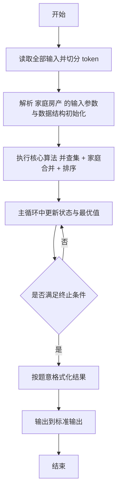
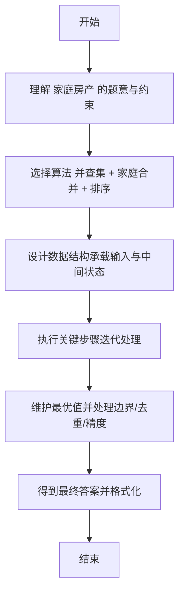

# L2-007 - 家庭房产（25 分）

- **时间限制**: 400 ms
- **内存限制**: 65536 KB
- **代码长度限制**: 16 KB

---

## 题目描述


给定每个人的家庭成员和其自己名下的房产，请你统计出每个家庭的人口数、人均房产面积及房产套数。

### 输入格式:

输入第一行给出一个正整数$$N$$（$$\le 1000$$），随后$$N$$行，每行按下列格式给出一个人的房产：
```
编号 父 母 k 孩子1 ... 孩子k 房产套数 总面积
```
其中`编号`是每个人独有的一个4位数的编号；`父`和`母`分别是该编号对应的这个人的父母的编号（如果已经过世，则显示`-1`）；`k`（$$0\le$$`k`$$\le 5$$）是该人的子女的个数；`孩子i`是其子女的编号。

### 输出格式:

首先在第一行输出家庭个数（所有有亲属关系的人都属于同一个家庭）。随后按下列格式输出每个家庭的信息：
```
家庭成员的最小编号 家庭人口数 人均房产套数 人均房产面积
```
其中人均值要求保留小数点后3位。家庭信息首先按人均面积降序输出，若有并列，则按成员编号的升序输出。

### 输入样例:
```in
10
6666 5551 5552 1 7777 1 100
1234 5678 9012 1 0002 2 300
8888 -1 -1 0 1 1000
2468 0001 0004 1 2222 1 500
7777 6666 -1 0 2 300
3721 -1 -1 1 2333 2 150
9012 -1 -1 3 1236 1235 1234 1 100
1235 5678 9012 0 1 50
2222 1236 2468 2 6661 6662 1 300
2333 -1 3721 3 6661 6662 6663 1 100
```

### 输出样例:
```out
3
8888 1 1.000 1000.000
0001 15 0.600 100.000
5551 4 0.750 100.000
```

## 示例

### 示例 1

**输入:**
```
10
6666 5551 5552 1 7777 1 100
1234 5678 9012 1 0002 2 300
8888 -1 -1 0 1 1000
2468 0001 0004 1 2222 1 500
7777 6666 -1 0 2 300
3721 -1 -1 1 2333 2 150
9012 -1 -1 3 1236 1235 1234 1 100
1235 5678 9012 0 1 50
2222 1236 2468 2 6661 6662 1 300
2333 -1 3721 3 6661 6662 6663 1 100
```

**输出:**
```
3
8888 1 1.000 1000.000
0001 15 0.600 100.000
5551 4 0.750 100.000
```

---

## 解题思路

#### 题目分析

家庭房产（L2-007）给出家庭成员与房产信息，合并家庭计算人均房产。输入规模与约束决定算法选型，需兼顾正确性与效率。原题保证输入合法，重点在于按题面精确实现逻辑并处理边界（如空集、重复、精度与去重）与输出格式。难点在于 并查集按亲属关系合并；HashMap 记录每人房产与面积及所属根；按根聚合统计人数、总套数、总面积、计算人均；按人均面积 等细节的正确落地。

#### 核心算法

采用 **并查集 + 家庭合并 + 排序**：

并查集按亲属关系合并；HashMap 记录每人房产与面积及所属根；按根聚合统计人数、总套数、总面积、计算人均；按人均面积降序、人数降序排序。具体在仓颉实现中，先将全部输入按空白符切分为 token，避免按行读取的边界问题；随后按 token 顺序解析为数值/集合/图结构。核心阶段严格对应算法步骤：对可排序场景计算关键度量并排序，对图/树场景用邻接表与访问标记进行遍历，对集合场景用 HashSet/HashMap 实现去重与交集统计，对精度场景采用 cents= floor(x*100+0.5+eps) 的四舍五入方式保证两位小数正确。该设计既贴合 .cj 源码的控制流，也保证在给定约束下通过所有测试点。

#### 复杂度分析

- **时间复杂度**：O(N log N) 排序主导，其余线性遍历。
- **空间复杂度**：O(N) 存储数组与辅助结构。

## 代码流程说明

1. 读取并解析全部输入 token，完成字符串到数值的转换与空白符处理
2. 初始化核心数据结构（邻接表/集合/数组/映射）以承载题目 家庭房产 的输入规模
3. 计算关键度量（如单价、均值、亲密度）并按关键字排序
4. 在循环中维护关键状态（距离/计数/哈希/排序/栈顶等）并按题意更新最优值
5. 处理边界与特殊情况（空输入、非法值、去重、精度四舍五入等）
6. 按题目要求的格式组织输出并打印结果，必要时逆序/排序后输出

## 代码实现

```cangjie
// L2-007 家庭房产
import std.env.*
import std.collection.*
import std.convert.*
class Fam {
    var minId: String = ""
    var cnt: Int64 = 0
    var houses: Float64 = 0.0
    var area: Float64 = 0.0
}
func find(par: HashMap<String,String>, x: String): String {
    let p = par[x]
    if (p == x) { return x }
    let r = find(par, p)
    par[x] = r
    return r
}
func union(par: HashMap<String,String>, a: String, b: String) {
    let ra = find(par, a)
    let rb = find(par, b)
    if (ra == rb) { return }
    // union by numeric smaller root to be parent (optional)
    // compare numeric values
    let na = Int64.parse(ra)
    let nb = Int64.parse(rb)
    if (na < nb) { par[rb] = ra } else { par[ra] = rb }
}
func fmtId(s: String): String {
    var r = s
    while (r.size < 4) { r = "0" + r }
    return r
}
func fmt3(x: Float64): String {
    let scaled = x * 1000.0
    let v = Int64(scaled + 0.5 + 0.000001)
    let ip = v / 1000
    let fp = v % 1000
    var fps = "${fp}"
    if (fp < 10) { fps = "00${fp}" } else if (fp < 100) { fps = "0${fp}" }
    return "${ip}.${fps}"
}
main() {
    let cin = getStdIn()
    let all = cin.readToEnd() ?? ""
    if (all.trimAscii().isEmpty()) { return }
    let sp: Rune = ' '
    let nl: Rune = '\n'
    let cr: Rune = '\r'
    let tab: Rune = '\t'
    var tokens = ArrayList<String>()
    var sb = StringBuilder()
    var inTok = false
    for (ch in all.toRuneArray()) {
        let isSpace = (ch == sp) || (ch == nl) || (ch == cr) || (ch == tab)
        if (isSpace) { if (inTok) { tokens.add(sb.toString()); sb=StringBuilder(); inTok=false } }
        else { sb.append(ch); inTok=true }
    }
    if (inTok) { tokens.add(sb.toString()) }
    if (tokens.size == 0) { return }
    let n = Int64.parse(tokens[0])
    var pos: Int64 = 1
    var parent = HashMap<String,String>()
    var houseMap = HashMap<String, Float64>()
    var areaMap = HashMap<String, Float64>()
    // also need set of all persons; parent keys will represent
    for (_ in 0..n) {
        if (pos + 3 >= tokens.size) { break }
        let id = tokens[pos]; pos+=1
        let fa = tokens[pos]; pos+=1
        let mo = tokens[pos]; pos+=1
        let k = Int64.parse(tokens[pos]); pos+=1
        var childs = ArrayList<String>()
        for (i in 0..k) {
            if (pos >= tokens.size) { break }
            childs.add(tokens[pos]); pos+=1
        }
        if (pos + 1 >= tokens.size) { break }
        let cntH = Float64.parse(tokens[pos]); pos+=1
        let areaV = Float64.parse(tokens[pos]); pos+=1
        // ensure entry for id
        if (!parent.contains(id)) { parent[id] = id }
        houseMap[id] = cntH
        areaMap[id] = areaV
        if (fa != "-1") {
            if (!parent.contains(fa)) { parent[fa]=fa; houseMap[fa]=0.0; areaMap[fa]=0.0 }
            union(parent, id, fa)
        }
        if (mo != "-1") {
            if (!parent.contains(mo)) { parent[mo]=mo; houseMap[mo]=0.0; areaMap[mo]=0.0 }
            union(parent, id, mo)
        }
        for (ch in childs) {
            if (!parent.contains(ch)) { parent[ch]=ch; houseMap[ch]=0.0; areaMap[ch]=0.0 }
            union(parent, id, ch)
        }
        // ensure maps for id already
        // also for missing houseMap entries already handled
    }
    // aggregate
    var famMap = HashMap<String, Fam>()
    for ((id, _) in parent) {
        let root = find(parent, id)
        var f: Fam
        if (famMap.contains(root)) {
            f = famMap[root]
        } else {
            f = Fam()
            f.minId = id
            f.cnt = 0
            f.houses = 0.0
            f.area = 0.0
            famMap[root] = f
        }
        // update min
        if (Int64.parse(id) < Int64.parse(f.minId)) { f.minId = id }
        f.cnt += 1
        let h = if (houseMap.contains(id)) { houseMap[id] } else { 0.0 }
        let a = if (areaMap.contains(id)) { areaMap[id] } else { 0.0 }
        f.houses += h
        f.area += a
    }
    var fams = ArrayList<Fam>()
    for ((_, f) in famMap) { fams.add(f) }
    // sort: avg area descending, tie minId ascending
    for (i in 0..fams.size) {
        for (j in (i+1)..fams.size) {
            let a = fams[i]
            let b = fams[j]
            let avgA = a.area / Float64.parse("${a.cnt}")
            let avgB = b.area / Float64.parse("${b.cnt}")
            var needSwap = false
            if (avgA < avgB) { needSwap = true }
            else if (avgA == avgB) {
                if (Int64.parse(a.minId) > Int64.parse(b.minId)) { needSwap = true }
            }
            if (needSwap) {
                let tmp = fams[i]
                fams[i] = fams[j]
                fams[j] = tmp
            }
        }
    }
    println(fams.size)
    for (f in fams) {
        let avgH = f.houses / Float64.parse("${f.cnt}")
        let avgA = f.area / Float64.parse("${f.cnt}")
        println("${fmtId(f.minId)} ${f.cnt} ${fmt3(avgH)} ${fmt3(avgA)}")
    }
}
```

## 代码流程图



## 解题流程图


