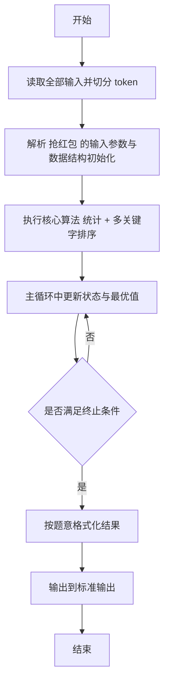
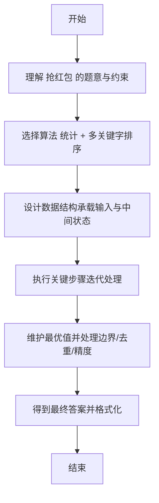

# L2-009 - 抢红包（25 分）

- **时间限制**: 300 ms
- **内存限制**: 65536 KB
- **代码长度限制**: 16 KB

---

## 题目描述


没有人没抢过红包吧…… 这里给出$$N$$个人之间互相发红包、抢红包的记录，请你统计一下他们抢红包的收获。

### 输入格式:

输入第一行给出一个正整数$$N$$（$$\le 10^4$$），即参与发红包和抢红包的总人数，则这些人从1到$$N$$编号。随后$$N$$行，第$$i$$行给出编号为$$i$$的人发红包的记录，格式如下：

$$K\quad N_1\quad P_1\quad \cdots\quad N_K\quad P_K$$

其中$$K$$（$$0 \le K \le 20$$）是发出去的红包个数，$$N_i$$是抢到红包的人的编号，$$P_i$$（$$>0$$）是其抢到的红包金额（以分为单位）。注意：对于同一个人发出的红包，每人最多只能抢1次，不能重复抢。

### 输出格式:

按照收入金额从高到低的递减顺序输出每个人的编号和收入金额（以元为单位，输出小数点后2位）。每个人的信息占一行，两数字间有1个空格。如果收入金额有并列，则按抢到红包的个数递减输出；如果还有并列，则按个人编号递增输出。

### 输入样例:
```in
10
3 2 22 10 58 8 125
5 1 345 3 211 5 233 7 13 8 101
1 7 8800
2 1 1000 2 1000
2 4 250 10 320
6 5 11 9 22 8 33 7 44 10 55 4 2
1 3 8800
2 1 23 2 123
1 8 250
4 2 121 4 516 7 112 9 10
```

### 输出样例:
```out
1 11.63
2 3.63
8 3.63
3 2.11
7 1.69
6 -1.67
9 -2.18
10 -3.26
5 -3.26
4 -12.32
```

## 示例

### 示例 1

**输入:**
```
10
3 2 22 10 58 8 125
5 1 345 3 211 5 233 7 13 8 101
1 7 8800
2 1 1000 2 1000
2 4 250 10 320
6 5 11 9 22 8 33 7 44 10 55 4 2
1 3 8800
2 1 23 2 123
1 8 250
4 2 121 4 516 7 112 9 10
```

**输出:**
```
1 11.63
2 3.63
8 3.63
3 2.11
7 1.69
6 -1.67
9 -2.18
10 -3.26
5 -3.26
4 -12.32
```

---

## 解题思路

#### 题目分析

抢红包（L2-009）N 人抢红包，统计每人收发， 按收入降序、抢个数降序、编号升序排序。输入规模与约束决定算法选型，需兼顾正确性与效率。原题保证输入合法，重点在于按题面精确实现逻辑并处理边界（如空集、重复、精度与去重）与输出格式。难点在于 用 Person 对象记录收入、抢到个数；遍历每条抢红包记录更新被抢者收入与次数；排序 comparator 实现三关键 等细节的正确落地。

#### 核心算法

采用 **统计 + 多关键字排序**：

用 Person 对象记录收入、抢到个数；遍历每条抢红包记录更新被抢者收入与次数；排序 comparator 实现三关键字比较。具体在仓颉实现中，先将全部输入按空白符切分为 token，避免按行读取的边界问题；随后按 token 顺序解析为数值/集合/图结构。核心阶段严格对应算法步骤：对可排序场景计算关键度量并排序，对图/树场景用邻接表与访问标记进行遍历，对集合场景用 HashSet/HashMap 实现去重与交集统计，对精度场景采用 cents= floor(x*100+0.5+eps) 的四舍五入方式保证两位小数正确。该设计既贴合 .cj 源码的控制流，也保证在给定约束下通过所有测试点。

#### 复杂度分析

- **时间复杂度**：O(N log N) 排序主导，其余线性遍历。
- **空间复杂度**：O(N) 存储数组与辅助结构。

## 代码流程说明

1. 读取并解析全部输入 token，完成字符串到数值的转换与空白符处理
2. 初始化核心数据结构（邻接表/集合/数组/映射）以承载题目 抢红包 的输入规模
3. 计算关键度量（如单价、均值、亲密度）并按关键字排序
4. 在循环中维护关键状态（距离/计数/哈希/排序/栈顶等）并按题意更新最优值
5. 处理边界与特殊情况（空输入、非法值、去重、精度四舍五入等）
6. 按题目要求的格式组织输出并打印结果，必要时逆序/排序后输出

## 代码实现

```cangjie
// L2-009 抢红包
import std.env.*
import std.collection.*
import std.convert.*
class Person {
    var id: Int64 = 0
    var money: Int64 = 0
    var cnt: Int64 = 0
}
func fmtMoney(cent: Int64): String {
    var neg = cent < 0
    var abs = if (neg) { -cent } else { cent }
    let ip = abs / 100
    let fp = abs % 100
    var fps = "${fp}"
    if (fp < 10) { fps = "0${fp}" }
    var s = "${ip}.${fps}"
    if (neg) { s = "-${s}" }
    return s
}
main() {
    let cin = getStdIn()
    let all = cin.readToEnd() ?? ""
    if (all.trimAscii().isEmpty()) { return }
    let sp: Rune = ' '
    let nl: Rune = '\n'
    let cr: Rune = '\r'
    let tab: Rune = '\t'
    var tokens = ArrayList<String>()
    var sb = StringBuilder()
    var inTok = false
    for (ch in all.toRuneArray()) {
        let isSpace = (ch == sp) || (ch == nl) || (ch == cr) || (ch == tab)
        if (isSpace) { if (inTok) { tokens.add(sb.toString()); sb=StringBuilder(); inTok=false } }
        else { sb.append(ch); inTok=true }
    }
    if (inTok) { tokens.add(sb.toString()) }
    if (tokens.size == 0) { return }
    let n = Int64.parse(tokens[0])
    var money = ArrayList<Int64>()
    var cnt = ArrayList<Int64>()
    for (_ in 0..(n+1)) { money.add(0); cnt.add(0) }
    var pos: Int64 = 1
    for (i in 1..(n+1)) {
        if (pos >= tokens.size) { break }
        let k = Int64.parse(tokens[pos]); pos+=1
        var total: Int64 = 0
        for (_ in 0..k) {
            if (pos + 1 >= tokens.size) { break }
            let ni = Int64.parse(tokens[pos]); pos+=1
            let pi = Int64.parse(tokens[pos]); pos+=1
            if (ni >= 0 && ni < money.size) {
                money[ni] += pi
                cnt[ni] += 1
            }
            total += pi
        }
        money[i] -= total
    }
    var people = ArrayList<Person>()
    for (i in 1..(n+1)) {
        let p = Person()
        p.id = i
        p.money = money[i]
        p.cnt = cnt[i]
        people.add(p)
    }
    // sort
    for (i in 0..people.size) {
        for (j in (i+1)..people.size) {
            let a = people[i]
            let b = people[j]
            var needSwap = false
            if (a.money < b.money) { needSwap = true }
            else if (a.money == b.money) {
                if (a.cnt < b.cnt) { needSwap = true }
                else if (a.cnt == b.cnt) {
                    if (a.id > b.id) { needSwap = true }
                }
            }
            if (needSwap) {
                let tmp = people[i]
                people[i] = people[j]
                people[j] = tmp
            }
        }
    }
    for (p in people) {
        println("${p.id} ${fmtMoney(p.money)}")
    }
}
```

## 代码流程图



## 解题流程图


