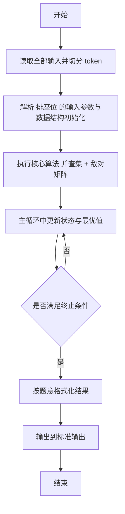
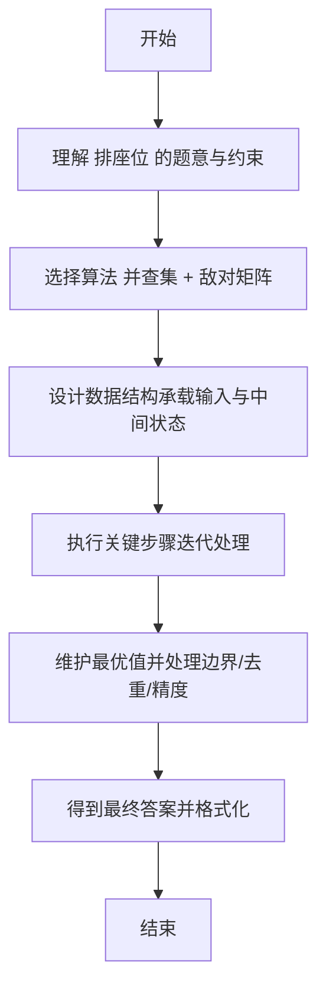

# L2-010 - 排座位（25 分）

- **时间限制**: 150 ms
- **内存限制**: 65536 KB
- **代码长度限制**: 16 KB

---

## 题目描述


布置宴席最微妙的事情，就是给前来参宴的各位宾客安排座位。无论如何，总不能把两个死对头排到同一张宴会桌旁！这个艰巨任务现在就交给你，对任何一对客人，请编写程序告诉主人他们是否能被安排同席。

### 输入格式:

输入第一行给出3个正整数：`N`（$$\le$$100），即前来参宴的宾客总人数，则这些人从1到`N`编号；`M`为已知两两宾客之间的关系数；`K`为查询的条数。随后`M`行，每行给出一对宾客之间的关系，格式为：`宾客1 宾客2 关系`，其中`关系`为1表示是朋友，-1表示是死对头。注意两个人不可能既是朋友又是敌人。最后`K`行，每行给出一对需要查询的宾客编号。

这里假设朋友的朋友也是朋友。但敌人的敌人并不一定就是朋友，朋友的敌人也不一定是敌人。只有单纯直接的敌对关系才是绝对不能同席的。

### 输出格式:

对每个查询输出一行结果：如果两位宾客之间是朋友，且没有敌对关系，则输出`No problem`；如果他们之间并不是朋友，但也不敌对，则输出`OK`；如果他们之间有敌对，然而也有共同的朋友，则输出`OK but...`；如果他们之间只有敌对关系，则输出`No way`。

### 输入样例:
```in
7 8 4
5 6 1
2 7 -1
1 3 1
3 4 1
6 7 -1
1 2 1
1 4 1
2 3 -1
3 4
5 7
2 3
7 2
```

### 输出样例:
```out
No problem
OK
OK but...
No way
```

## 示例

### 示例 1

**输入:**
```
7 8 4
5 6 1
2 7 -1
1 3 1
3 4 1
6 7 -1
1 2 1
1 4 1
2 3 -1
3 4
5 7
2 3
7 2
```

**输出:**
```
No problem
OK
OK but...
No way
```

---

## 解题思路

#### 题目分析

排座位（L2-010）判断两人是否同帮派及是否有敌对关系。输入规模与约束决定算法选型，需兼顾正确性与效率。原题保证输入合法，重点在于按题面精确实现逻辑并处理边界（如空集、重复、精度与去重）与输出格式。难点在于 并查集维护朋友圈合并；矩阵 enemy[a][b] 标记敌对；查询时先查是否同一集合，再查敌对标记分四种输出 等细节的正确落地。

#### 核心算法

采用 **并查集 + 敌对矩阵**：

并查集维护朋友圈合并；矩阵 enemy[a][b] 标记敌对；查询时先查是否同一集合，再查敌对标记分四种输出。具体在仓颉实现中，先将全部输入按空白符切分为 token，避免按行读取的边界问题；随后按 token 顺序解析为数值/集合/图结构。核心阶段严格对应算法步骤：对可排序场景计算关键度量并排序，对图/树场景用邻接表与访问标记进行遍历，对集合场景用 HashSet/HashMap 实现去重与交集统计，对精度场景采用 cents= floor(x*100+0.5+eps) 的四舍五入方式保证两位小数正确。该设计既贴合 .cj 源码的控制流，也保证在给定约束下通过所有测试点。

#### 复杂度分析

- **时间复杂度**：O((N+M) α(N)) 接近线性，α 为反阿克曼函数。
- **空间复杂度**：O(N) 并查集与映射。

## 代码流程说明

1. 读取并解析全部输入 token，完成字符串到数值的转换与空白符处理
2. 初始化核心数据结构（邻接表/集合/数组/映射）以承载题目 排座位 的输入规模
3. 执行核心算法 并查集 + 敌对矩阵 的主循环，按 .cj 中的逻辑逐项处理
4. 在循环中维护关键状态（距离/计数/哈希/排序/栈顶等）并按题意更新最优值
5. 处理边界与特殊情况（空输入、非法值、去重、精度四舍五入等）
6. 按题目要求的格式组织输出并打印结果，必要时逆序/排序后输出

## 代码实现

```cangjie
// L2-010 排座位
import std.env.*
import std.collection.*
import std.convert.*
func find(par: ArrayList<Int64>, x: Int64): Int64 {
    let p = par[x]
    if (p != x) {
        let r = find(par, p)
        par[x] = r
        return r
    }
    return p
}
func union(par: ArrayList<Int64>, a: Int64, b: Int64) {
    let ra = find(par, a)
    let rb = find(par, b)
    if (ra != rb) { par[rb] = ra }
}
main() {
    let cin = getStdIn()
    let all = cin.readToEnd() ?? ""
    if (all.trimAscii().isEmpty()) { return }
    let sp: Rune = ' '
    let nl: Rune = '\n'
    let cr: Rune = '\r'
    let tab: Rune = '\t'
    var tokens = ArrayList<String>()
    var sb = StringBuilder()
    var inTok = false
    for (ch in all.toRuneArray()) {
        let isSpace = (ch == sp) || (ch == nl) || (ch == cr) || (ch == tab)
        if (isSpace) { if (inTok) { tokens.add(sb.toString()); sb=StringBuilder(); inTok=false } }
        else { sb.append(ch); inTok=true }
    }
    if (inTok) { tokens.add(sb.toString()) }
    if (tokens.size < 3) { return }
    let n = Int64.parse(tokens[0])
    let m = Int64.parse(tokens[1])
    let k = Int64.parse(tokens[2])
    var par = ArrayList<Int64>()
    for (i in 0..(n+1)) { par.add(i) }
    // enemy matrix: use ArrayList<ArrayList<Bool>>
    var enemy = ArrayList<ArrayList<Bool>>()
    for (_ in 0..(n+1)) {
        var row = ArrayList<Bool>()
        for (_ in 0..(n+1)) { row.add(false) }
        enemy.add(row)
    }
    var pos: Int64 = 3
    for (_ in 0..m) {
        if (pos+2 >= tokens.size) { break }
        let a = Int64.parse(tokens[pos]); let b = Int64.parse(tokens[pos+1]); let r = Int64.parse(tokens[pos+2]); pos+=3
        if (r == 1) { union(par, a, b) }
        else { enemy[a][b] = true; enemy[b][a] = true }
    }
    for (_ in 0..k) {
        if (pos+1 >= tokens.size) { break }
        let a = Int64.parse(tokens[pos]); let b = Int64.parse(tokens[pos+1]); pos+=2
        let isFriend = find(par, a) == find(par, b)
        let isEnemy = enemy[a][b]
        if (isFriend && !isEnemy) {
            println("No problem")
        } else if (!isFriend && !isEnemy) {
            println("OK")
        } else if (isEnemy) {
            var hasCommon = false
            for (c in 1..(n+1)) {
                if (c == a || c == b) { continue }
                let fa = find(par, a) == find(par, c)
                let fb = find(par, b) == find(par, c)
                if (fa && fb) { hasCommon = true; break }
            }
            if (hasCommon) { println("OK but...") } else { println("No way") }
        } else {
            // isFriend && isEnemy already handled? Actually isEnemy true case above covers
            println("OK")
        }
    }
}
```

## 代码流程图



## 解题流程图


