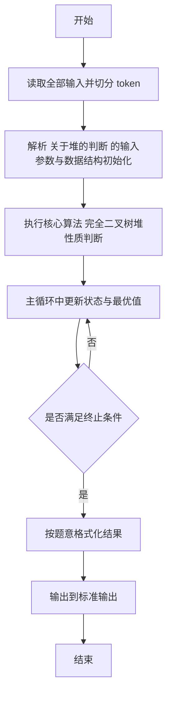
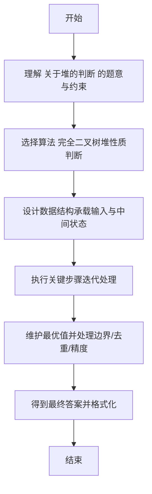

# L2-012 - 关于堆的判断（25 分）

- **时间限制**: 400 ms
- **内存限制**: 65536 KB
- **代码长度限制**: 16 KB

---

## 题目描述


将一系列给定数字顺序插入一个初始为空的小顶堆`H[]`。随后判断一系列相关命题是否为真。命题分下列几种：

- `x is the root`：`x`是根结点；
- `x and y are siblings`：`x`和`y`是兄弟结点；
- `x is the parent of y`：`x`是`y`的父结点；
- `x is a child of y`：`x`是`y`的一个子结点。

### 输入格式:

每组测试第1行包含2个正整数`N`（$$\le$$ 1000）和`M`（$$\le$$ 20），分别是插入元素的个数、以及需要判断的命题数。下一行给出区间$$[-10000, 10000]$$内的`N`个要被插入一个初始为空的小顶堆的整数。之后`M`行，每行给出一个命题。题目保证命题中的结点键值都是存在的。

### 输出格式:

对输入的每个命题，如果其为真，则在一行中输出`T`，否则输出`F`。

### 输入样例:
```in
5 4
46 23 26 24 10
24 is the root
26 and 23 are siblings
46 is the parent of 23
23 is a child of 10
```

### 输出样例:
```out
F
T
F
T
```

## 示例

### 示例 1

**输入:**
```
5 4
46 23 26 24 10
24 is the root
26 and 23 are siblings
46 is the parent of 23
23 is a child of 10
```

**输出:**
```
F
T
F
T
```

---

## 解题思路

#### 题目分析

关于堆的判断（L2-012）给定插入序列建堆，判断多条陈述是否正确。输入规模与约束决定算法选型，需兼顾正确性与效率。原题保证输入合法，重点在于按题面精确实现逻辑并处理边界（如空集、重复、精度与去重）与输出格式。难点在于 按完全二叉树数组存储；逐节点检查父子大小关系判断是否为大根堆/小根堆；HashMap 记录元素下标位置回答兄弟、父子等查 等细节的正确落地。

#### 核心算法

采用 **完全二叉树堆性质判断**：

按完全二叉树数组存储；逐节点检查父子大小关系判断是否为大根堆/小根堆；HashMap 记录元素下标位置回答兄弟、父子等查询。具体在仓颉实现中，先将全部输入按空白符切分为 token，避免按行读取的边界问题；随后按 token 顺序解析为数值/集合/图结构。核心阶段严格对应算法步骤：对可排序场景计算关键度量并排序，对图/树场景用邻接表与访问标记进行遍历，对集合场景用 HashSet/HashMap 实现去重与交集统计，对精度场景采用 cents= floor(x*100+0.5+eps) 的四舍五入方式保证两位小数正确。该设计既贴合 .cj 源码的控制流，也保证在给定约束下通过所有测试点。

#### 复杂度分析

- **时间复杂度**：O(N log N) 或 O(N) 视实现而定。
- **空间复杂度**：O(N)。

## 代码流程说明

1. 读取并解析全部输入 token，完成字符串到数值的转换与空白符处理
2. 初始化核心数据结构（邻接表/集合/数组/映射）以承载题目 关于堆的判断 的输入规模
3. 执行核心算法 完全二叉树堆性质判断 的主循环，按 .cj 中的逻辑逐项处理
4. 在循环中维护关键状态（距离/计数/哈希/排序/栈顶等）并按题意更新最优值
5. 处理边界与特殊情况（空输入、非法值、去重、精度四舍五入等）
6. 按题目要求的格式组织输出并打印结果，必要时逆序/排序后输出

## 代码实现

```cangjie
// L2-012 关于堆的判断
import std.env.*
import std.collection.*
import std.convert.*
main() {
    let cin = getStdIn()
    let all = cin.readToEnd() ?? ""
    if (all.trimAscii().isEmpty()) { return }
    let sp: Rune = ' '
    let nl: Rune = '\n'
    let cr: Rune = '\r'
    let tab: Rune = '\t'
    var tokens = ArrayList<String>()
    var sb = StringBuilder()
    var inTok = false
    for (ch in all.toRuneArray()) {
        let isSpace = (ch == sp) || (ch == nl) || (ch == cr) || (ch == tab)
        if (isSpace) { if (inTok) { tokens.add(sb.toString()); sb=StringBuilder(); inTok=false } }
        else { sb.append(ch); inTok=true }
    }
    if (inTok) { tokens.add(sb.toString()) }
    if (tokens.size < 2) { return }
    let n = Int64.parse(tokens[0])
    let m = Int64.parse(tokens[1])
    var nums = ArrayList<Int64>()
    var pos: Int64 = 2
    for (_ in 0..n) {
        if (pos >= tokens.size) { break }
        nums.add(Int64.parse(tokens[pos])); pos+=1
    }
    // build heap
    var heap = ArrayList<Int64>()
    heap.add(0) // dummy
    for (num in nums) {
        heap.add(num)
        var i = heap.size - 1
        while (i > 1) {
            let p = i / 2
            if (heap[p] > heap[i]) {
                let tmp = heap[p]
                heap[p] = heap[i]
                heap[i] = tmp
                i = p
            } else {
                break
            }
        }
    }
    var posMap = HashMap<Int64, Int64>()
    for (i in 1..heap.size) {
        let v = heap[i]
        posMap[v] = i
    }
    // parse m propositions using tokens remaining
    for (_ in 0..m) {
        if (pos >= tokens.size) { break }
        // peek
        // need to determine type
        // tokens[pos] is x (maybe for siblings, but also first token)
        // check if pos+1 < size and tokens[pos+1]=="and"
        var consumed: Int64 = 0
        var result: Bool = false
        if (pos+1 < tokens.size && tokens[pos+1] == "and") {
            // x and y are siblings
            if (pos+4 >= tokens.size) { break }
            let x = Int64.parse(tokens[pos])
            let y = Int64.parse(tokens[pos+2])
            // tokens: x and y are siblings -> 5 tokens
            let px = if (posMap.contains(x)) { posMap[x] } else { -1 }
            let py = if (posMap.contains(y)) { posMap[y] } else { -1 }
            if (px != -1 && py != -1) {
                if (px/2 == py/2 && px != py) { result = true } else { result = false }
            } else { result = false }
            consumed = 5
        } else if (pos+1 < tokens.size && tokens[pos+1] == "is") {
            // could be is the root / is the parent of / is a child of
            if (pos+2 < tokens.size && tokens[pos+2] == "the") {
                if (pos+3 < tokens.size && tokens[pos+3] == "root") {
                    let x = Int64.parse(tokens[pos])
                    let px = if (posMap.contains(x)) { posMap[x] } else { -1 }
                    result = (px == 1)
                    consumed = 4
                } else if (pos+3 < tokens.size && tokens[pos+3] == "parent") {
                    // x is the parent of y -> 6 tokens: x is the parent of y
                    if (pos+5 >= tokens.size) { break }
                    let x = Int64.parse(tokens[pos])
                    let y = Int64.parse(tokens[pos+5])
                    let px = if (posMap.contains(x)) { posMap[x] } else { -1 }
                    let py = if (posMap.contains(y)) { posMap[y] } else { -1 }
                    if (px != -1 && py != -1) {
                        if (px == py/2) { result = true } else { result = false }
                    } else { result = false }
                    consumed = 6
                } else {
                    consumed = 4
                }
            } else if (pos+2 < tokens.size && tokens[pos+2] == "a") {
                // x is a child of y -> 6 tokens: x is a child of y
                if (pos+5 >= tokens.size) { break }
                let x = Int64.parse(tokens[pos])
                let y = Int64.parse(tokens[pos+5])
                let px = if (posMap.contains(x)) { posMap[x] } else { -1 }
                let py = if (posMap.contains(y)) { posMap[y] } else { -1 }
                if (px != -1 && py != -1) {
                    if (py == px/2) { result = true } else { result = false }
                } else { result = false }
                consumed = 6
            } else {
                consumed = 3
            }
        } else {
            // unknown, skip one
            consumed = 1
        }
        if (result) { println("T") } else { println("F") }
        pos += consumed
    }
}
```

## 代码流程图



## 解题流程图


