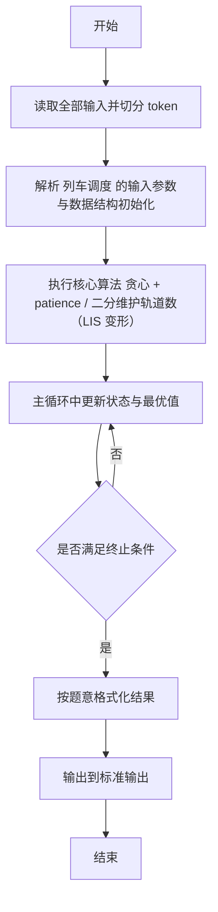
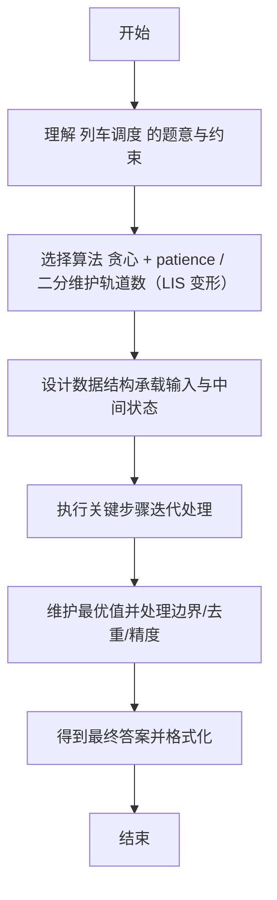

# L2-014 - 列车调度（25 分）

- **时间限制**: 300 ms
- **内存限制**: 65536 KB
- **代码长度限制**: 16 KB

---

## 题目描述


火车站的列车调度铁轨的结构如下图所示。


两端分别是一条入口（Entrance）轨道和一条出口（Exit）轨道，它们之间有`N`条平行的轨道。每趟列车从入口可以选择任意一条轨道进入，最后从出口离开。在图中有9趟列车，在入口处按照{8，4，2，5，3，9，1，6，7}的顺序排队等待进入。如果要求它们必须按序号递减的顺序从出口离开，则至少需要多少条平行铁轨用于调度？

### 输入格式:

输入第一行给出一个整数`N` (2 $$\le$$ `N` $$\le 10^5$$)，下一行给出从1到`N`的整数序号的一个重排列。数字间以空格分隔。

### 输出格式:

在一行中输出可以将输入的列车按序号递减的顺序调离所需要的最少的铁轨条数。

### 输入样例:
```in
9
8 4 2 5 3 9 1 6 7
```

### 输出样例:
```out
4
```

## 示例

### 示例 1

**输入:**
```
9
8 4 2 5 3 9 1 6 7
```

**输出:**
```
4
```

---

## 解题思路

#### 题目分析

列车调度（L2-014）求最少需要多少条调度轨道。输入规模与约束决定算法选型，需兼顾正确性与效率。原题保证输入合法，重点在于按题面精确实现逻辑并处理边界（如空集、重复、精度与去重）与输出格式。难点在于 维护每条轨道末尾的最小可能尾数 tails；对每辆列车二分找首个 > 当前车的轨道（upper_bound），找到则替换 等细节的正确落地。

#### 核心算法

采用 **贪心 + patience / 二分维护轨道数（LIS 变形）**：

维护每条轨道末尾的最小可能尾数 tails；对每辆列车二分找首个 > 当前车的轨道（upper_bound），找到则替换否则新增轨道；答案为 tails 长度。具体在仓颉实现中，先将全部输入按空白符切分为 token，避免按行读取的边界问题；随后按 token 顺序解析为数值/集合/图结构。核心阶段严格对应算法步骤：对可排序场景计算关键度量并排序，对图/树场景用邻接表与访问标记进行遍历，对集合场景用 HashSet/HashMap 实现去重与交集统计，对精度场景采用 cents= floor(x*100+0.5+eps) 的四舍五入方式保证两位小数正确。该设计既贴合 .cj 源码的控制流，也保证在给定约束下通过所有测试点。

#### 复杂度分析

- **时间复杂度**：O(N log N) 排序主导，其余线性遍历。
- **空间复杂度**：O(N) 存储数组与辅助结构。

## 代码流程说明

1. 读取并解析全部输入 token，完成字符串到数值的转换与空白符处理
2. 初始化核心数据结构（邻接表/集合/数组/映射）以承载题目 列车调度 的输入规模
3. 计算关键度量（如单价、均值、亲密度）并按关键字排序
4. 在循环中维护关键状态（距离/计数/哈希/排序/栈顶等）并按题意更新最优值
5. 处理边界与特殊情况（空输入、非法值、去重、精度四舍五入等）
6. 按题目要求的格式组织输出并打印结果，必要时逆序/排序后输出

## 代码实现

```cangjie
// L2-014 列车调度 - patience LIS
import std.env.*
import std.collection.*
import std.convert.*
main() {
    let cin = getStdIn()
    let all = cin.readToEnd() ?? ""
    if (all.trimAscii().isEmpty()) { return }
    let sp: Rune = ' '
    let nl: Rune = '\n'
    let cr: Rune = '\r'
    let tab: Rune = '\t'
    var tokens = ArrayList<String>()
    var sb = StringBuilder()
    var inTok = false
    for (ch in all.toRuneArray()) {
        let isSpace = (ch == sp) || (ch == nl) || (ch == cr) || (ch == tab)
        if (isSpace) { if (inTok) { tokens.add(sb.toString()); sb=StringBuilder(); inTok=false } }
        else { sb.append(ch); inTok=true }
    }
    if (inTok) { tokens.add(sb.toString()) }
    if (tokens.size == 0) { return }
    let n = Int64.parse(tokens[0])
    var nums = ArrayList<Int64>()
    for (i in 1..(n+1)) {
        if (i < tokens.size) { nums.add(Int64.parse(tokens[i])) }
    }
    var tracks = ArrayList<Int64>()
    for (num in nums) {
        var left: Int64 = 0
        var right: Int64 = tracks.size - 1
        var found: Int64 = -1
        while (left <= right) {
            let mid = (left + right) / 2
            if (tracks[mid] > num) {
                found = mid
                right = mid - 1
            } else {
                left = mid + 1
            }
        }
        if (found != -1) {
            tracks[found] = num
        } else {
            tracks.add(num)
        }
    }
    println(tracks.size)
}
```

## 代码流程图



## 解题流程图


