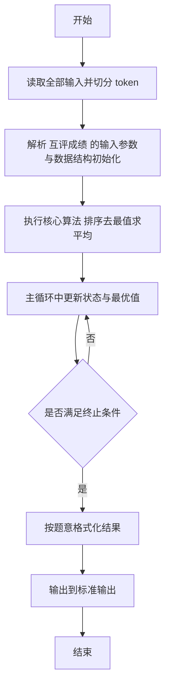
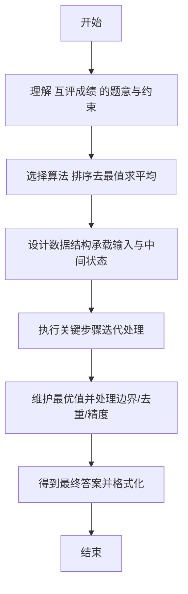

# L2-015 - 互评成绩（25 分）

- **时间限制**: 300 ms
- **内存限制**: 65536 KB
- **代码长度限制**: 16 KB

---

## 题目描述


学生互评作业的简单规则是这样定的：每个人的作业会被`k`个同学评审，得到`k`个成绩。系统需要去掉一个最高分和一个最低分，将剩下的分数取平均，就得到这个学生的最后成绩。本题就要求你编写这个互评系统的算分模块。

### 输入格式:

输入第一行给出3个正整数`N`（3 $$<$$ `N` $$\le 10^4$$，学生总数）、`k`（3 $$\le$$ `k` $$\le$$ 10，每份作业的评审数）、`M`（$$\le$$ 20，需要输出的学生数）。随后`N`行，每行给出一份作业得到的`k`个评审成绩（在区间[0, 100]内），其间以空格分隔。

### 输出格式:

按非递减顺序输出最后得分最高的`M`个成绩，保留小数点后3位。分数间有1个空格，行首尾不得有多余空格。

### 输入样例:
```in
6 5 3
88 90 85 99 60
67 60 80 76 70
90 93 96 99 99
78 65 77 70 72
88 88 88 88 88
55 55 55 55 55
```

### 输出样例:
```out
87.667 88.000 96.000
```

## 示例

### 示例 1

**输入:**
```
6 5 3
88 90 85 99 60
67 60 80 76 70
90 93 96 99 99
78 65 77 70 72
88 88 88 88 88
55 55 55 55 55
```

**输出:**
```
87.667 88.000 96.000
```

---

## 解题思路

#### 题目分析

互评成绩（L2-015）对每位学生的成绩去掉最高最低后求平均，取前 K 名。输入规模与约束决定算法选型，需兼顾正确性与效率。原题保证输入合法，重点在于按题面精确实现逻辑并处理边界（如空集、重复、精度与去重）与输出格式。难点在于 对每组 N 个成绩排序，去掉首尾后求和/ (N-2)；收集所有学生平均分后整体排序取前列输出；注意四舍五入与精度 等细节的正确落地。

#### 核心算法

采用 **排序去最值求平均**：

对每组 N 个成绩排序，去掉首尾后求和/ (N-2)；收集所有学生平均分后整体排序取前列输出；注意四舍五入与精度。具体在仓颉实现中，先将全部输入按空白符切分为 token，避免按行读取的边界问题；随后按 token 顺序解析为数值/集合/图结构。核心阶段严格对应算法步骤：对可排序场景计算关键度量并排序，对图/树场景用邻接表与访问标记进行遍历，对集合场景用 HashSet/HashMap 实现去重与交集统计，对精度场景采用 cents= floor(x*100+0.5+eps) 的四舍五入方式保证两位小数正确。该设计既贴合 .cj 源码的控制流，也保证在给定约束下通过所有测试点。

#### 复杂度分析

- **时间复杂度**：O(N log N) 排序主导，其余线性遍历。
- **空间复杂度**：O(N) 存储数组与辅助结构。

## 代码流程说明

1. 读取并解析全部输入 token，完成字符串到数值的转换与空白符处理
2. 初始化核心数据结构（邻接表/集合/数组/映射）以承载题目 互评成绩 的输入规模
3. 计算关键度量（如单价、均值、亲密度）并按关键字排序
4. 在循环中维护关键状态（距离/计数/哈希/排序/栈顶等）并按题意更新最优值
5. 处理边界与特殊情况（空输入、非法值、去重、精度四舍五入等）
6. 按题目要求的格式组织输出并打印结果，必要时逆序/排序后输出

## 代码实现

```cangjie
 // L2-015 互评成绩 - 去掉最高最低求平均，取前M按非递减输出
import std.env.*
import std.collection.*
import std.convert.*
import std.math.*
import std.sort.*

func format3(x: Float64): String {
    let neg = x < 0.0
    let ax = if (neg) { -x } else { x }
    let c = Int64(round(ax * 1000.0))
    let intPart = c / 1000
    let frac = c % 1000
    let fracStr = frac.toString().padStart(3, padding: '0')
    let s = "${intPart}.${fracStr}"
    return if (neg && c != 0) { "-${s}" } else { s }
}

main() {
    let cin = getStdIn()
    let all = cin.readToEnd() ?? ""
    if (all.trimAscii().isEmpty()) { return }
    let toks = tokenize(all)
    var idx: Int64 = 0
    func next(): String {
        let v = toks[idx]
        idx++
        return v
    }
    let N = Int64.parse(next())
    let K = Int64.parse(next())
    let M = Int64.parse(next())
    var avgs = ArrayList<Float64>()
    for (_ in 0..N) {
        var arr = ArrayList<Int64>()
        for (_2 in 0..K) {
            arr.add(Int64.parse(next()))
        }
        sort(arr)
        var sum: Int64 = 0
        for (i in 1..K-1) {
            if (i >= K-1) { break }
            // i goes 1..K-2 inclusive
            if (i <= K-2) {
                sum += arr[i]
            }
        }
        let avg = Float64(sum) / Float64(K - 2)
        avgs.add(avg)
    }
    sort(avgs)
    let total: Int64 = avgs.size
    let start: Int64 = total - M
    let sb = StringBuilder()
    for (i in start..total) {
        if (i > start) { sb.append(" ") }
        sb.append(format3(avgs[i]))
    }
    println(sb.toString())
}

func tokenize(s: String): Array<String> {
    let res = ArrayList<String>()
    var cur = StringBuilder()
    for (r in s.toRuneArray()) {
        let rs = r.toString()
        if (rs == " " || rs == "\n" || rs == "\r" || rs == "\t") {
            if (cur.size > 0) {
                res.add(cur.toString())
                cur = StringBuilder()
            }
        } else {
            cur.append(rs)
        }
    }
    if (cur.size > 0) { res.add(cur.toString()) }
    return res.toArray()
}
```

## 代码流程图



## 解题流程图


